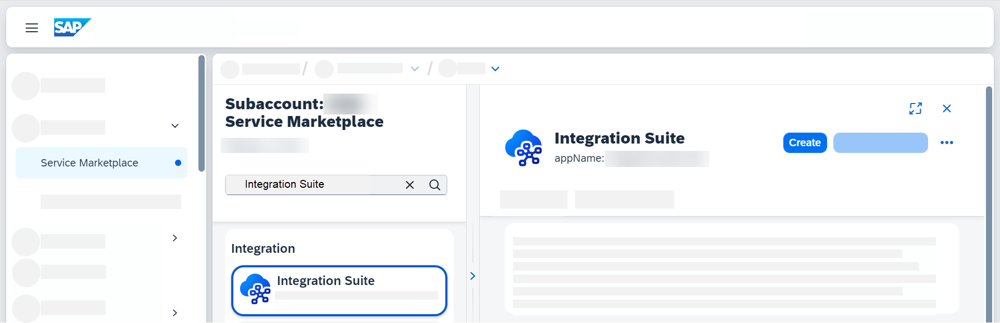
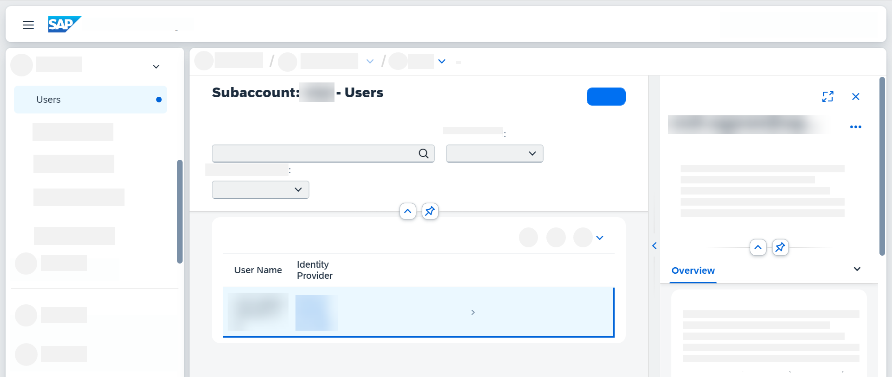
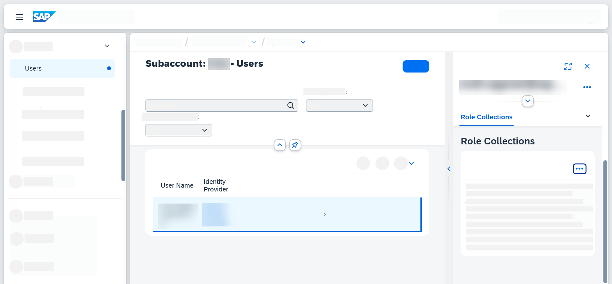
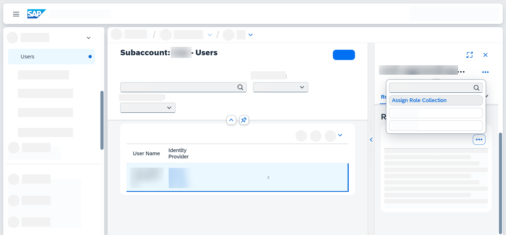
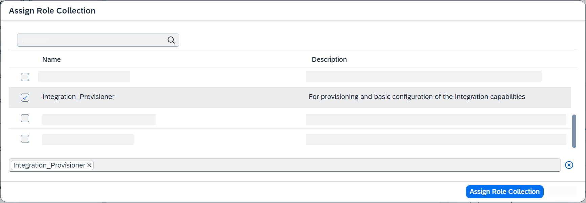

<!-- loio8a3c8b7a6b1c4f249bb81d11644ef806 -->

<link rel="stylesheet" type="text/css" href="../css/sap-icons.css"/>

# Subscribing and Configuring Initial Access to SAP Integration Suite

Subscribe to the SAP Integration Suite in SAP BTP cockpit and assign the Integration\_Provisioner role to gain access.

<a name="loio8a3c8b7a6b1c4f249bb81d11644ef806__prereq_nbs_lth_vlb"/>

## Prerequisites

-   You’ve created a subaccount in your assigned global account using the SAP BTP cockpit and added the desired service plans for Integration Suite to the subaccount. For more information on service plans, see [SAP Discovery Center - Integration Suite](https://discovery-center.cloud.sap/serviceCatalog/integration-suite?region=all).

-   If you want to use Integration Suite with the **Starter** service plan, additionally assign the entitlement *integration\_flows* to your subaccount. This entitlement along with the appropriate quota assignment is a prerequiste to create custom integration flows. For more information about the service plans, see SAP Note [2903776](https://me.sap.com/notes/2903776).

    > ### Note:  
    > If you are unable to assign the *integration\_flows* entitlement, contact the administrator of your subaccount or global account.

> ### Tip:  
> We recommend you clear your browser cookies and cache after subscribing to the application and assigning roles. If you still can't access the application with the correct roles, log out and log back in to resolve the issue.

You can watch a short video to learn about subscribing and configuring initial access here: 

## Procedure

1.  In the navigation area of the subaccount, choose *Services* \> *Service Marketplace*.

2.  Search for *Integration Suite* and choose *Create* on the overview page. 

3.  In the *New Instance or Subscription* dialog box, select the *Plan* and choose *Create*. Wait for the subscription to complete successfully.

    > ### Note:  
    > For different plans see the SAP Note [2903776](https://me.sap.com/notes/2903776).

    Check the status of the submission in the subscriptions section on the *Instances and Subscriptions* page. If the subscription is successful, you notice the status of the *Integration Suite* shown as *Subscribed*.

4.  You must have specific roles to access the Integration Suite. To assign these roles navigate to *Security* \> *Users*.

5.  Choose *Create* to add a new user.

    > ### Tip:  
    > If the user details exist already in the subaccount, you can skip this step and continue from [here](subscribing-and-configuring-initial-access-to-sap-integration-suite-8a3c8b7.md#loio8a3c8b7a6b1c4f249bb81d11644ef806__step_chooseuser).

6.  Enter the *User Name* and *E-Mail*, and choose *Create*.

7.  Choose the user .

8.  On the right-hand panel, scroll to the *Role Collections* section 

9.  Choose  Additional Options and choose *Assign Role Collection*.

    > ### Note:  
    > In some cases, the Integration\_Provisioner role is assigned automatically.

10. In the resulting dialog box, choose the checkbox for the *Integration\_Provisioner* role collection and choose *Assign Role Collection*. 

11. Navigate to *Services* \> *Instances and Subscription* and then select the instance of the application.

12. Choose *Go to Application* to launch the Integration Suite home page. For more information, see [Working with SAP Integration Suite Home](../20-Working_with_SAP_Integration_Suite_Home/working-with-sap-integration-suite-home-a53dce3.md).

    > ### Tip:  
    > Clear your web browser cache and cookies before navigating to *Go to Application*. To access the application, you'll need the correct authorization. If you try to enter without it, you'll be asked to assign the necessary role. If you're still unable to access the application after role assignment, simply log out and then log back into the SAP BTP cockpit. This should grant you access to the application.

    > ### Tip:  
    > To remain informed and receive timely notifications about planned and unplanned downtime, customer communications, and maintenance announcements, we recommend you maintain your contact information via Cloud System Notification Subscriptions \(CSNS\). For more information, see [Cloud Availability Center & Cloud System Notification Subscriptions](https://support.sap.com/en/my-support/systems-installations/cac.html).

