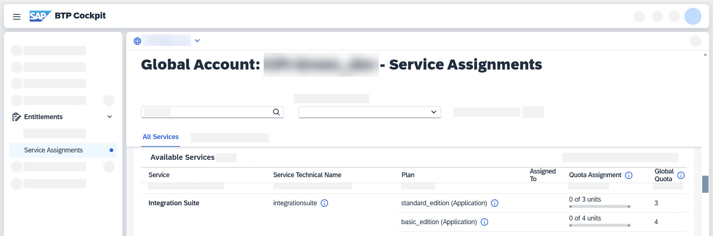
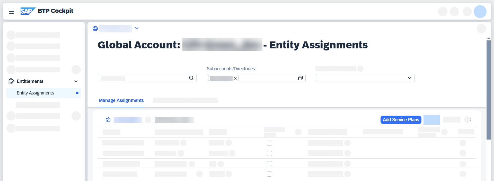
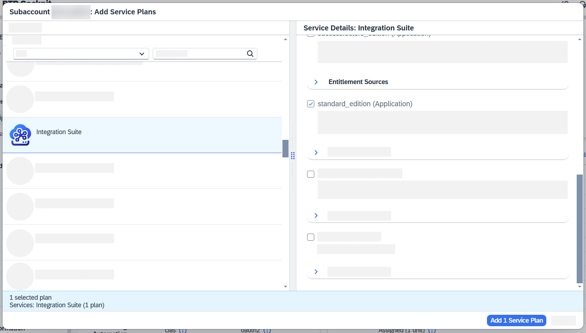
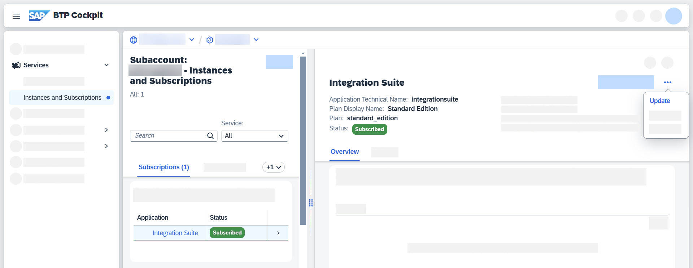
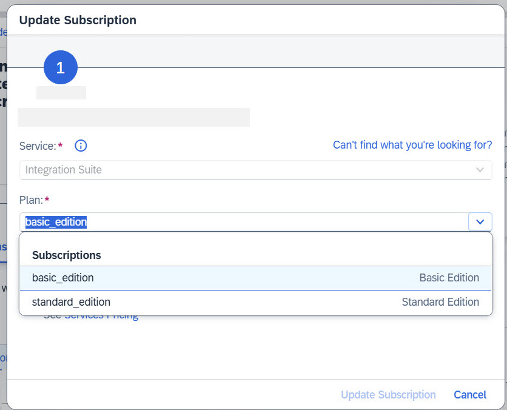
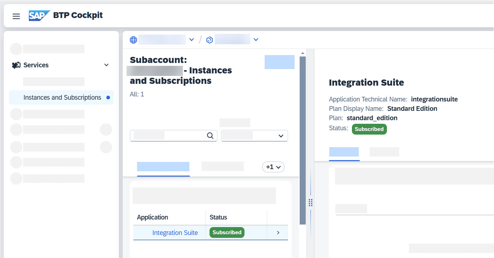
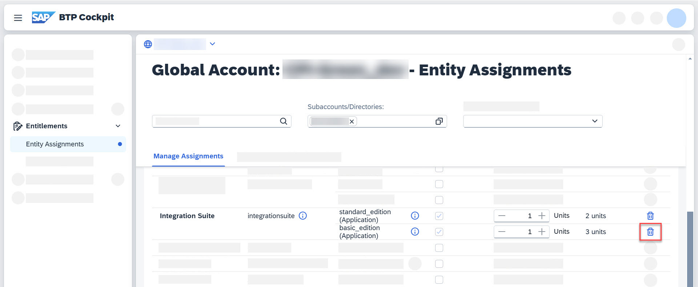

<!-- loiofdc33fd6878a44e887ffb8292fb6a722 -->

<link rel="stylesheet" type="text/css" href="../css/sap-icons.css"/>

# Upgrading to a Higher Service Plan

Learn how to upgrade to another service plan for SAP Integration Suite.

<a name="loiofdc33fd6878a44e887ffb8292fb6a722__prereq_gkk_qc3_q2c"/>

## Prerequisites

-   You have an active SAP Integration Suite tenant.

-   You’ve procured the additional entitlements required to upgrade the tenant.

-   You have unused quota of the target plan on your global account.

-   For most steps, you must be either **subaccount administrator** or **global account administrator**. Each step mentions the role that can execute it.

<a name="loiofdc33fd6878a44e887ffb8292fb6a722__context_nhx_4c3_q2c"/>

## Context

The procedure described in this topic is the same for all supported upgrade paths, including hybrid use cases. For a list of possible upgrade combinations, see SAP Note [2903776 - SAP Integration Suite - Service Plans and Upgrade Paths](https://me.sap.com/notes/2903776). If you want to upgrade from a free plan to a paid plan, see the blog [Integration Suite – Provisioning and Upgrading a Free Tier Tenant](https://blogs.sap.com/2021/11/18/integration-suite-provisioning-and-upgrading-a-free-tier-tenant/).

There are different service plans available that allow you to work with SAP Integration Suite. For details about service plans, see SAP Note [2903776 - SAP Integration Suite - Service Plans and Upgrade Paths](https://me.sap.com/notes/2903776).

> ### Note:  
> Since this plan upgrade is a commercial metadata update, it won't cause any downtime of the service.

## Procedure

1.  In this example, you want to upgrade your tenant service plan from *basic\_edition* to *standard\_edition*.

    Before the upgrade, you as the **global account administrator** must verify your entitlements to ensure that the service plans are available.

    While in your global account in the SAP BTP cockpit, go to *Entitlements* \> *Service Assignments*. You should see both the current plan \(*basic\_edition*\) and the future plan \(*standard\_edition*\).

    

2.  The global account admin then needs to assign the desired higher service plan to the subaccount that’s already subscribed to the current service plan.

    > ### Note:  
    > There's no impact on the tenant even if the messages quota has been assigned during the plan update step.

    To assign the service plan, configure entitlements as follows:

    1.  Go to *Entity Assignments* and select your subaccount.

    2.  Choose *Edit*, then *Add Service Plans*.

        

    3.  Select your desired service plan, then confirm by choosing *Add 1 Service Plan*.

        

    4.  Finally, don’t forget to *save* your changes.

        If the assignment was successful, you can see it in your global account at *Entitlements* \> *Entity Assignments*.

3.  Now, you as the **subaccount administrator** can update your service plan.

    1.  In your subaccount, go to *Services* \> *Instances and Subscriptions* \> *Subscriptions*, and choose *Update* from the available actions.

        

    2.  From the dropdown list, select the higher edition you want to upgrade to. In this example, you want to upgrade to *standard\_edition*. Choose *Update Subscription*.

        > ### Caution:  
        > Updating the subscription is irreversible.

        

        Once the upgrade is successful, you can see the plan change in the detail page of your subscription.

        

4.  Now that you have a higher service plan, you as the **subaccount administrator** can activate additional capabilities that are offered with the higher service plan. To do that, choose *Go to Application* to open SAP Integration Suite, and follow the steps described in [Activating and Managing Capabilities](https://help.sap.com/docs/integration-suite/sap-integration-suite/activating-and-managing-capabilities?state=DRAFT&version=DEV).

5.  Finally, you as the **global account administrator** can free up the quota from the old plan so it can be reused on another subaccount.

    1.  In your global account, go to *Entitlements* \> *Entity Assignments*.
    2.  For *Subaccounts/Directories*, select your subaccount and choose *Edit*. Choose :wastebasket: for the old quota.

        In this example, because you upgraded from *basic\_edition* to *standard\_edition*, you can delete the quota for *basic\_edition*.

        

    3.  Save your changes.

<a name="loiofdc33fd6878a44e887ffb8292fb6a722__result_vcb_wqm_q2c"/>

## Results

You've successfully upgraded your service plan for SAP Integration Suite and freed up the old quota so another subaccount can use it.

