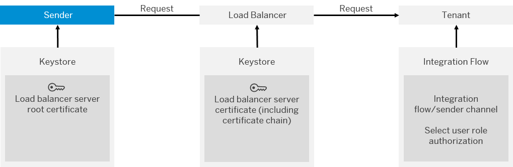

<!-- loio2c4c2d98e9de4b92a3b3af2ba9483909 -->

# Basic Authentication

Basic authentication allows a client to authenticate itself against the server based on user credentials.

> ### Caution:  
> Consider that we do **not** recommend to use basic authentication in productive scenarios because of the following security aspects:
> 
> Basic authentication has the risk that authentication credentials, for example, passwords, are sent in clear text. Using TLS \(transport-layer security, also referred to as Secure Sockets Layer\) as transport-level encryption method \(when using HTTPS as protocol\) makes sure that this information is nevertheless encrypted on the transport path. However, the authentication credentials might become visible to SAP-internal administrators at points in the network where the TLS connection is terminated, for example, load balancers. If logging is not done properly at such devices, the authentication credentials might become part of log files. Also network monitoring tools used at such devices might expose the authentication information to administrators. Furthermore, the person to whom the authentication credentials belong \(in the previous example, the password owner\) needs to maintain the password in a secure place.

## How it Works

The following figure shows the setup of components required for inbound basic authentication.

> ### Note:  
> For inbound HTTP connections, a load balancer component connects the remote sender system and the SAP Integration Suite tenant.
> 
> The load balancer terminates each inbound Transport Layer Security \(TLS\) request and establishes a new one for the connection to the tenant where the message is processed.

These are the steps at runtime:

The HTTP header of the inbound message \(from the sender\) contains user name and password. To protect these credentials during the communication step, the connection is secured using TLS \(SSL\).

This includes a step where the load balancer authenticates itself as server against the sender based on a certificate. To enable this security measure, the keystore of the load balancer contains a server certificate signed by a certification authority. To be more precise, the keystore of the load balancer contains a complete certificate chain from \(including all intermediate certificates\). On the other side of the communication, the keystore of the connected sender system must contain the load balancer server root certificate. That is the certificate that identifies the certification authority \(CA\) that signed the load balancer’s server certificate \(on top of the certificate chain\).

The other way round, the identity of the sender is checked by SAP evaluating the credentials \(user and password\) against the user.

It is also depicted in the figure that the authentication option needs to be activated for the corresponding integration flow.

<a name="loio2c4c2d98e9de4b92a3b3af2ba9483909__InboundBasicScenario"/>

## Required Security Material

To enable the sender system to authenticate itself against the integration platform with basic authentication, a communication user has to be created for the sender.

The following figure provides an overview of the involved security artifacts and storage locations.

**Certificates for Inbound Message Processing**

<table>
<tr>
<th valign="top">

Keystore

</th>
<th valign="top">

Certificate

</th>
<th valign="top">

Description

</th>
</tr>
<tr>
<td valign="top">

Sender keystore

</td>
<td valign="top">

Load balancer server root certificate \(identifies CA that has signed the load balancer server certificate\)

</td>
<td valign="top">

This certificate is required to identify the root CA at the top of the certificate chain that ultimately guarantees the trustability of the load balancer server certificate.

In many cases, there is a multilevel setup of CAs so that a certificate is signed by an intermediate CA. The trustability of the intermediate CA is guaranteed by another intermediate CA one level higher, and so on, up to the root CA at the top of the **certificate chain**. In this case, it is necessary to assign the certificate chain to the certificate, to enable the connected component \(which has imported only the root CA into its keystore\) to evaluate the chain of trust.

</td>
</tr>
<tr>
<td valign="top">

Load balancer keystore

</td>
<td valign="top">

Load balancer server certificate

</td>
<td valign="top">

This certificate is required to identify the load balancer as a trusted server \(to which clients like the sender system can connect\).

</td>
</tr>
</table>

For sakes of completeness, note that always a tenant keystore \(not depicted in the figure\) needs to be available to enable the system to do an additional outbound communication step that is required for technical purposes: The basic technical connectivity of a cluster is checked on a regular basis, as soon as the cluster is active. For this purpose, every 30 seconds the tenant management node sends an HTTPS request to an assigned runtime node via the load balancer. This simulates an external call to the runtime node. To enable this communication, a keystore needs to be deployed on the tenant, containing a valid client certificate that is accepted by the load balancer as well as the root certificate of the same. If this keystore is not available or contains an invalid certificate, the cluster will raise an error. The keystore and required certificate are provisioned by SAP together with the tenant.

When defining the service instance, the tenant administrator also specifies the role to be used to authorize the sender to call integration flow endpoint. You can either specify the predefined role `ESBMessaging.send` or a custom role.

The service key generated for the service instance contains values for the properties `clientid` and `clientsecret`. These values are required to call the integration flow endpoint.

Based on this setup of keys and OAuth credentials, the communication is established at runtime in the following way:

**Related Information**  

[Using Custom IDP with SAP Cloud Integration](https://help.sap.com/viewer/368c481cd6954bdfa5d0435479fd4eaf/Cloud/en-US/c59610d483974fcda631af4a2aae586b.html "") :arrow_upper_right:

[Basic Authentication with clientId and clientsecret for Integration Flow Processing](basic-authentication-with-clientid-and-clientsecret-for-integration-flow-processing-647eeb3.md "Use this procedure to connect a sender system to SAP Cloud Integration.")

