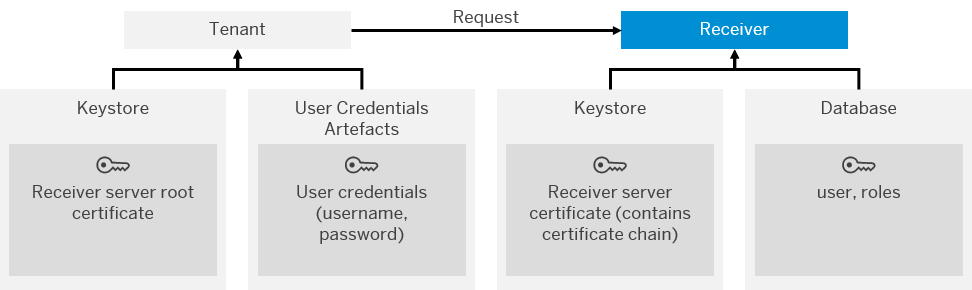

<!-- loioa5d77b12ff16483c965cce936aa1b698 -->

# Basic Authentication

Basic authentication allows a the tenant to authenticate itself against the receiver through credentials \(user name and password\).

## How it Works

The following figure shows the setup of components required for this authentication option.

Basic authentication for HTTPS-based outbound calls works the following way:

1.  The tenant \(client\) sends a message to the customer back-end system.

    The HTTP header of the message contains user credentials \(name and password\).

    To protect the user credentials during the communication step, the connection is secured using SSL.

2.  The customer back-end authenticates itself as server against the tenant using a certificate \(the customer back-end identifies itself as trusted server\).

    To support this, the keystore of the customer back-end system must contain a server certificate signed by a certification authority. To be more precise, the keystore must contain the complete certificate chain. On the other side of the communication, the keystore of the connected tenant must contain the customer back-end server root certificate.

3.  The tenant is authenticated by the customer back-end by evaluating the credentials against the user stored in a related data base connected to the customer back-end.

<a name="loioa5d77b12ff16483c965cce936aa1b698__OutboundBasicElements"/>

## Required Security Material

**Certificates for Outbound Message Processing**

<table>
<tr>
<th valign="top">

Keystore

</th>
<th valign="top">

Security Element

</th>
<th valign="top">

Description

</th>
</tr>
<tr>
<td valign="top">

Keystore \(tenant-specific\)

More information: [Keystore](keystore-b163513.md)

</td>
<td valign="top">

Receiver server root certificate

</td>
<td valign="top">

This certificate is required to identify the root CA that is at the top of the certificate chain that ultimately guarantees the trustability of the receiver server certificate.

</td>
</tr>
<tr>
<td valign="top">

Receiver keystore

</td>
<td valign="top">

Receiver server certificate \(signed by CA with which the tenant has a trust relationship\)

</td>
<td valign="top">

This certificate is required to identify the receiver \(to which the tenant connects as the client\) as a trusted server.

</td>
</tr>
<tr>
<td valign="top">

User credentials artifact

</td>
<td valign="top">

User and password

</td>
<td valign="top">

With these credentials the tenant authenticates itself as client at the receiver system.

</td>
</tr>
</table>

