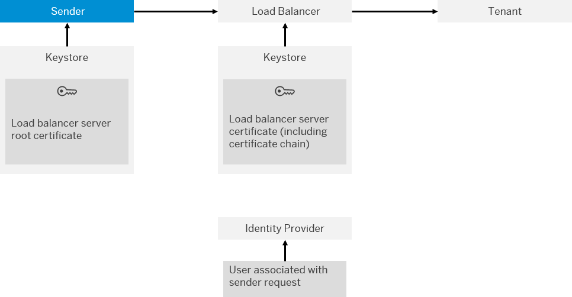

<!-- loio5d46e56550a048e99995f23e1e20083a -->

# Basic Authentication of IdP User for Integration Flow Processing

Use this procedure to connect a sender system to SAP Integration Suite using basic authentication of a user registered by an identity provider \(IdP\).

## Context

> ### Caution:  
> This authentication option can’t be used when operating SAP Integration Suite on Alibaba Cloud.
> 
> On Alibaba Cloud, SAP ID Service isn't used as default IdP. Therefore, also basic authentication with SAP ID Service can't be used on Alibaba Cloud.

> ### Note:  
> When setting up trust relationships in SAP BTP cockpit, in most cases *SAP ID service* is used as default identity provider. For more information about adding users to SAP ID Service, see [SAP ID Service](https://help.sap.com/viewer/65de2977205c403bbc107264b8eccf4b/Cloud/en-US/d6a8db70bdde459f92f2837349f95090.html). In the BTP cockpit, the role name to be used in the Role Collection is `MessagingSend`, which corresponds to the user role `ESBmessaging.send` on Cloud Platform Integration side.
> 
> However, you've the option to define a custom IdP as your default IdP.
> 
> > ### Note:  
> > This option is **not** recommended for productive scenarios.
> 
> If you like to use SAP Identity Authentication Service as custom IdP, you need to make this IdP as your default IdP. To do that, perform the steps described at [Setting Up SAP Identity Authentication Service as Custom IdP for Basic Authentication](setting-up-sap-identity-authentication-service-as-custom-idp-for-basic-authentication-0668507.md).

The following figure shows the components and the involved security artifacts:

The table provides an overview of the required digital keys and their purpose in the authentication process, and summarizes the required configuration steps. Note that when setting up secure communication of different systems, typically administrators associated with the different systems need to accomplish configuration tasks in a coordinated way and to exchange public keys.

<table>
<tr>
<th valign="top">

Security Artifact

</th>
<th valign="top">

Used to ...

</th>
<th valign="top">

Configuration Steps

</th>
</tr>
<tr>
<td valign="top">

Load balancer server root certificate

</td>
<td valign="top">

Make the sender trust the load balancer.

</td>
<td valign="top">

Sender administrator:

Get certificate using the Cloud Integration *Connectivity Test* \(pointing to endpoint address of integration flow\).

</td>
</tr>
<tr>
<td valign="top">

Load balancer server certificate \(including certificate chain\)

</td>
<td valign="top">

Qualify load balancer as trusted component \(for senders that like to connect to it\).

</td>
<td valign="top">

No action required as this artifact is maintained by the operator of the cloud infrastructure.

</td>
</tr>
</table>

Using SAP BTP cockpit, assign to the user a role that is to be used to authorize the sender to call the integration flow endpoint. You can either assign the predefined role `ESBMessaging.send` or a custom role.

In detail, perform the following steps.

## Procedure

1.  In SAP BTP cockpit, select the subaccount.

2.  Select *Security* \> *Role Collections*.

3.  Click the *\+* icon to create a new role collection.

4.  In the *Create Role Collection* dialog, enter a name and \(optional\) a description of the role collection and choose *Create*.

5.  Select the newly created role collection.

6.  Click *Edit*.

7.  Open the dropdown list of field *Role Name* and select the desired combination of role \(left entry\) and application identifier \(right entry\).

    Select the role that grants permission for a sender to call the integration flow. By default, the role template `MessagingSend` is available \(which corresponds to the predefined role `ESBMessaging.send`\).

    > ### Tip:  
    > This predefined role grants permissions to call an integration flow endpoint.
    > 
    > You can also define a custom role for that purpose. To do that, go to the SAP Integration Suite *Monitor* section and under *Manage Security* select the *User Roles* tile. On the next screen, you can create a new role.
    > 
    > More information: [Managing User Roles](../50-Development/managing-user-roles-4e86f0d.md)
    > 
    > After you've performed that step, you find the newly defined role in SAP BTP cockpit next to the application starting with `it-rt` \(when selecting the subaccount under *Security* \> *Roles*\). Using this role, you can define a role collection in the same way as described for the previous steps. When configuring the sender adapter of the integration flow, you can select the newly defined role. That way, you control access to individual integration flows using separate custom roles.

    > ### Tip:  
    > The *Application Identifier* parameter identifies the SAP BTP application. The `it-rt` application represents Cloud Integration when accessed at runtime.
    > 
    > Note that remote components can connect to Cloud Integration at different levels, where the level is expressed by different application identifiers.
    > 
    > -   To configure access to Cloud Integration resources as a dialog user \(designing integration flows. for example\) or an API client, you connect the remote system to an application with an *Application Identifier* starting with `it!`.
    > 
    > -   To configure access to Cloud Integration runtime resources \(integration flows\) from a sender, you need to connect the sender to an `it-rt` application.

8.  Choose *Add*.

9.  Choose *Save*.

10. In the navigation area, select *Security* \> *Trust Configuration*.

11. Select *Default identity provider*.

12. In the navigation area, select *Security* \> *Users*. Enter the email address of the IdP user and click *Show Assignments*.

    If the user isn’t known yet to the tenant, a message is displayed. Confirm the message by choosing *Add User*.

13. Choose *Assign Role Collection*.

14. Select the role collection that you defined and choose *Assign Role Collection*.

    > ### Note:  
    > Due to caching mechanisms in SAP Integration Suite , it can take up to 1 hour until role changes are considered.

15. In the sender adapter of the integration flow that you want to call for *Authorization*, select *User Role*.

<a name="loio5d46e56550a048e99995f23e1e20083a__result_cjh_yzx_1mb"/>

## Results

A sender can now call the integration flow endpoints using the IdP user with the configured settings.

