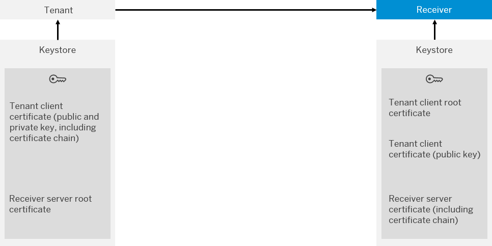

<!-- loioc4e4a1570d6b4896b7426f67ae053a5e -->

# Client Certificate Authentication \(Outbound\)

The following figure shows the setup of components required for this authentication option.

## How it Works

The tenant authenticates itself against the receiver based on a certificate.

This authentication option works the following way:

1.  The tenant sends a message to the receiver.
2.  The receiver authenticates itself \(as trusted server\) against the tenant when the connection is being set up.

    In this case, the receiver acts as server and the authentication is based on certificates.

3.  Authentication of the tenant: The identity of the tenant is checked by the receiver by evaluating the client certificate chain of the tenant.

    As prerequisite for this authentication process, the client root certificate of the tenant has to be imported into the receiver keystore \(prior to the connection set up\).

    As CA who provides the root certificate, *Cyber trust Public Sure Server SV CA* is used.

    Steps 2 and 3 are referred to as mutual *SSL handshake*.

4.  Authorization check: The permissions of the client \(tenant\) are checked in a subsequent step by the receiver.

> ### Remember:  
> If your tenant contains many key pairs in the Keystore, the tenant takes significantly more time to authenticate itself against the target endpoint.

