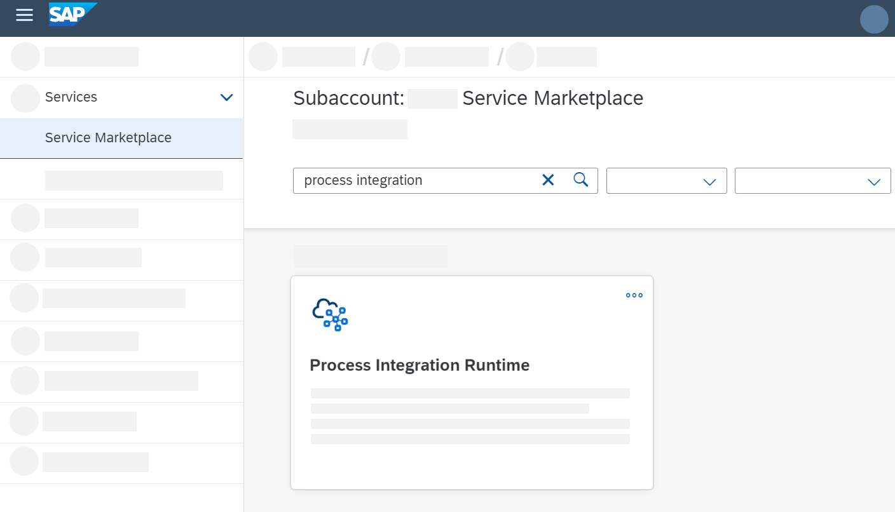

<!-- loio19af5e205fe14af6a4f8a9fd80d4dc92 -->

# Creating Service Instance and Service Key for Inbound Authentication

With a service instance, you define how to access a certain SAP BTP service. In the context of SAP Integration Suite , a service instance is the definition of an OAuth client.

Create a service instance to implement inbound communication. A service instance is an OAuth client \(with grant type `Client Credentials`\).

> ### Note:  
> How to specify the parameters, depends on the plan and authentication option.
> 
> For more information on the inbound authentication options for senders calling integration flow endpoints \(*integration-flow* plan\):
> 
> -   [Client Certificate Authentication for Integration Flow Processing](client-certificate-authentication-for-integration-flow-processing-7f84d16.md)
> 
> -   [OAuth with Client Credentials Grant for Integration Flow Processing](oauth-with-client-credentials-grant-for-integration-flow-processing-6c052ce.md)
> 
> -   [Basic Authentication with clientId and clientsecret for Integration Flow Processing](basic-authentication-with-clientid-and-clientsecret-for-integration-flow-processing-647eeb3.md)
> 
> 
> For more information on the inbound authentication options of API clients calling the SAP Cloud Integration OData API \(*api* plan\):
> 
> -   [Client Certificate Authentication for API Clients](client-certificate-authentication-for-api-clients-d9ca0ac.md)
> 
> -   [OAuth with Client Credentials Grant for API Clients](oauth-with-client-credentials-grant-for-api-clients-20e26a8.md)


<a name="loio19af5e205fe14af6a4f8a9fd80d4dc92__section_c2m_yxk_zsb"/>

## Creating Service Instance

1.  Go to SAP BTP cockpit.

2.  Select the subaccount that hosts your SAP Integration Suite application.

3.  Choose your subaccount, navigate to *Services* \> *Service Marketplace*, and select *Process Integration Runtime*.

    > ### Note:  
    > This tile is only displayed when you've created a runtime instance.

    

4.  Choose *Create*.

5.  In the *New Instance or Subscription* dialog box, ***Process Integration Runtime*** is already preselected as *Service*.

6.  Specify the following parameters:


    <table>
    <tr>
    <th valign="top">

    Parameter


    
    </th>
    <th valign="top">

    Value


    
    </th>
    </tr>
    <tr>
    <td valign="top">

     *Plan* 


    
    </td>
    <td valign="top">

    Depending on the use case, select one of the following options:

    -   *integration-flow*

        To define inbound authentication of senders calling integration flow endpoint \(on an SAP Cloud Integration worker node\).

        See: [Set Up Integration Suite](https://developers.sap.com/tutorials/cp-starter-isuite-onboard-subscribe.html)

    -   *api*

        To define inbound authentication of API clients calling the SAP Cloud Integration OData API.


    
    </td>
    </tr>
    <tr>
    <td valign="top">

     *Runtime Environment* 


    
    </td>
    <td valign="top">

     *Cloud Foundry* 


    
    </td>
    </tr>
    <tr>
    <td valign="top">

     *Space* 


    
    </td>
    <td valign="top">

    Select a space \(for example *dev*\).


    
    </td>
    </tr>
    <tr>
    <td valign="top">

     *Instance Name* 


    
    </td>
    <td valign="top">

    Enter a meaningful short name.

    > ### Note:  
    > We recommend you use a CLI-friendly name to enable the managing of your instances with the SAP BTP command line interface as well.
    > 
    > CLI-friendly name is a short string \(up to 32 characters\) that only contains alphanumeric characters \(A-Z, a-z, 0-9\), periods, underscores, and hyphens.
    > 
    > Your instance name can't contain white spaces if you want your instance name to be CLI-friendly.


    
    </td>
    </tr>
    </table>
    
7.  Choose *Next*.

8.  Configure instance parameters. Choose how to enter your details, via *Form* or *JSON*.

    We recommend to choose *Form* as the more convenient option.

    Specify the following parameters.


    <table>
    <tr>
    <th valign="top">

    Parameter


    
    </th>
    <th valign="top">

    Value


    
    </th>
    </tr>
    <tr>
    <td valign="top">

     *Roles* 


    
    </td>
    <td valign="top">

    The selection of roles depend on the chosen option for *Plan*.

    -   When as *Plan* you've chosen *integration-flow*, you can either keep the standard role `ESBMessaging.send` or enter a custom role \(see [Managing User Roles](../50-Development/managing-user-roles-4e86f0d.md)\).

        You are able to add multiple roles by pressing enter after each role. The default is set to the standard role \(`ESBMessaging.send`\).

        > ### Tip:  
        > When defining a service instance with *integration-flow* plan, you assign a role to it that enables the associated user to process the integration flow on the worker node. Simply spoken, this role defines permission for a sender to process an integration flow.

    -   When as *Plan* you've chosen *api*, select one or more roles as provided in the dropdown list.

        These roles define permissions for API clients to access certain SAP Integration Suite resources using the OData API.

        Choose the role depending on the resource you like to access using the OData API \(see [Tasks and Permissions](https://help.sap.com/viewer/368c481cd6954bdfa5d0435479fd4eaf/Cloud/en-US/556d5575d4b0483e85d4f3251f21d0ec.html "") :arrow_upper_right:\).


    
    </td>
    </tr>
    <tr>
    <td valign="top">

     *Grant-types* 


    
    </td>
    <td valign="top">

    Select `Client Credentials`.

    > ### Note:  
    > The list of supported grant types is:
    > 
    > -   `Authorization Code`
    > 
    > -   `Client Credentials`
    > 
    > -   `Password`
    > 
    > -   `Refresh Token`
    > 
    > -   `SAML2 Bearer`
    > 
    > -   `JWT Bearer`


    
    </td>
    </tr>
    <tr>
    <td valign="top">

     *Redirect-uris* \(optional\)


    
    </td>
    <td valign="top">

    Enter the redirect URIs for authorization code grant type. Hit *Enter* after typing your uri and proceed with the next uri.


    
    </td>
    </tr>
    </table>
    
    > ### Note:  
    > Selecting *JSON*, you can also pass these parameters in a valid JSON object that contains service-specific configuration parameters, provided either in-line or in a file \(see [Specifying Service Instance and Service Key Parameters in JSON Format](specifying-service-instance-and-service-key-parameters-in-json-format-ae419b6.md)\).

9.  Optional: Choose *Next* to review and verify the instance details.

10. Choose *Create*.


<a name="loio19af5e205fe14af6a4f8a9fd80d4dc92__section_vlj_zxk_zsb"/>

## Creating Service Key

With this step, you create a service key for the instance.

1.  Using SAP BTP cockpit, enter your subaccount and go to *Instances and Subscriptions*.

    You can see your instances in a table.

2.  Select the service instance.

3.  Under *Actions \(°°°\)*, choose *Create Service Key*.

4.  Enter a name for the service key under *Service Key Name*. You can use up to 32 characters.

5.  Configure instance parameters. Choose how to enter your details, via *Form* or *JSON*.

    We recommend choosing *Form* as the more convenient option.

    Specify the following parameters.


    <table>
    <tr>
    <th valign="top">

    Parameter


    
    </th>
    <th valign="top">

    Value


    
    </th>
    </tr>
    <tr>
    <td valign="top">

     *Key Type* 


    
    </td>
    <td valign="top">

    There are the following options.

    -   *ClientId/Secret*: To define a service key that contains a clientId and clientsecret.

    -   *Certificate*: Provides a x509 certificate issued by SAP.

        Select this option to have SAP BTP generate a client certificate for you.

        Client credentials grant is required to be able to use this key type.

    -   *External Certificate*: Allows to map an existing x509 certificate to a service key.

        Select this option to use a client certificate generated with another application than SAP BTP.

        Client credentials grant is required to be able to use this key type.


    See: [Service Key Types](service-key-types-0fc1446.md)


    
    </td>
    </tr>
    <tr>
    <td valign="top">

     *External Certificate* \(only applicable if for *Key Type* the option *External Certificate* has been chosen\)


    
    </td>
    <td valign="top">

    Add *External Certificate*: Enter the certificate that you exported from the certificate-generating application to your local computer.

    Enter the PEM-encoded X.509 certificate.

    > ### Tip:  
    > *PEM* stands for *Privacy Enhanced Mail* and is a common format for X.509 certificates. It contains base64-encoded text content with the string `-----BEGIN CERTIFICATE-----` at the beginning and the string `-----END CERTIFICATE-----` at the end of the character sequence.
    > 
    > Example:
    > 
    > > ### Sample Code:  
    > > ```
    > > -----BEGIN CERTIFICATE-----MIIHyDCCBrCgAwIB[...]CAq8Tn7kSFDmVnrXe6v8hcQ==-----END CERTIFICATE-----
    > > ```

    Don't enter the whole certificate chain.

    Make sure that the certificate is signed by a certification authority supported by the load balancer \(see [Load Balancer Root Certificates Supported by SAP](load-balancer-root-certificates-supported-by-sap-4509f60.md)\).

    You can only use a single certificate once across all existing service instances. To assign multiple roles, don't create multiple service instances. Instead of this, maintain multiple roles within one service instance.


    
    </td>
    </tr>
    <tr>
    <td valign="top">

     *Validity in days* \(only applicable if for *Key Type* the option *Certificate* has been chosen\)


    
    </td>
    <td valign="top">

    Define the validity in days by selecting a number between 1 and 365.


    
    </td>
    </tr>
    <tr>
    <td valign="top">

     *Key Size* \(only applicable if for *Key Type* the option *Certificate* has been chosen\)


    
    </td>
    <td valign="top">

    The default for the key size is set to 2048.


    
    </td>
    </tr>
    </table>
    
6.  > ### Note:  
    > Selecting *JSON*, you can also pass these parameters in a valid JSON object that contains service-specific configuration parameters, provided either in-line or in a file \(see [Specifying Service Instance and Service Key Parameters in JSON Format](specifying-service-instance-and-service-key-parameters-in-json-format-ae419b6.md)\).

7.  Choose *Create*.

8.  Choose the newly created service key to display the details of the service key. You need the values of the service key for later reference.

    Depending on the chosen *Key Type*, the service key contains certain parameters. The following table lists the parameters that are required to configure the client application:

    **Service Key Parameters**


    <table>
    <tr>
    <th valign="top">

    Key Type


    
    </th>
    <th valign="top">

    Parameters Contained in Service Key


    
    </th>
    </tr>
    <tr>
    <td valign="top">

     *ClientId/Secret* 


    
    </td>
    <td valign="top">

    -   *clientid*

        clientid to be used as credential when requesting the access token from the token server.

    -   *clientsecret*

        clientsecret to be used as password when requesting the access token from the token server.

    -   *tokenurl*

        URL of token server that issues the access token.


    
    </td>
    </tr>
    <tr>
    <td valign="top">

     *Certificate* 


    
    </td>
    <td valign="top">

    -   *clientid*

        clientid of service key.

    -   *certificate*

        PEM-encoded certificate chain \(to be used by the sending application to authenticate itself against token server or application\).

        The certificate chain contains a root certificate supported by SAP \(see [Load Balancer Root Certificates Supported by SAP](load-balancer-root-certificates-supported-by-sap-4509f60.md)\).

    -   *key*

        Private key of SAP-generated key pair.

    -   *tokenurl*

        URL of token server that issues the access token.


    > ### Note:  
    > To enable the related HTTP client to support this authentication option, you need to format the certificate \(including the certificate chain\) and the key accordingly. In particular, make sure to replace all `\n` in the SAP-generated certificate or key by line breaks.
    > 
    > A suitable certificate, for example, would then look like:
    > 
    > ```
    > -----BEGIN CERTIFICATE-----
    > MIIFtDCCA5ygAwIBAgIQCUFIj6cfjiSfZi/ZvVU6IDANBgkqhkiG9w0BAQsFADB5
    > ................................................................
    > ................................................................
    > ................................................................+
    > LvHPhNDM3rMsLu06agF4JTbO8ANYtWQTx0PVrZKJu+8fcIaUp7MVBIVZ
    > -----END CERTIFICATE-----
    > ```

    > ### Note:  
    > The generated certificate also contains additional parameters under *certificatedetails*.
    > 
    > When for *Key Type* you have chosen *Certificate*, the following applies for these parameters:
    > 
    > -   The values for the parameters *issuerdn*, *serialnumber*, and *subjectdn* are determined by SAP.
    > 
    > -   The value of parameter *validuntil* is calculated from the entry that you have selected for *Validity in days* when defining the service key.
    > 
    > 
    > See: [Service Key Types](service-key-types-0fc1446.md)


    
    </td>
    </tr>
    <tr>
    <td valign="top">

     *External Certificate* 


    
    </td>
    <td valign="top">

    -   *clientid*

        clientid of service key.

    -   *certificate*

        PEM-encoded certificate \(to be used by the sending application to authenticate itself against token server or application\).

    -   *tokenurl*

        URL of token server that issues the access token.


    A service key with this *Key Pair* doesn't contain a private key because the corresponding key pair has been generated with another application than SAP BTP.


    
    </td>
    </tr>
    </table>
    
    > ### Note:  
    > You have 2 options to display these parameters:
    > 
    > -   *Form*
    > 
    >     Displays content of service key in a user-friendly list easy to consume.
    > 
    > -   *JSON*
    > 
    >     Displays content of service key in JSON format.

    You have the following options:

    -   Copy these values to your clipboard or to a text editor.

    -   Download the service key.


    You need these values when specifying the required credentials or certificate values associated with the sending application.


<a name="loio19af5e205fe14af6a4f8a9fd80d4dc92__section_rdk_v2l_zsb"/>

## Updating Service Instance

You can update an existing service instance. To do that, perform the following steps.

1.  Using SAP BTP cockpit, enter your subaccount and go to *Instances and Subscriptions.*

    You can see your instances in a table.

2.  Select the service instance.

3.  Under *Actions \(°°°\)*, choose *Update*.

4.  Check out the parameter settings and, if necessary, change them.

5.  Choose *Update Instance*.


> ### Note:  
> Because of caching mechanisms in SAP Cloud Integration, it can take up to 1 hour until role changes are considered.

**Related Information**  


[Tutorial: Set Up Inbound OAuth Client Credentials Grant Authentication for API Clients with SAP-Generated Certificate](https://developers.sap.com/tutorials/btp-integration-suite-oauth-client-certificate.html)

