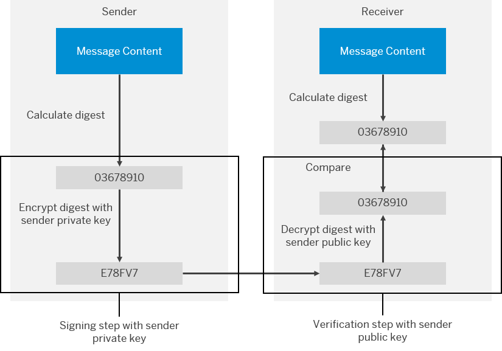

<!-- loio21325d5c79ca432792ef35a1dc85f3b3 -->

# How PKCS\#7 Works

You have the option to sign and encrypt message payloads based on PKCS\#7/CMS Enveloped Data and Signed Data \(PKCS stands for Public Key Cryptography Standards\).

<a name="loio21325d5c79ca432792ef35a1dc85f3b3__section_N10014_N10011_N10001"/>

## Signing and Verifying a Message

A digital signature ensures the authenticity of a message that way that it guarantees the identity of the signer and that the message wasn't altered after signing.

Digitally signing and verifying a message works in the following way:

1.  The sender signs the message using its own private key.

2.  The receiver verifies the signature by using the public key associated with the sender's private key.

On a technical level, the signing and verifying process works in the following way:

1.  The sender calculates out of the message content a digest \(or hash value\) using a digest algorithm.
2.  The sender encrypts the digest using a private key \(type RSA or DSA\). This is actually the signing step.

    Supported algorithms for content signing \(digest and encryption algorithm\): SHA3-224/RSA, SHA3-256/RSA, SHA3-384/RSA, SHA3-512/RSA, SHA512/RSA, SHA384/RSA, SHA256/RSA, SHA224/RSA, SHA/RSA, RIPEMD128/RSA, RIPEMD160/RSA, RIPEMD256/RSA, MD5/RSA, MD2/RSA, RIPEMD160andMGF1/RSA-ISO9796-2-2-3, SHAandMGF1/RSA-ISO9796-2-2-3, SHA3-512/DSA, SHA3-384/DSA, SHA3-256/DSA, SHA3-224/DSA, SHA512/DSA, SHA384/DSA, SHA256withDSA, SHA224withDSA, SHA/DSA, SHA3-224/ECDSA, SHA3-256/ECDSA, SHA3-384/ECDSA, SHA3-512/ECDSA, SHA512/ECDSA, SHA384/ECDSA, SHA256/ECDSA, SHA224/ECDSA, SHA1/ECDSA.

3.  The sender sends the encrypted digest \(which corresponds to the signature\) together with the message content to the receiver.
4.  The receiver decrypts the digest with the public key \(which is related to the senders’ private key\). The public key has the type RSA or DSA.
5.  The receiver calculates the digest out of the content of the message \(which has been sent to it by the sender\).

    The receiver uses the same digest algorithm that the sender had used.

    > ### Note:  
    > PKCS\#7 ensures that the digest algorithm is transferred together with the signature of the message and therefore available for the receiver.

    This calculation is based on the message content. In case the message content has been transferred encrypted, a decryption step is needed before this step.

6.  The receiver compares the decrypted digest \(from the sender\) with the one calculated at receiver side. In case both values \(digests\) are identical, the signature is verified.

The following figure illustrates the process of digitally signing and verifying a message.

<a name="loio21325d5c79ca432792ef35a1dc85f3b3__section_N10073_N10011_N10001"/>

## Encrypting and Decrypting the Content of a Message

Digital encryption allows you to encode the content of a message in such a way that only authorized parties can read it.

Digital encryption works two-stage based on symmetric and asymmetric key technology:

1.  The sender encrypts the content of the message using a symmetric key.

    > ### Note:  
    > The following algorithms for content encryption \(by the symmetric key\) are supported \(format Cipher/Operation Mode/Padding Scheme\): DESede/CBC/PKCS5Padding, DES/CBC/PKCS5Padding, AES/CBC/PKCS5Padding, ARCFOUR/ECB/NoPadding, Camellia/CBC/PKCS5Padding, RC2/CBC/PKCS5Padding, CAST5/CBC/PKCS5Padding.

2.  The sender encrypts the symmetric key using a public key.

    > ### Note:  
    > To encrypt the symmetric key, a public key of type RSA \(with the cipher – or algorithm – RSA/ECB/PKCS1Padding\) is used for each recipient.

3.  The sender sends the encrypted message and the encrypted symmetric key to the receiver.
4.  The receiver decrypts the symmetric key using a private key \(which is related to the public key used by the sender\).

    > ### Note:  
    > For this decryption step, you need a private key of type RSA.

5.  The receiver decrypts the content of the message using the decrypted symmetric key.

> ### Note:  
> Strong encryption is supported for the following algorithms:
> 
> -   AES/CBC/PKCS5Padding
> -   Camellia/CBC/PKCS5Padding
> 
> For these algorithms also the key lengths 192 and 256 are possible.

The following figure illustrates the process of digitally encrypting and decrypting the content of a message.

