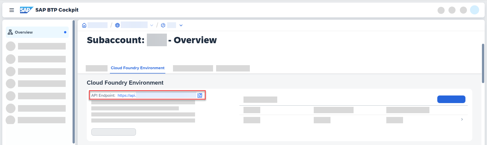

<!-- loio6e5db6046f5841159559326bfa917825 -->

# Managing Service Instances and Service Keys Using an API

Manage service instances and service keys using an application programming interface \(API\).

Using the Cloud Foundry V3 API, you can implement sequences of API calls to manage service instances and service keys automatically on your SAP Business Technology Platform subaccount.

The API supports write and read access. You can, for example, create and update service instances, as well as get the details of service instances and service keys.

> ### Tip:  
> For example, assume that you have configures a large number of service instances and service keys and you like to get an automatic notification for service keys that soon expire. To solve this challenge, you can implement a suitable sequence of API calls to get the service key's expiration dates as a final result.

The Cloud Foundry V3 API is described under [https://v3-apidocs.cloudfoundry.org/version/3.133.0/index.html](https://v3-apidocs.cloudfoundry.org/version/3.133.0/index.html).

The API documentation provides you with the paths and the supported methods.

To use this API, you need a user with the `Space Developer` role for the Cloud Foundry space associated with the service instances.


<a name="loio6e5db6046f5841159559326bfa917825__section_q2l_sbh_yxb"/>

## API Endpoint Address

To get the base URL for the API calls, perform the following steps:

1.  Go to SAP Business Technology Platform cockpit and select your subaccount \(for which you like to manage the service instances and service keys\).

2.  On the *Overview* page, go to section *Cloud Foundry Environment*.

    The *API Endpoint* entry is the base URL to use.


For example, assume that you like to get a list of all service instances defined on your subaccount.

In the API documentation, you find the following method and API path:

`GET /v3/service_instances`

That means, you have to send a GET request to the following address:

`https://<API Endpoint address>/v3/service_instances` 


<a name="loio6e5db6046f5841159559326bfa917825__section_lsf_5bh_yxb"/>

## Authentication

You can authenticate your API client against the Cloud Foundry API with OAuth Password Credentials grant.

That means, you use the user credentials of the SAP Business Technology Platform space user to get an access token from a token server first. In a second call, you use the access token to call the API.

If you use Postman as your API client, there's a convenient way to configure the OAuth call sequence in one user interface.

Using Postman, set up the API call in the following way:

1.  Open Postman.
2.  In the address field, enter the address of the request \(for example, `https://<API Endpoint address>/v3/service_instances`\) and select the method \(for example, *GET*\).

3.  For *Authorization* select *OAuth 2.0*.

4.  Specify the following settings.

    

    Keep the default settings, except the following ones. Specify these parameters in the following way:


    <table>
    <tr>
    <th valign="top">

    Parameter
    
    </th>
    <th valign="top">

    Description
    
    </th>
    </tr>
    <tr>
    <td valign="top">
    
    *Grant Type* 
    
    </td>
    <td valign="top">
    
    Select *Password Credentials*.
    
    </td>
    </tr>
    <tr>
    <td valign="top">
    
    *Access Token URL* 
    
    </td>
    <td valign="top">
    
    Enter the address of the token server that issues tha access token to request the API endpoint.

    Assume that your API endpoint address has the following form:

    `https://api.<myAPI>`

    In this case, for *Access Token URL* enter:

    `https://uaa.<myAPI>/oauth/token`
    
    </td>
    </tr>
    <tr>
    <td valign="top">
    
    *Client ID* 
    
    </td>
    <td valign="top">
    
    `cf`
    
    </td>
    </tr>
    <tr>
    <td valign="top">
    
    *Username* 
    
    </td>
    <td valign="top">
    
    Enter the user name of the user that has the corresponding permissions on the subaccount.
    
    </td>
    </tr>
    <tr>
    <td valign="top">
    
    *Password* 
    
    </td>
    <td valign="top">
    
    Enter the password of the user.
    
    </td>
    </tr>
    </table>
    
5.  select *Get New Access Token*.

6.  Select *Send*.


You get a response that contains the list of service instances.


<a name="loio6e5db6046f5841159559326bfa917825__section_skh_1fh_yxb"/>

## Call Sequence to Get Service Key Details

Let's assume that you are an integration developer and you've configured a set of service instances and service keys on your subaccount. Furthermore, you are interested in the expriy dates of the service keys associated with those service instances that control inbound communication to your integration flow endpoints. In other words, you are interested in the expiry dates of all service keys associated with service instances with service plan `integration-flow`.

To get the details of the service keys you are interested in, you can implement the following sequence of API calls.


<table>
<tr>
<th valign="top">

API Call

</th>
<th valign="top">

API Call

</th>
<th valign="top">

Description

</th>
</tr>
<tr>
<td valign="top">

**\(1\)**

Get all service instances with service plan `integration-flow`.

</td>
<td valign="top">

`https://<API Endpoint address>/v3/service_instances?service_plan_names=integration-flow` 

</td>
<td valign="top">

As response, you get a list of all service instances with service plan `integration-flow` configured on your subaccount.

Let's assume you get 2 service instances, one with guid `xyz-789-abc` and the other with guid `uvw-567-def`.

This is part of an example response:

```
"resources": [
        {
            "guid": "xyz-789-abc",
            "created_at": "2023-06-23T12:35:55Z",
            "updated_at": "2023-06-23T12:35:56Z",
            "name": "test2",
            "tags": [],
            "last_operation": {
                "type": "create",
                "state": "succeeded",
                "description": "",
                "updated_at": "2023-06-23T12:35:56Z",
                "created_at": "2023-06-23T12:35:56Z"
            },
...
        {
            "guid": "uvw-567-def",
            "created_at": "2023-06-23T12:35:55Z",

            "updated_at": "2023-06-23T12:35:56Z",

            "name": "test2",

            "tags": [],

            "last_operation": {

                "type": "create",

                "state": "succeeded",

                "description": "",

                "updated_at": "2023-06-23T12:35:56Z",

                "created_at": "2023-06-23T12:35:56Z"

            },
```


</td>
</tr>
<tr>
<td valign="top">

**\(2\)**

Get the service keys configured for the service instances retrieved from previous call.

</td>
<td valign="top">

`https://<API Endpoint address>/v3/service_credential_bindings?service_instance_guids=<guid1>,<guid2>...`

To filter for the service instances retrieved from the previous call, you provide the service instance guids in a comma-separated list for the query parameter `service_instance_guids` \(check out the Cloud Foundry API documentation for details about the query parameters\).

> ### Note:  
> Example:
> 
> `https://<API Endpoint address>/v3/service_credential_bindings?service_instance_guids=xyz-789-abc,uvw-567-def`


</td>
<td valign="top">

As response, you get a list of service keys.

Let's assume you get 2 service keys, one with guid `abcd-1234` and the other with guid `efgh-5678` \(in our example, for each service instance exactly 1 service key is defined\).

This is part of an example response:

```
    "resources": [
        {
            "guid": "abcd-1234",
            "created_at": "2023-06-23T11:23:58Z",
            "updated_at": "2023-06-23T11:23:59Z",
            "name": "testkey",
            "type": "key",
            "last_operation": {
                "state": "succeeded",
                "description": null,
                "type": "create",
                "updated_at": "2023-06-23T11:23:59Z",
                "created_at": "2023-06-23T11:23:59Z"
....
        {
            "guid": "efgh-5678",
            "created_at": "2023-06-29T10:30:21Z",
            "updated_at": "2023-06-29T10:30:27Z",
            "name": "testABC_123",
            "type": "key",
            "last_operation": {
                "state": "succeeded",
                "description": null,
                "type": "create",
                "updated_at": "2023-06-29T10:30:27Z",
                "created_at": "2023-06-29T10:30:27Z"
            },
 
```


</td>
</tr>
<tr>
<td valign="top">

**\(3\)**

Get details of individual service key retrieved from previous call.

</td>
<td valign="top">

`https://<API Endpoint address>/v3/service_credential_bindings/<guid>/details`

You can use the `guid` parameter retrieved from the previous call to get details of an individual service key.

> ### Note:  
> Example:
> 
> `https://<API Endpoint address>/v3/service_credential_bindings/abcd-1234/details`

You need to repeat call \(3\) for all service key guids retrieved from the previous call to get the details for all relevant service keys.

</td>
<td valign="top">

For each service key retrieved from the previous call, you perform this call.

As response, you get the service key details.

If the service key is configured with an expiration, you can find the relevant information in the `validuntil` element.

Part of an example response:

```
            "certificatedetails": {
                "issuerdn": "CN=SAP PKI Certificate Service Client CA,OU=SAP BTP Clients,O=SAP SE,L=cf-us10,C=DE",
                "subjectdn": "CN=xyz,L=sap-uaa,OU=uvw,OU=SAP Cloud Platform Clients,O=SAP SE,C=DE",
                "validuntil": "2023-06-24T12:56:52.000Z",
                "serialnumber": "0xABCD1234"
            }
```


</td>
</tr>
</table>

