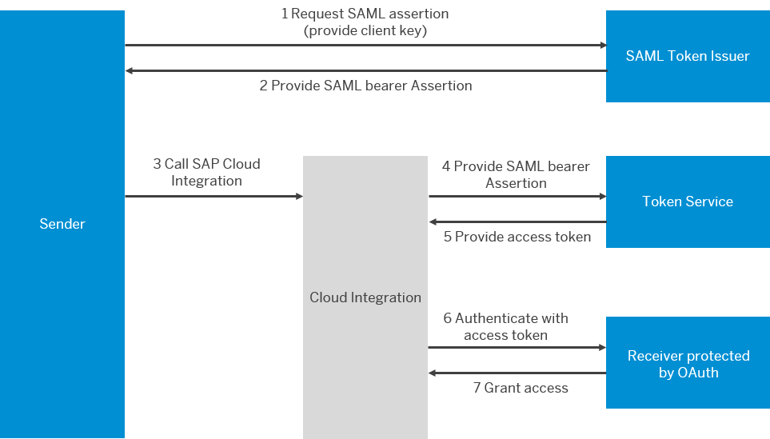
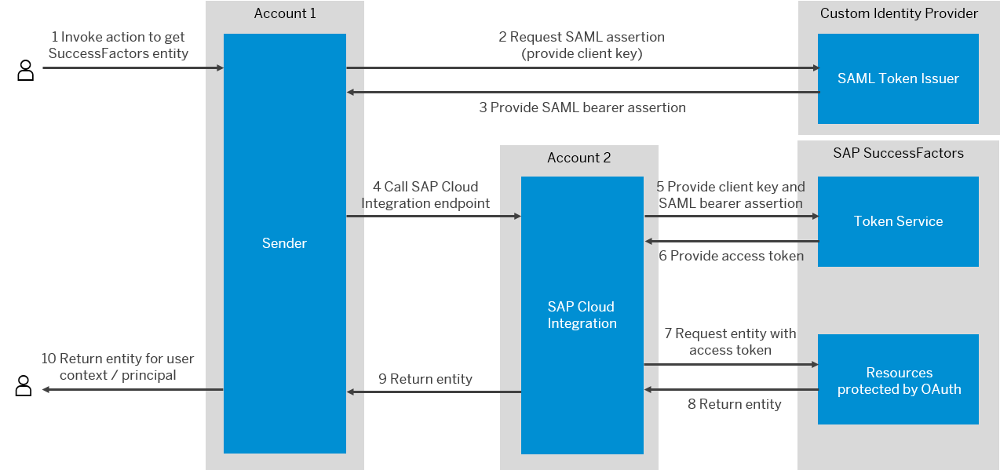

<!-- loio382313443b8d4453b0fd536b82b9e15d -->

<link rel="stylesheet" type="text/css" href="../css/sap-icons.css"/>

# OAuth 2.0

OAuth 2.0 allows a user to grant a client access to a protected resource \(hosted by a resource server\). The user typically restricts the access of the client and doesn't allow full access.

OAuth 2.0 \(Open Authorization\) is an open standard for authorization. It enables users, for example the owners of a protected source, to grant clients restricted access \(scope\) to their data, that is, the protected source without sharing their authorization details. This data is hosted by a resource server \(in terms of Cloud Integration outbound communication, the receiver system\). This means, users restrict access and keep credentials private. In Cloud Integration, the Twitter, Facebook, HTTP, Mail, OData, SFSF, and AMQP adapters support the OAuth 2.0 authorization standard.

OAuth 2.0 uses the following components:

****

<table>
<tr>
<th valign="top">

Component/Term

</th>
<th valign="top">

Description

</th>
<th valign="top">

In the context of Cloud Integration outbound communication, this is ...

</th>
</tr>
<tr>
<td valign="top">

*Resource owner*

</td>
<td valign="top">

Owns the data and allows access to it.

</td>
<td valign="top">

Administrator of the receiver system.

</td>
</tr>
<tr>
<td valign="top">

*Resource server*

</td>
<td valign="top">

Hosts data and accounts of the resource owner.

</td>
<td valign="top">

Receiver system \(functions of the receiver system called by Cloud Integration\)

The protected resources hosted on the resource server are the capabilities or functions of a receiver system called by an integration flow in the context of an integration scenario.

</td>
</tr>
<tr>
<td valign="top">

*OAuth client*

</td>
<td valign="top">

Party that wants to access the data of a resource owner that needs to be authorized.

</td>
<td valign="top">

The Cloud Integration runtime component that calls the receiver.

</td>
</tr>
<tr>
<td valign="top">

*Token service* 

</td>
<td valign="top">

Service that issues OAuth access tokens. A token service is implemented on a system that is referred to in terms of OAuth as an *authorization server*.

</td>
<td valign="top">

Is in general provided or hosted by the receiver system's organization.

</td>
</tr>
<tr>
<td valign="top">

*Token service URL* 

</td>
<td valign="top">

Address of the token service that issues the access token.

</td>
<td valign="top">

 

</td>
</tr>
<tr>
<td valign="top">

*Authorization URL*

</td>
<td valign="top">

Address required to ask for for an authorization code from a resource owner.

With the authorization code, an access token can be fetched from the token service.

This component is only required for the OAuth 2.0 Authorization Code grant type.

</td>
<td valign="top">

 

</td>
</tr>
<tr>
<td valign="top">

*Client credentials*

</td>
<td valign="top">

Comprises client ID and client secret and is used to get an access token \(from the token service\) when using the OAuth 2.0 Client Credentials grant type.

</td>
<td valign="top">

 

</td>
</tr>
<tr>
<td valign="top">

*Access token*

</td>
<td valign="top">

Is used to get access to the protected resource.

</td>
<td valign="top">

 

</td>
</tr>
</table>

When talking about Cloud Integration outbound communication towards a receiver system, protected resources are the capabilities of the receiver system addressed by the integration flow \(outbound communication\). The client in this scenario is the Cloud Integration worker where the integration flow is deployed.

There are three grant types for OAuth 2.0. Grant types refer to the possible ways in which an application can get an access token.

-   OAuth 2.0 Client Credentials

-   OAuth 2.0 SAML Bearer Assertion

-   OAuth 2.0 Authorization Code

A specific OAuth variant is used with the Cloud Integration Twitter and Faceboook adapter.

<a name="loio6316af5a7f2c4f3e870a997fd2d3e04e"/>

<!-- loio6316af5a7f2c4f3e870a997fd2d3e04e -->

## OAuth 2.0 Client Credentials Grant

When OAuth 2.0 client credentials grant is implemented, the client gets access to the protected resources in two steps: After presenting a set of client credentials, the client fetches an access token from the token service. In a subsequent step, the client uses the access token to get access to the protected resources.

In detail, OAuth 2.0 client credentials grant is implemented in the following way for Cloud Integration outbound communication:

At **design time**, the integration developer performs the following tasks:

1.  The integration developer requests the client credentials such as Client ID, Client Secret and token service URL from the administrator of the receiver system

2.  Once the receiver system administrator has shared the credentials and the URL, the integration developer specifies an *OAuth2 Client Credentials* artifact using information requested before and deploys the artifact on the Cloud Integration tenant. Likewise, the integration developer specifies the name of the *OAuth2 Client Credentials* artifact when configuring the receiver adapter of the integration flow involved \(that is used to connect to the receiver system\).

    > ### Note:  
    > See: [Deploying an OAuth2 Client Credentials Artifact](../50-Development/deploying-an-oauth2-client-credentials-artifact-801b106.md)

After these steps have been executed successfully, at **runtime**, the authorization workflow is processed as outlined in the following chart:

1.  Cloud Integration connects to the token service and presents the credentials.

2.  The token service authenticates the client credentials and \(if they are valid\) provides an access token in return.

3.  Cloud Integration authenticates itself against the receiver system \(that hosts the protected resources in OAuth terms\) with the help of the access token and requests access to the protected source.

4.  The receiver system validates the access token and \(if it's valid\) grants access to the protected resource.

<a name="loio68f00f63d900486caab408f9fe8c173e"/>

<!-- loio68f00f63d900486caab408f9fe8c173e -->

## OAuth 2.0 SAML Bearer Assertion Grant

When OAuth 2.0 SAML Bearer Assertion grant is implemented, the client \(Cloud Integration\) gets a SAML Bearer Assertion from a \(SAML\) custom identity provider. Using the SAML Bearer Assertion, the client requests an access token from a token service in a next step \(using the SAML bearer assertion to proof its identity\). Finally, the token service validates the SAML Bearer Assertion and passes back the OAuth access token that can be used to access the protected resources finally.

A SAML Bearer Assertion defines a user context that can be propagated between different systems in a communication scenario – a scenario known as *Principal Propagation*. A SAML Bearer Assertion contains a user and a public certificate that identifies the user at a custom identity provider. The SAML Bearer Assertion enables a component to request an access token from a resource server for the given user context.

The following receiver system types are currently supported:

-   An SAP SuccessFactors system

-   An SAP BTP system \(either Neo or Cloud Foundry\)

> ### Tip:  
> For an example of how this grant type is used with an SAP SuccessFactors system, see:
> 
> [OAuth SAML Bearer Assertion Flow Example](oauth-2-0-3823134.md#loiod724d6189ec64640bc48acf058eb0dc7) \(maps the explanation of the grant type to a concrete system landscape and use case\).
> 
> [SAP Cloud Integration – Principal Propagation with SuccessFactors OData V2](https://blogs.sap.com/2018/07/30/sap-cloud-platform-integration-principal-propagation-with-successfactors-odata-v2/) \(SAP Community blog describing step by step how to set up this example\)

In detail, OAuth 2.0 SAML Bearer Assertion grant is implemented in the following way for Cloud Integration outbound communication:

At **design time**, the integration developer performs the following tasks:

1.  The integration developer creates a trust relationship between the sender system and Cloud Integration.

2.  The integration developer creates an OAuth client for Cloud Integration \(required to define the connection from the sender to Cloud Integration\).

3.  The integration developer creates an OAuth client for the receiver system \(required to define the connection from Cloud Integration to the receiver\).

    You specify the signing certificate of the certificate defined when setting up the trust relationship \(that way, you exchange the public certificate for the custom identity provider associated with Cloud Integration with the receiver system\).

    During this step, a client key is created \(that is needed to specify the security artifact for Cloud Integration\). This is a key to access the API of the receiver system \(API key\).

4.  The integration developer gets information such like token service URL, the type of receiver system, and additional information specific for the receiver system type. In case the *SuccessFactors* system type is chosen, a company ID is given that indicates the client instance used to connect to the SuccessFactors system. In case the *SAP Cloud BTP* \(Neo or Cloud Foundry\) system type is chosen, a token service user and password is given that indicates the user to access the token service

    This information is needed to define the *OAuth2 SAML Bearer Assertion* artifact to be referred to in the related receiver adapter

5.  Once the information is known, the integration developer specifies an *OAuth2 SAML Bearer Assertion* artifact using information requested before and deploys the artifact on Cloud Integration. Likewise, the integration developer specifies the name of the *OAuth2 SAML Bearer Assertion* artifact when configuring the receiver adapter of the integration flow involved \(that is used to connect to the receiver system\).

    More information: [Deploying an OAuth2 SAML Bearer Assertion](../50-Development/deploying-an-oauth2-saml-bearer-assertion-3ee6582.md)

6.  Set up the connection of the sender to Cloud Integration \(for example, by defining a destination in the sender system\). During this step, you need to specify token service URL, token service user, and password of the subaccount that hosts the SAP Integration Suite tenant.

When these steps have been executed successfully, at **runtime**, the authorization workflow is processed as outlined in the following chart:

1.  The sender sends the client key to the SAML token issuer.

2.  The SAML token issuer authenticates the client key and, if valid, provides the sender with the SAML Bearer Assertion \(for the given user context\).

3.  The sender requests processing of the related integration flow on the Cloud Integration tenant \(and provides the SAML Bearer Assertion with the request\).

    This step is executed via an SAP BTP destination with `OAuth2SAMLBearer` authentication.

4.  Cloud Integration connects to the token service and presents the SAML Bearer Assertion.

5.  The token service validates the SAML Bearer Assertion and \(if it is valid\) provides an access token in return.

6.  Cloud Integration authenticates itself against the receiver system with the help of access token and requests access to the protected resource. Note that the receiver system contains the protected resources in terms of OAuth.

7.  The receiver system validates the access token and \(if it's valid\) grants access to the protected resource.

**Related Information**  

[OAuth SAML Bearer Assertion Flow Example](oauth-2-0-3823134.md#loiod724d6189ec64640bc48acf058eb0dc7 "")

<a name="loiod724d6189ec64640bc48acf058eb0dc7"/>

<!-- loiod724d6189ec64640bc48acf058eb0dc7 -->

### OAuth SAML Bearer Assertion Flow Example

In the example, OAuth SAML Bearer Assertion grant type is used with the SuccessFactors OData V2 receiver adapter.

You find a detailed description how to configure and set up this example step by step in the following SAP Community blog: [SAP Cloud Integration – Principal Propagation with SuccessFactors OData V2](https://blogs.sap.com/2018/07/30/sap-cloud-platform-integration-principal-propagation-with-successfactors-odata-v2/).

We summarize how the components involved interact with each other, the steps how to configure the scenario, and the OAuth authorization workflow.

In this example, the user logs in to a sender app to fetch tasks retrieved from an SAP SuccessFactors system \(which, in OAuth terms, contains the protected resources\).

Cloud Integration is interconnected with the sender and SAP SuccessFactors. The connection to the SucessFactors system is configured using the SuccessFactors OData V2 receiver adapter.

In this scenario, Cloud Integration fetches the tasks of the user logged in to the sender app. Therefore, the user context \(principal\) needs to be propagated from the sender app to Cloud Integration, and, finally, from Cloud Integration to SAP SuccessFactors. Principal propagation is achieved through the OAuth2 SAML Bearer assertion flow.

The sender app uses a custom identity provider that also acts as SAML token issuer.

The following figure maps the entities described generally in [OAuth 2.0 SAML Bearer Assertion Grant](oauth-2-0-3823134.md#loio68f00f63d900486caab408f9fe8c173e) to the concrete use case and system landscape given in the example.

When configured as described in the blog [SAP Cloud Integration – Principal Propagation with SuccessFactors OData V2](https://blogs.sap.com/2018/07/30/sap-cloud-platform-integration-principal-propagation-with-successfactors-odata-v2/), the authorization flow works in the following way.

1.  The user \(logged in to the sender app deployed on account 1\) invokes an action to get an SAP SuccessFactors entity \(task\).

2.  The sender app requests the SAML assertion from the custom identity provider \(providing the client key\).

    The sender app communicates with the integration flow via an SAP BTP destination configured in account 1. When connecting to the custom identity provider to get the SAML assertion, account 1 communicates with the custom identity provider based on this destination.

3.  The custom identity provider sends back the SAML assertion.

4.  The sender calls the Cloud Integration endpoint \(of the related integration flow\).

    This step is executed via an SAP BTP destination with `OAuth2SAMLBearer` authentication.

5.  Cloud Integration connects to the token service \(part of SAP SuccessFactors\) providing the information stored in the *OAuth2 SAML Bearer Assertion* credentials artifact \(deployed on the Cloud Integration tenant and referred to in the SuccessFactors receiver adapter\).

6.  The token service returns the OAuth access token.

7.  Cloud Integration uses the access token to request the SAP SuccessFactors entity.

8.  SAP SuccessFactors checks if the token is valid and, if that's the case, returns the entity.

9.  Cloud Integration returns the SAP SuccessFactors entity to the sender app.

10. The sender app returns the entity for the given user context.

<a name="loio508a70db7eac4addbb6ac69a06d46e79"/>

<!-- loio508a70db7eac4addbb6ac69a06d46e79 -->

## OAuth 2.0 Authorization Code Grant

The grant type Authorization Code is the most complex grant type and offers an additional level of security. The user password is never visible to the OAuth client.

In detail, OAuth 2.0 Authorization Code grant is implemented in the following way for Cloud Integration outbound communication:

As a prerequisite to initiate the Authorization Code grant workflow, the integration developer performs the following tasks:

> ### Note:  
> The integration developer and the account user are typically the same person just with different roles.

1.  The integration developer registers an application, so an OAuth 2.0 client \(with client Id, client secret, authorization URL, and token service URL\) is created. For the Mail adapter, the integration developer creates the OAuth 2.0 client in Microsoft Active Directory tenant.

    > ### Note:  
    > For the registration of the application, you need to specify a Redirect URI which is used by the Token Service to return the authorization code to the SAP Integration Suite tenant. Determine the Redirect URI in the following way:
    > 
    > 1.  Log into SAP Integration Suite and check your host name in the browser address field:
    > 
    >     `https://<host name>/itspaces`
    > 
    > 2.  Use the <host name\> to construct the following redirect URI:
    > 
    >     `https://<host name>/itspaces/odata/api/v1/OAuthTokenFromCode`

2.  The integration developer uses SAP Integration Suite and creates an *OAuth2 Authorization Code* credentials artifact and deploys it on the SAP Integration Suite tenant. During this step, the integration developer specifies the parameters *Client ID*, *Client Secret*, *Authorization URL*, and *Token Service URL* based on the values generated when creating the OAuth client in the previous step. After this step, the credential is in status *Unauthorized*.

    See: [Deploying an OAuth2 Authorization Code](../50-Development/deploying-an-oauth2-authorization-code-081bfd7.md).

When these steps have been executed successfully, at the authorization workflow is processed as outlined in the following chart. Note that the workflow depicted in the figure comprises user actions \(of the integration developer\) and system steps \(executed by the Cloud Integration worker\).

The following chart explains the flow for OAuth 2.0 Authorization Code:

1.  The integration developer authorizes the *OAuth2 Authorization Code* credentials artifact using the Cloud Integration Web UI.

2.  Triggered by the *Authorize* action, Cloud Integration requests user authorization for certain scopes of the application from the token server \(Authorization URL is used\).

3.  The token service prompts a user login screen and requests the approval of the user for the app.

4.  The account user grants approval.

5.  After the user gave his/her approval, the token service returns the authorization code of the user to the SAP Integration Suite tenant \(Redirect URL\).

6.  Cloud Integration calls the OAuth 2.0 token endpoint of the token service with the client ID, client secret, and the authorization code \(Token Service URL with "authorization\_code" grant type is used\).

7.  The token service checks the request and sends a refresh token as response. It also sends an access token that is ignored by the SAP Integration Suite tenant \(Token Service URL with "authorization\_code" grant type is used\).

8.  Cloud Integration stores the refresh token and the user name together with the client Id, client secret, and the scopes in the OAuth 2.0 Authorization Code.

    The status of the *OAuth2 Authorization Code* credentials artifact changes to *Deployed*.

9.  The Cloud Integration worker reads OAuth 2.0 Authorization Code information and calls the token service with client Id, client secret, and refresh token \(Token Service URL with "refresh\_token" grant type is used\).

10. The token service sends back an access token \(Token Service URL with "refresh\_token" grant type is used\).

11. The Cloud Integration worker connects to the receiver system protected by OAuth 2.0 and requests access with the access token and user name if necessary.

> ### Note:  
> -   *Refresh Token:* A refresh token must be valid at least for 3 days, although Microsoft allows shorter validity periods \(up to 10 minutes\).
> 
> -   *Refresh Token:* The refresh token is automatically updated before it expires by a scheduled job.
> 
> -   The maximum number of OAuth2 Authorization Code credentials is 500 \(including the Microsoft 365 credentials\).

<a name="loiocacd00949e164a2fb56af7b6803d830d"/>

<!-- loiocacd00949e164a2fb56af7b6803d830d -->

## OAuth 2.0 Used WithTwitter and Facebook Adapter

OAuth can be used for outbound communication with the Twitter or Facebook receiver adapter. In this case, the OAuth 2.0 roles are used in the following way:

-   The tenant is the client that accesses Twitter or Facebook \(as resource server\).

-   The Twitter or Facebook account owner is the user \(that owns the protected resources which is Twitter or Facebook content\).

-   Using an API \(for Twitter or Facebook\), the user generates the OAuth 2.0 credentials \(client credentials as well as token credentials\) required in order to access the protected resources.

-   The user provides the client \(tenant\) with the OAuth 2.0 credentials in the following way:

    For each OAuth 2.0 credential, a separate *Secure Parameter* artifact is created and deployed on the tenant. In the Twitter or Facebook adapter, the credential names are specified.

The following figure illustrates the OAuth 2.0 communication flow for this use case.

<a name="loio9a6c395778da484ab21cd7138c3e86b4"/>

<!-- loio9a6c395778da484ab21cd7138c3e86b4 -->

## Adapters Supporting OAuth 2.0 \(Outbound Communication\)

The following receiver adapters support OAuth 2.0.

****

<table>
<tr>
<th valign="top">

Receiver Adapter

</th>
<th valign="top">

OAuth 2.0 Client Credentials Grant

</th>
<th valign="top">

OAuth 2.0 SAML Bearer Assertion Grant

</th>
<th valign="top">

OAuth 2.0 Authorization Code Grant

</th>
<th valign="top">

OAuth 2.0 for Twitter/Facebook Adapter

</th>
</tr>
<tr>
<td valign="top">

AMQP/Websocket

</td>
<td valign="top">

:heavy_check_mark:

</td>
<td valign="top">

 

</td>
<td valign="top">

 

</td>
<td valign="top">

 

</td>
</tr>
<tr>
<td valign="top">

Facebook

</td>
<td valign="top">

 

</td>
<td valign="top">

 

</td>
<td valign="top">

 

</td>
<td valign="top">

:heavy_check_mark:

</td>
</tr>
<tr>
<td valign="top">

HTTP

</td>
<td valign="top">

:heavy_check_mark:

</td>
<td valign="top">

:heavy_check_mark:

</td>
<td valign="top">

 

</td>
<td valign="top">

 

</td>
</tr>
<tr>
<td valign="top">

Mail

</td>
<td valign="top">

 

</td>
<td valign="top">

 

</td>
<td valign="top">

:heavy_check_mark:

</td>
<td valign="top">

 

</td>
</tr>
<tr>
<td valign="top">

OData/V2

</td>
<td valign="top">

:heavy_check_mark:

</td>
<td valign="top">

:heavy_check_mark:

</td>
<td valign="top">

 

</td>
<td valign="top">

 

</td>
</tr>
<tr>
<td valign="top">

OData/V4

</td>
<td valign="top">

:heavy_check_mark:

</td>
<td valign="top">

 

</td>
<td valign="top">

 

</td>
<td valign="top">

 

</td>
</tr>
<tr>
<td valign="top">

SuccessFactors/OData V2

</td>
<td valign="top">

 

</td>
<td valign="top">

:heavy_check_mark:

</td>
<td valign="top">

 

</td>
<td valign="top">

 

</td>
</tr>
<tr>
<td valign="top">

SuccessFactors/ SOAP

</td>
<td valign="top">

 

</td>
<td valign="top">

:heavy_check_mark:

</td>
<td valign="top">

 

</td>
<td valign="top">

 

</td>
</tr>
<tr>
<td valign="top">

Twitter

</td>
<td valign="top">

 

</td>
<td valign="top">

 

</td>
<td valign="top">

 

</td>
<td valign="top">

:heavy_check_mark:

</td>
</tr>
</table>

