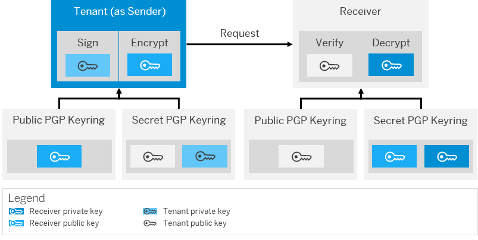

<!-- loio8641a15cff7e4dbd83528556aba1660c -->

# Outbound: Message-Level Security with OpenPGP

On top of a secure transport channel \(for example, based on HTTPS\), you have the option to implement message-level security capabilities. That way, you can protect the message by applying digital signing or encryption. Asymmetric key technology is used in the following way to implement these features:

**Keys for Message-Level Security**

<table>
<tr>
<th valign="top">

Key Type

</th>
<th valign="top">

Usage

</th>
</tr>
<tr>
<td valign="top" rowspan="2">

**Private key** 

</td>
<td valign="top">

Used by a sender to sign a message

</td>
</tr>
<tr>
<td valign="top">

Used by a receiver to decrypt a message \(that has been encrypted by a sender\)

</td>
</tr>
<tr>
<td valign="top" rowspan="2">

**Public key** 

</td>
<td valign="top">

Used by a receiver to verify a message \(signed by a sender\)

</td>
</tr>
<tr>
<td valign="top">

Used by a sender to encrypt a message

</td>
</tr>
</table>

In the outbound case, the tenant acts as sender that either encrypts or signs a message.

To implement message-level security for OpenPGP, you use PGP keys.

**Related Information**  

[How OpenPGP Works](how-openpgp-works-29bc188.md "You can use Open Pretty Good Privacy (Open PGP) to digitally sign and encrypt messages.")

[Creating OpenPGP Keys](creating-openpgp-keys-6c5846b.md "You use the tool gpg4win to create the required keys for the usage of OpenPGP.")

