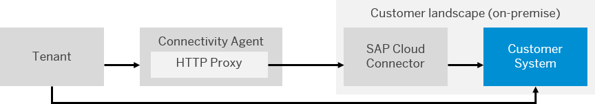

<!-- loio642e87f1492146998a8eb0779cd07289 -->

# Outbound: SAP Cloud Connector

SAP Cloud Connector \(SCC\) runs as on premise agent in a secured network and acts as a reverse invoke proxy between the on premise network and SAP Integration Suite . Due to its reverse invoke support, you don't need to configure the on premise firewall to allow external access from the cloud to internal systems.

You can configure an outbound connection from the tenant via SAP Cloud Connector \(SCC\). The following figure illustrates how the connection is set up and the basic components of the scenario.

You need to install and configure the SAP Cloud Connector on your on premise systems for this mode of outbound communication. For more information on installing and configuring SCC, you can refer to [Using SAP Cloud Connector with Cloud Integration Adapters](using-sap-cloud-connector-with-cloud-integration-adapters-65a60e7.md)

## More Information

These documents describe step-by-step how to install SAP Cloud Connector for different scenarios:

[http://scn.sap.com/docs/DOC-42533](http://scn.sap.com/docs/DOC-42533)

[http://scn.sap.com/docs/DOC-62598](http://scn.sap.com/docs/DOC-62598)

