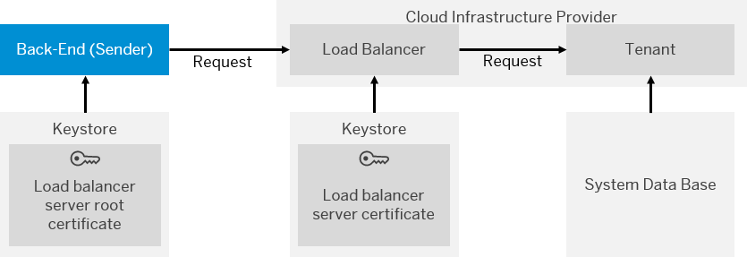

<!-- loio1779401229b74629bfcdc18cca8b3966 -->

# Renewal of Load Balancer Server Certificate

In this use case, the load balancer server certificate has to be renewed. In the renewal process, the load balancer administrator \(at the site of the cloud infrastructure provider\) and the sender back-end administrator \(at the customer side\) collaborate with each other.

The following figure illustrates the communication path that is relevant for this use case.

> ### Note:  

Certificate renewal has to be performed in the following sequence.

1.  Load balancer administrator: Creates new key pair/certificate with new CA root certificate.
2.  Load balancer administrator: Informs tenant administrator that virtual server certificate will be exchanged at a certain point in time and forwards new root \(CA\) certificate.
3.  Tenant administrator: Informs sender administrator and forwards the new root certificate to the sender.
4.  Sender administrator: Adds the new root certificate to the truststore of the sender back-end \(HTTPS client\).
5.  Load balancer administrator: Exchanges the load balancer virtual server key pair/certificate at the specified point in time.
6.  Sender administrator: Can now remove the old root certificate form the truststore of the sender back-end \(HTTPS client\) after the specified point in time has passed.

**Related Information**  

[Involved Roles](involved-roles-3968091.md "The security artifact renewal process requires that different persons perform a sequence of steps in a coordinated way on each side of the communication. The exact sequence depends on the kind of security material which is renewed and on the use case.")

