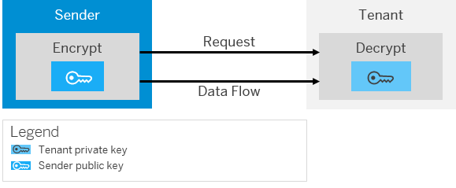

<!-- loio66cbb514a6394d30aaa229fa265b3b5a -->

# Renewal of OpenPGP Encryption Key - Inbound

In this use case, the tenant is the receiver \(inbound communication\) and renews the encryption key.

The following figure illustrates the communication path that is relevant for this use case:

1.  Tenant administrator: Creates a new PGP key pair with the same user ID as the old key in the PGP Secret Keyring.
2.  Tenant administrator: Deploys the changed PGP Secret Keyring.

    From this moment on the PGP decryptor accepts payloads encrypted with the old key or payloads encrypted with the new public key.

3.  Tenant administrator: Exports the new PGP public key.
4.  Tenant administrator: Provides the sender administrator with the exported key via a secure channel and informs the sender administrator about the following:
    -   For a certain period of time the tenant will be able to accept payloads encrypted with the old key or payloads encrypted with the new public key.
    -   After this period only payloads encrypted with the new key are accepted.

5.  Sender administrator: Exchanges the old key with the new key, so that from now on the sender system sends payloads encrypted with the new key.
6.  After the specified period is over, the tenant administrator removes the old key pair from the PGP Secret Keyring and deploys the PGP Secret keyring.

**Related Information**  

[Involved Roles](involved-roles-3968091.md "The security artifact renewal process requires that different persons perform a sequence of steps in a coordinated way on each side of the communication. The exact sequence depends on the kind of security material which is renewed and on the use case.")

