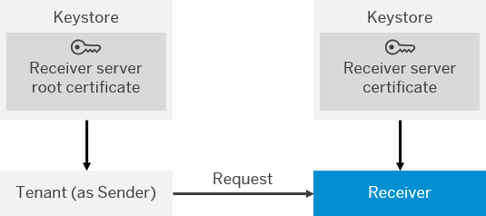

<!-- loio3f4eb83726c7455fb91d3c3de513da0f -->

# Renewal of Receiver Back-End Server Certificate

In this use case, the server certificate \(of the receiver\) has to be renewed.

The following figure illustrates the communication path that is relevant for this use case.

> ### Note:  

Certificate renewal has to be performed in the following sequence:

> ### Note:  
> This process is also applicable in case a SuccessFactors adapter is used in the receiver channel.

> ### Note:  
> It is assumed here that the exchange of the server certificate does not cause any downtime of the server. The load balancer, AS ABAP \(in case the receiver is an SAP system based on AS ABAP\) and also the SAP JEE Engine support this.

1.  Receiver administrator: Ceates key pair/certificate for the receiver \(server\) and uses a different CA certificate to sign the server certificate.
2.  Receiver administrator: Provides the tenant administrator with the server root certificate \(of the CA\).
3.  Tenant administrator: Imports the root certificate into the tenant client keystore \(of the tenant\).
4.  Tenant administrator: Restarts all integration flows which are sending via HTTPS data to the receiver system.

    This is required because the SSL socket caches the keystore for 24 hours.

5.  Tenant administrator: Informs receiver administrator that root certificate has been added.
6.  Receiver administrator: Exchanges the key pair/certificate in the receiver system.
7.  Receiver administrator: Informs the tenant administrator that the old root certificate can be removed.
8.  Tenant administrator: Deletes the old root certificate from the tenant client keystore.

**Related Information**  

[Involved Roles](involved-roles-3968091.md "The security artifact renewal process requires that different persons perform a sequence of steps in a coordinated way on each side of the communication. The exact sequence depends on the kind of security material which is renewed and on the use case.")

