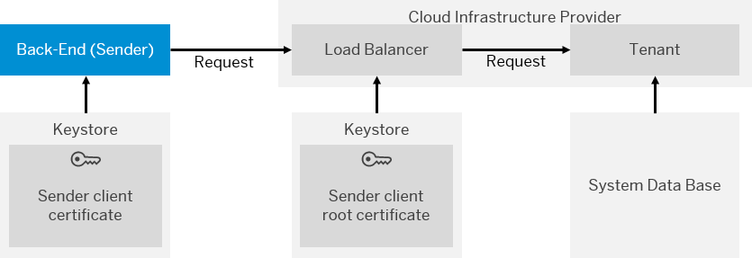

<!-- loio2d3cae71ef0c447d8c42b25194524b2a -->

# Renewal of Sender Back-End Client Certificate

In this use case, the client certificate \(of the sender\) has to be renewed.

The following figure illustrates the communication path that is relevant for this use case.

> ### Note:  

Certificate revewal has to be performed in the following sequence.

1.  Sender administrator: Creates new key pair/client certificate \(also the root certificate \(CA\) may be changed\).
2.  Sender administrator: Provides tenant administrator with the certificate and the root certificate.

    Sender administrator has to make sure that the client certificate in the sender keystore is signed by one CA that is listed in [Load Balancer Root Certificates Supported by SAP](load-balancer-root-certificates-supported-by-sap-4509f60.md).

3.  After the CA certificate was added to the truststore of the virtual server, tenant administrator forwards the certificate to the integration developer and asks him to add the subject and issuer DN of the certificate to the authorization interceptor of the inbound channel corresponding to the sender system.
4.  Integration developer and tenant adminstrator need to perform the following steps:
    1.  Integration developer:

        In all HTTP-based sender channels \(like HTTP, SOAP, SAP XI, AS2\) with *Authorization* setting *Client Certificate* adapts entries for the *Subject DN* and *Issuer DN* with the entries for the new client certificate, and redeploys the corresponding integration flows.

    2.  Tenant administrator:

        If the involved integration flows use HTTP-based sender channels with *Authorization* setting *User Role*, the tenant administrator creates a new Certificate-to-User Mapping with the new certificate \(making sure that the same user like in the entry with the old certificate is used\).

5.  Integration developer: Informs the tenant administrator that authorization interceptor has been configured with the new certificate.
6.  Tenant administrator: Informs the sender administrator that he now can sent messages with the new client certificate.
7.  Sender administrator: Configures sender system that way that it sends HTTPS messages with the new client certificate.
8.  Sender administrator: Informs tenant administrator that sender system is using now the new client certificate for the HTTPS communication.
9.  The tenant adminstrator needs to perform the following steps:
    1.  If the involved integration flows use HTTP-based sender channels with *Authorization* setting *Client Certificate* \(see step 4 a\)\), the tenant administrator informs the integration developer that he or she can remove the DNs of the old certificate from the authorization interceptor in the integration flows.

    2.  If there is an entry in the Certificate-to-User Mappings with the old certificate, the tenant administrator removes this entry.

10. Integration developer: Removes the DNs of the old certificate from the authorization interceptor in the integration flow and redeploys the integration flow.

> ### Note:  
> Steps 4-6 and 10-11 are only necessary if the subject DN or issuer DN of the certificate has been changed.

**Related Information**  

[Involved Roles](involved-roles-3968091.md "The security artifact renewal process requires that different persons perform a sequence of steps in a coordinated way on each side of the communication. The exact sequence depends on the kind of security material which is renewed and on the use case.")

