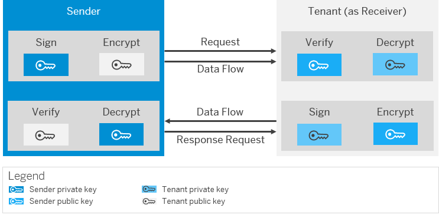
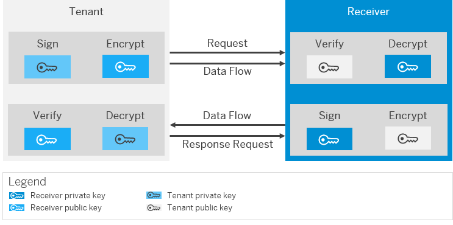

<!-- loio169b0b5b16d2415590bc3ce84cc4a918 -->

# Security Artifact Renewal for WS-Security

Web services allow you to implement the request-response pattern. Web-Services Security \(WS-Security\) allows you to protect the request and response messages with digital signatures and encryption.

For Web services scenarios, there are separate security artifact renewal use cases for both request and response messages. WS-Security settings are configured in the sender and receiver SOAP adapters - depending on whether the tenant is a Web services provider or Web services consumer.

## Inbound Communication \(Tenant as WS Provider\)

The following figure illustrates the communication paths that have to be considered when using WS-Security.

The corresponding settings on the tenant side are configured in the sender SOAP adapter.

The table below contains the security renewal use cases:

**Security Renewal Use Cases \(Inbound Communication\)**

<table>
<tr>
<th valign="top">

Use Case

</th>
<th valign="top">

More information

</th>
</tr>
<tr>
<td valign="top">

Tenant verifies inbound request message.

</td>
<td valign="top">

[Security Artifact Renewal for WS-Security \(Tenant Verifies Inbound Request\)](security-artifact-renewal-for-ws-security-tenant-verifies-inbound-request-266470d.md)

</td>
</tr>
<tr>
<td valign="top">

Tenant decrypts inbound request message.

</td>
<td valign="top">

[Security Artifact Renewal for WS-Security \(Tenant Decrypts Inbound Request\)](security-artifact-renewal-for-ws-security-tenant-decrypts-inbound-request-192762b.md)

</td>
</tr>
<tr>
<td valign="top">

Tenant signs inbound response message.

</td>
<td valign="top">

[Security Artifact Renewal for WS-Security \(Tenant Signs Inbound Response\)](security-artifact-renewal-for-ws-security-tenant-signs-inbound-response-a6ccced.md)

</td>
</tr>
<tr>
<td valign="top">

Tenant encrypts inbound response message.

</td>
<td valign="top">

[Security Artifact Renewal for WS-Security \(Tenant Encrypts Inbound Response\)](security-artifact-renewal-for-ws-security-tenant-encrypts-inbound-response-fdea960.md)

</td>
</tr>
</table>

> ### Note:  
> The terms *inbound* and *outbound* used in this section reflect the perspective of the tenant. *Tenant verifies inbound request message* refers to the request message sent from a sender system to the tenant \(incoming message at tenant side\).

## Outbound Communication \(Tenant as WS Consumer\)

The following figure illustrates the communication paths that have to be considered when using WS-Security.

The corresponding settings at tenant side are configured in the receiver SOAP adapter.

The table contains the security renewal use cases:

**Security Renewal Use Cases \(Inbound Communication\)**

<table>
<tr>
<th valign="top">

Use Case

</th>
<th valign="top">

More information

</th>
</tr>
<tr>
<td valign="top">

Tenant signs outbound request message.

</td>
<td valign="top">

[Security Artifact Renewal for WS-Security \(Tenant Signs Outbound Request\)](security-artifact-renewal-for-ws-security-tenant-signs-outbound-request-10c32fe.md)

</td>
</tr>
<tr>
<td valign="top">

Tenant encrypts outbound request message.

</td>
<td valign="top">

[Security Artifact Renewal for WS-Security \(Tenant Encrypts Outbound Request\)](security-artifact-renewal-for-ws-security-tenant-encrypts-outbound-request-efb83b3.md)

</td>
</tr>
<tr>
<td valign="top">

Tenant verifies outbound response message.

</td>
<td valign="top">

[Security Artifact Renewal for WS-Security \(Tenant Verifies Outbound Response\)](security-artifact-renewal-for-ws-security-tenant-verifies-outbound-response-289b653.md)

</td>
</tr>
<tr>
<td valign="top">

Tenant decrypts outbound response message.

</td>
<td valign="top">

[Security Artifact Renewal for WS-Security \(Tenant Decrypts Outbound Response\)](security-artifact-renewal-for-ws-security-tenant-decrypts-outbound-response-90b85ec.md)

</td>
</tr>
</table>

**Related Information**  

[WS-Security Configuration for the Sender SOAP 1.x Adapter](../50-Development/ws-security-configuration-for-the-sender-soap-1-x-adapter-e53bb5c.md "")

[WS-Security Configuration for the Receiver SOAP 1.x Adapter](../50-Development/ws-security-configuration-for-the-receiver-soap-1-x-adapter-e9f42bf.md "")

[SOAP \(SOAP 1.x\) Adapter](../50-Development/soap-soap-1-x-adapter-b847968.md "With this adapter, the tenant can exchange messages with another system that supports Simple Object Access Protocol (SOAP) 1.1 or SOAP 1.2.")

