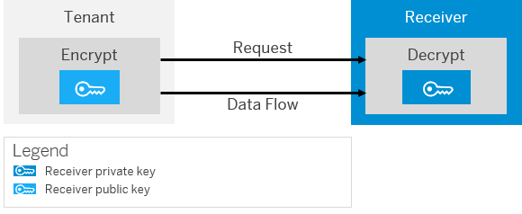

<!-- loioefb83b33bbfd4408ad36048b9b64688b -->

# Security Artifact Renewal for WS-Security \(Tenant Encrypts Outbound Request\)

This use case covers all situations where a private key used for message decryption is changed by a receiver. The renewal process ensures that the related public encryption key is changed on the tenant side so that no or minimum downtime is required.

The encryptor uses a public key to encrypt a payload.

This public key is provided in the tenant keystore with an X.509 certificate. The encryptor uses an alias configured in the corresponding integration flow step to locate the public key in the keystore. The encrypted WS-Security data contains either the certificate of the public key corresponding to the private key or the issuer and serial version number of the certificate so that the receiver can easily determine the certificate and private key to be used for the decryption.

The renewal process depends on whether the receiver system can decrypt XML Encryption data with different public keys at the same time.

The following figure illustrates the communication path for this use case.

## Receiver is Able to Verify Payloads Encrypted by the Old Key and Payloads Encrypted by the New Key at the Same Time

1.  Receiver administrator: Creates a new key pair/certificate.
2.  Receiver administrator: Configures the receiver system so that it can decrypt payloads encrypted by the old key and payloads encrypted by the new key.
3.  Receiver administrator: Provides the tenant administrator with the new certificate and informs the tenant administrator that the receiver system can verify payloads signed by the old key and payloads signed by the new key.
4.  Tenant administrator: Exchanges the old key pair/certificate with the new key pair/certificate in the keystore, keeping the old alias.

    From now on, data is encrypted with the new key.

5.  Tenant administrator: Informs the receiver administrator that the certificate has been exchanged.
6.  Receiver administrator: Removes the old certificate so that from now on the receiver system can only verify payloads signed by the new key.

## Receiver is Only Able to Verify Payloads Encrypted by the Same Key at One Time

1.  Receiver administrator: Creates a new key pair/certificate.
2.  Receiver administrator: Provides the tenant administrator with the new certificate.
3.  Tenant administrator: Agrees a downtime with the receiver administrator so that no encrypted messages are sent during the certificate exchange.
4.  Tenant administrator: Informs the integration developer that the integration flow that specifies the encryption of the payload must be undeployed.
5.  Integration developer: Undeploys integration flow \(using the *Deployed Artifacts* editor tab of the Integration Operations feature\).

    From now on, no encrypted messages are sent to the receiver system.

6.  Integration developer: Informs the tenant administrator about the preceding step.
7.  Tenant administrator: Exchanges the old certificate with the new certificate, keeping the old alias in the keystore.

    From now on, data is encrypted with the new key.

8.  Tenant administrator: Informs the receiver administrator that no encrypted messages are being sent.
9.  Receiver administrator: Exchanges the key pair/certificate in the receiver system.
10. Receiver administrator: Informs the tenant administrator that from now on the receiver system expects payloads encrypted by the new key.
11. Tenant administrator: Informs the integration developer that the integration flow can be redeployed.
12. Integration developer: Redeploys the integration flow \(using the *Deployed Artifacts* editor tab of the Integration Operations feature\).

The participants have to make sure that old keys are kept for at least 90 days after they have been exchanged for new ones. This is to ensure that messages can still be decrypted with the old keys for a period of time.

**Related Information**  

[How WS-Security Works](how-ws-security-works-2f9a038.md "Messages can be protected according to the WS-Security standard.")

[Involved Roles](involved-roles-3968091.md "The security artifact renewal process requires that different persons perform a sequence of steps in a coordinated way on each side of the communication. The exact sequence depends on the kind of security material which is renewed and on the use case.")

