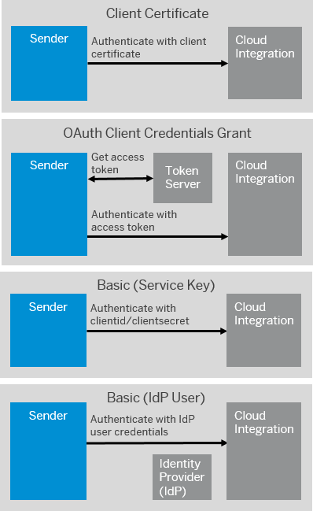

<!-- loio0f92842bee8a46a9890c8b02b6bec05a -->

# Setting Up Inbound HTTP Connections \(Integration Flow Processing\)

Enable a sender system to send messages to Cloud Integration over the HTTP protocol.

The following figure shows the authentication options for *User Role* authorization.

### Client Certificate Authentication

Sender is authenticated based on a client certificate.

You can either use an SAP-generated certificate created with a service key or a certificate created with an external tool.

At runtime, the system checks if a service key is available that contains the client certificate provided by the sender. If a service key is available, the system then checks if the associated service instance has a role specified that grants permissions to call the integration flow endpoint.

> ### Note:  
> This option is a recommended and secure way to set up HTTP inbound connections.

**More Information:**

-   How to configure: [Client Certificate Authentication for Integration Flow Processing](client-certificate-authentication-for-integration-flow-processing-7f84d16.md)

-   How it works \(concept\): [Client Certificate Authentication \(Inbound\)](client-certificate-authentication-inbound-4ec6192.md) 

### OAuth Client Credentials Grant

Sender is authenticated based on an OAuth access token. The access token is retrieved in a preceding call from a token server.

There are 2 options to authenticate the sender against the token server:

-   Using clientId and clientsecret from the service key

-   Using a client certificate

    You can either use an SAP-generated certificate created with a service key or a certificate created with an external tool.

> ### Note:  
> This option is a recommended and secure way to set up HTTP inbound connections.

More information:

-   How to configure: [OAuth with Client Credentials Grant for Integration Flow Processing](oauth-with-client-credentials-grant-for-integration-flow-processing-6c052ce.md)

-   How it works \(concept\): [OAuth Authentication with Client Credentials Grant \(Inbound\)](oauth-authentication-with-client-credentials-grant-inbound-b9df724.md) 

### Basic Authentication with clientid and clientsecret

Sender is authenticated based on credentials \(clientid and clientsecret\) that are generated together with a service key.

> ### Note:  
> Basic authentication doesn't provide strong security. Therefore, it's not recommended for productive scenarios. However, you can use basic authentication for testing purposes as it requires only minimal effort to configure this option.

More information:

-   How to configure: [Basic Authentication with clientId and clientsecret for Integration Flow Processing](basic-authentication-with-clientid-and-clientsecret-for-integration-flow-processing-647eeb3.md)

-   How it works \(concept\): [Basic Authentication](basic-authentication-2c4c2d9.md) 

### Basic Authentication with IdP User

Sender is authenticated based on user credentials associated with a user registered at an identity provider \(IdP\).

> ### Note:  
> Basic authentication doesn't provide strong security. Therefore, it's not recommended for productive scenarios. However, you can use basic authentication for testing purposes as it requires only minimal effort to configure this option.

**More information: [Basic Authentication of IdP User for Integration Flow Processing](basic-authentication-of-idp-user-for-integration-flow-processing-5d46e56.md)**

> ### Note:  
> **Note Related to Application Server ABAP**
> 
> If an SAP system based on Application Server ABAP sends requests to Cloud Integration and there are 2 or more worker nodes enabled on Cloud Integration side, you can receive an `HTTP/1.1 403` authentication error. The root cause is that the SAP kernel encodes the cookies' value by default, which breaks the load-balancing feature. To solve the issue, set profile parameter `ict/disable_cookie_urlencoding` to `1` or `2` depending on kernel level. For more information, see SAP note [2681175](https://me.sap.com/notes/2681175).

> ### Note:  
> **Note Related to Role Configuration**
> 
> Depending on the chosen inbound authorization option, you define permissions for sender systems to call integration flow endpoints in different ways:
> 
> ****
> 
> 
> <table>
> <tr>
> <th valign="top">
> 
> Option
> 
> </th>
> <th valign="top">
> 
> Summary of Steps
> 
> </th>
> </tr>
> <tr>
> <td valign="top">
> 
> Basic authentication of a user registered at an identity provider \(IdP\)
> 
> </td>
> <td valign="top">
> 
> Use SAP BTP cockpit to define a role collection that contains the predefined role template `MessagingSend` and assign the role collection to the IdP user \(under *Security* \> *Trust Configuration*\). The role template `MessagingSend` is provided by default in your subaccount to define permissions for sender systems to call integration flow endpoints for this use case.
> 
> See: [Basic Authentication of IdP User for Integration Flow Processing](basic-authentication-of-idp-user-for-integration-flow-processing-5d46e56.md)
> 
> </td>
> </tr>
> <tr>
> <td valign="top">
> 
> Authentication with an OAuth client \(service instance\)
> 
> </td>
> <td valign="top">
> 
> Use the Cloud Integration *Monitor* application and select the *User Roles* tile under *Manage Security*. When doing this, you can either use the predefined role `ESBMessaging.send` or create a custom role.
> 
> Create service instance and service key using SAP BTP cockpit. During this step, you need the role specified with the *User Roles* tile.
> 
> See:
> 
> -   [Client Certificate Authentication for Integration Flow Processing](client-certificate-authentication-for-integration-flow-processing-7f84d16.md)
> 
> -   [OAuth with Client Credentials Grant for Integration Flow Processing](oauth-with-client-credentials-grant-for-integration-flow-processing-6c052ce.md)
> 
> -   [Basic Authentication with clientId and clientsecret for Integration Flow Processing](basic-authentication-with-clientid-and-clientsecret-for-integration-flow-processing-647eeb3.md)
> 
> -   [Basic Authentication with clientId and clientsecret for Integration Flow Processing](basic-authentication-with-clientid-and-clientsecret-for-integration-flow-processing-647eeb3.md)
> -   [Client Certificate Authentication for Integration Flow Processing](client-certificate-authentication-for-integration-flow-processing-7f84d16.md)
> -   [OAuth with Client Credentials Grant for Integration Flow Processing](oauth-with-client-credentials-grant-for-integration-flow-processing-6c052ce.md)
> 
> 
> 
> </td>
> </tr>
> </table>

**Related Information**  

[Creating Service Instance and Service Key for Inbound Authentication](creating-service-instance-and-service-key-for-inbound-authentication-19af5e2.md "With a service instance, you define how to access a certain SAP BTP service. In the context of SAP Integration Suite , a service instance is the definition of an OAuth client.")

[Configuration Checklist for Inbound Authentication](configuration-checklist-for-inbound-authentication-4a428fd.md "")

[Tutorial: Set Up Inbound OAuth Client Credentials Grant Authentication for Senders Calling Integration Flows with SAP-Generated Certificate](https://developers-qa-blue.wcms-nonprod.c.eu-de-2.cloud.sap/tutorials/btp-integration-suite-oauth-integration-flow.html)

