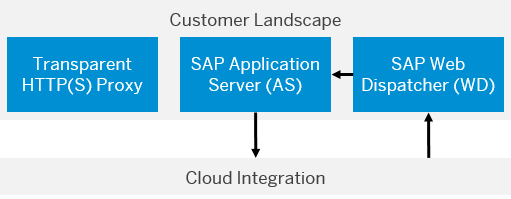

<!-- loiof69e1776a4444722b25b4fa07fb5d7f9 -->

# Technical Landscape for On Premise-On Demand Integration

As one example for certificate-based connectivity, customer intends to connect a customer-based SAP on-premise system \(based on SAP Application Server ABAP with Cloud Integration\).

The following figure illustrates the system landscape.

> ### Note:  
> We use the following abbreviations in this documentation:
> 
> -   **AS** for SAP Application Server
> -   **WD** for SAP Web Dispatcher

In the proposed system landscape, SAP Web Dispatcher is used in the on premise customer landscape to receive incoming calls from Cloud Integration. SAP Web Dispatcher \(as reverse proxy\) is the entry point for HTTPS requests into the customer system landscape.

## Communication Cloud Integration to SAP Application Server

In the proposed landscape, two SSL connections have to be implemented on the way in between Cloud Integration and AS, because WD - interconnected in between - terminates all SSL calls from Cloud Integration. Therefore, the following traust relationships have to be implemented:

-   Trust relationship between WD and Cloud Integration.

    As this connection spans the Internet, it is strongly recommended to use certificates that are signed by a certification authority \(CA\) that both parties \(WD and Cloud Integration\) trust.

-   Trust relationship between WD and AS.

    As this connection resides within the customer landscape, it might be an option to use self-signed certificates for this connection.

    > ### Note:  
    > For reasons of simplicity, within this guide we assume that self-signed certificates are used for this connection.

The following table summarizes the required certificates and the related keystores.

**Keystores**

<table>
<tr>
<th valign="top">

Keystore

</th>
<th valign="top">

Certificate/Key

</th>
<th valign="top">

Description

</th>
</tr>
<tr>
<td valign="top" rowspan="2">

Cloud Integration client keystore

</td>
<td valign="top">

Cloud Integration client certificate \(private and public key\)

</td>
<td valign="top">

Required to authenticate Cloud Integration as sender of messages.

This security artifact has to be generated at SAP side and contains the public and private key of Cloud Integration.

The certificate has to be signed by a certification authority \(CA\) that both SAP \(Cloud Integration\) and the customer \(WD\) trust.

</td>
</tr>
<tr>
<td valign="top">

WD server root certificate \(of the CA that has signed the server certificate\)

</td>
<td valign="top">

Required to authenticate WD as receiver od messages.

This certificate identifies the CA that has signed the WD server certificate.

</td>
</tr>
<tr>
<td valign="top" rowspan="2">

WD server keystore

\(SSL server PSE\)

</td>
<td valign="top">

Cloud Integration client root certificate

</td>
<td valign="top">

Required to identify Cloud Integration as trusted communication partner.

This certificate identifies the CA that has signed the Cloud Integration client certificate.

</td>
</tr>
<tr>
<td valign="top">

WD server certificate

</td>
<td valign="top">

Required to authenticate WD as trusted communication partner to receive calls.

This certificate is signed by the CA to which both WD and Cloud Integration have established a trust relationship.

</td>
</tr>
<tr>
<td valign="top">

WD client keystore

\(SSL client PSE\)

</td>
<td valign="top">

WD client certificate \(private and public key\)

</td>
<td valign="top">

Required to authenticate WD as sender of messages.

This security artifact has to be generated at customer side and contains the public and private key of the WD.

As the related communication path resides within the customer landscape, it might be sufficient to use a self-signed certificate.

> ### Note:  
> Customers can extend the use case in a way that also this certificate is signed by a CA. This is not covered in this guide.

</td>
</tr>
<tr>
<td valign="top">

AS server keystore

\(SSL server PSE\)

</td>
<td valign="top">

WD client certificate \(public key\)

</td>
<td valign="top">

Required to authenticate WD as sender of messages.

This public key has to be imported it into the AS server keystore.

</td>
</tr>
</table>

## Communication SAP Application Server to Cloud Integration

In the proposed landscape, the SSL connection is **not** terminiated on the way in between AS and Cloud Integration \(transparent proxy\). Therefore, a trust relationship has to be set up between AS and Cloud Integration.

As this connection spans the Internet, it is strongly recommended to use certificates that are signed by a certification authority \(CA\) that both parties \(AS and Cloud Integration\) trust.

The following table summarizes the required certificates and the related keystores.

**Keystores**

<table>
<tr>
<th valign="top">

Keystore

</th>
<th valign="top">

Certificate/Key

</th>
<th valign="top">

Description

</th>
</tr>
<tr>
<td valign="top" rowspan="2">

AS client keystore

</td>
<td valign="top">

AS client certificate \(private and public key\)

</td>
<td valign="top">

Required to authenticate AS as sender of messages.

This security artifact has to be generated at customer side and contains the public and private key of AS.

The certificate has to be signed by a certification authority \(CA\) that both SAP \(Cloud Integration\) and the customer \(AS\) trust.

</td>
</tr>
<tr>
<td valign="top">

Cloud Integration server root certificate

</td>
<td valign="top">

Required to authenticate Cloud Integration as trusted receiver of messages.

This certificate identifies the CA that has signed the Cloud Integration server certificate.

</td>
</tr>
<tr>
<td valign="top" rowspan="2">

Cloud Integration server keystore

</td>
<td valign="top">

AS client root certificate

</td>
<td valign="top">

Required to authenticate AS as sender of messages.

This certificate identifies the CA that has signed the AS client certificate.

This artifact has to be provided by the customer for SAP during the connection setup process, and the expert at SAP side has to import it into the Cloud Integration server keystore.

</td>
</tr>
<tr>
<td valign="top">

Cloud Integration server certificate

</td>
<td valign="top">

Required to authenticate Cloud Integration as trusted communication partner to receive calls.

This certificate is signed by the CA to which both AS and Cloud Integration have established a trust relationship.

</td>
</tr>
</table>

