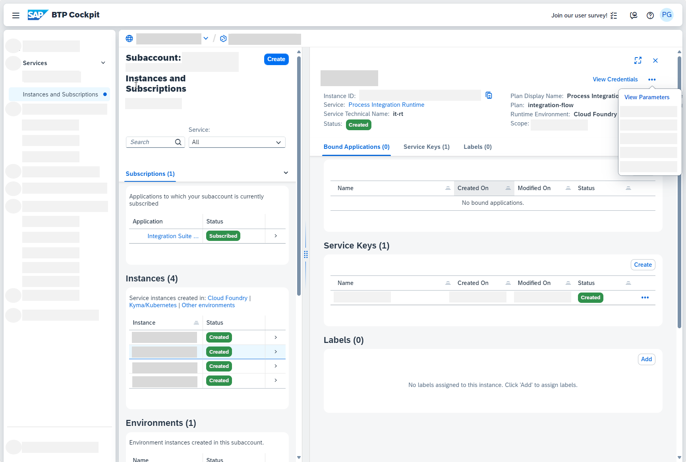
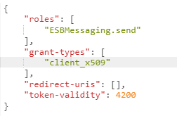
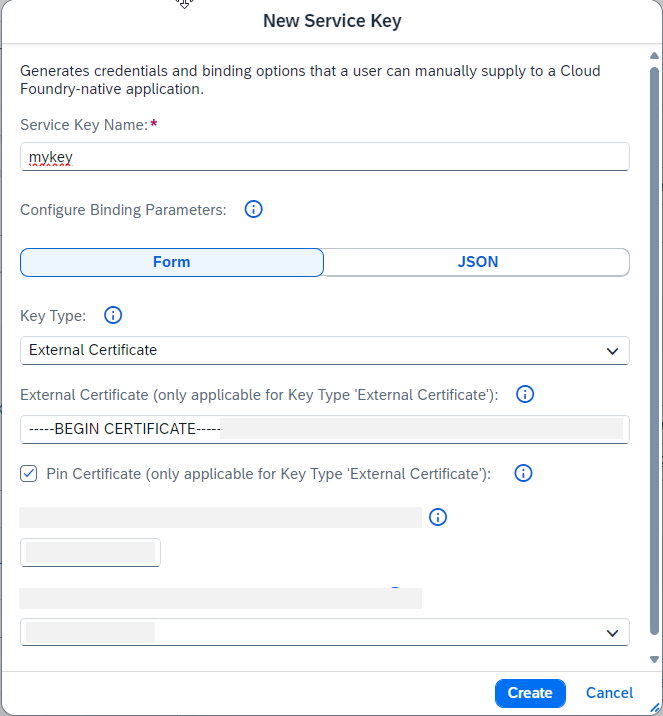

<!-- loio0a383737f6cd4abfb3f1c58680747152 -->

# Update Service Instance that Contains Deprecated client\_x509 Grant Type

This information is relevant for you when you operate scenarios using Cloud Integration inbound authentication with client certificates and service instances with client\_x509 grant type. This affects all users who have set up such a scenario before March 2022.

For SAP Cloud Integration, the client\_x509 grant type has already been removed from the SAP BTP cockpit user interface in March 2022.

By the end of 2024, grant-type *client\_x509* is deprecated. Grant type *client\_x509* was required to call Cloud Integration endpoints with an *External Certificate* \(see [Creating Service Instance and Service Key for Inbound Authentication](creating-service-instance-and-service-key-for-inbound-authentication-19af5e2.md)\). It is substituted by the *client\_credentials* grant type. While service instances with *client\_x509* grant type continue to work, its recommended to replace existing *client\_x509* service instances. To do this, replace the *client\_x509* grant type by *client\_credential* grant type.


<a name="loio0a383737f6cd4abfb3f1c58680747152__section_osh_w33_rcc"/>

## Updating Affected Service Instances

To find out if a service instance is affected, perform the following steps:

1.  SAP BTP cockpit and select *Services* \> *Instances and Subscriptions* \> *.* 

2.  Select a service instance.

    > ### Note:  
    > Only service instances with service *Process Integration Runtime* are relevant.

3.  Select *View Parameters*.

    

4.  In the popup, choose the *JSON* tab.

5.  If under *Grant-types* there is the entry *client\_x509*, this service instance is affected.

    

6.  Copy the JSON representation to a text editor and replace entry `client_x509` by `client_credentials`.

7.  Save the text for later reference.

8.  Create a new service instance and provide the JSON configuration from the text editor.

9.  For each service key in the old service instance, create a new service key in the new service instance.

    -   Open each old service key and copy the value of *certificate* and *certificate-pinning*. You can open a service key by clicking the service key name. This will show the service key details.

        Example:

        ```
        {
          "oauth": {
            ...,
            ...,
            "certificate": "...",
            "certificate-pinning": "...",
            ...,
            ...,
            ...
          }
        }
        ```

    -   During the creation of the service keys in the new instance, reuse the existing values from the old service instance. The key type must always have the key type *External Certificate*.

        Example:

        

    -   As long as the old service key is not deleted, the creation of the new service key fails with the following error message:

        `Certificate already exists for Follower within Leader with appid […].`

        Resolve this error by deleting the old service key before creating the new service key.

        > ### Note:  
        > Deleting a service key means that the client that is using this specific certificate for inbound authentication is no longer able to call integration flow or API endpoints. It is crucial to make sure that a service key with the certificate is recreated in the new service instance.


See also: [Cloud Integration on CF - How to Setup Secure HTTP Inbound Connection with Client Certificates](https://community.sap.com/t5/technology-blogs-by-sap/cloud-integration-on-cf-how-to-setup-secure-http-inbound-connection-with/ba-p/13393777) \(SAP Community blog\)

