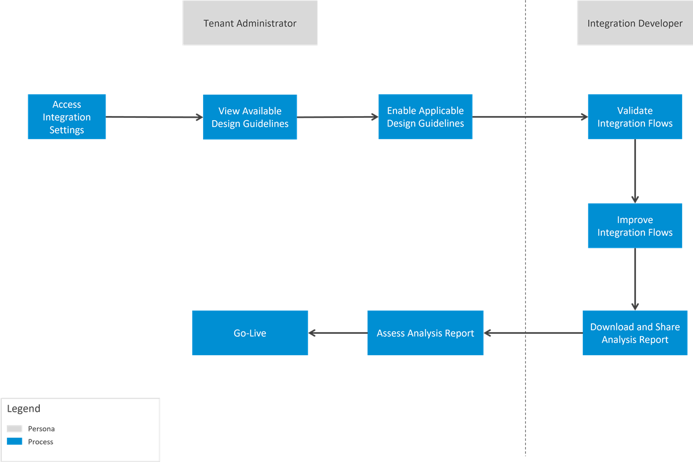

<!-- loio4d1c84f65d2b4ac79713f2d1aecfca43 -->

# Design Guidelines

As the integration lead for your organization, help your integration developers design enterprise-grade integration flows.

### What are Design Guidelines

Design guidelines for integration flows enable your integration developers to design integration flows in a robust fashion to safeguard your business processes.

In the past, these design guidelines were recommendations that were published as product help and prepackaged content on SAP Business Accelerator Hub. You can find the guidelines in the [Integration Flow Design Guidelines](../integration-flow-design-guidelines-6803389.md) section. Now, the same guidelines are embedded within the software as rules that help integration developers.

### Why Design Guidelines

Each design guideline acts as a rule that helps integration developers design an improved integration flow. For example, keeping your integration flow readable, easy to understand, avoid memory leaks and performance issues, handling attachments in the right way, applying the appropriate security standards, or implement a specific pattern. Enable all or a subset of available design guidelines that you think are applicable for your organization's business needs.

The design guidelines are logically grouped. For example, all transaction handling related guidelines are grouped under a single category. Some of the logical groupings are: *Handle errors gracefully* and *Run an integration flow under well-defined boundary conditions*.

The diagram shows a typical workflow that helps you benefit from using design guidelines:

### Enable Design Guidelines

Before you enable, understand every design guideline and its implications. Consume the in-app help available for each design guideline to learn more.

Follow these simple steps to enable or disable all or a subset of available design guidelines:

1.  Go to *Settings* \> *Integrations* \> *Design Guidelines*.

2.  Choose *Edit*.

3.  Enable the design guidelines that you think are appropriate for your organization's requirements. Similarly, disable the ones that you think aren't appropriate anymore.

4.  Choose *Save*.

You can enable or disable a design guideline anytime.

> ### Tip:  
> As a tenant administrator, you can assign a dedicated Integration Lead to enable the applicable design guidelines. You can [define a custom role collection](https://help.sap.com/docs/btp/sap-business-technology-platform/define-role-collection?version=Cloud) in the SAP BTP cockpit and add the role `WorkspaceDesignGuidelinesConfigure` to it. Later, assign this role collection to a user.

### Harmonize All Tenants

It's critical that the various development tenants that you've follow the same design guidelines so that the experience of integration flow validation is the same. To achieve this experience, you can export the design guidelines with the enabled/disabled status from one tenant and import the same in another tenant. This way, you don't have to manually enable the same design guidelines in multiple tenants.

Follow these simple steps to export and import the design guidelines with their status:

1.  In your source tenant, go to *Settings* \> *Integrations* \> *Design Guidelines*.

2.  Choose *Export* and save the file to your local drive.

3.  In your target tenant, go to *Settings* \> *Integrations* \> *Design Guidelines*.

4.  Choose *Import* and select the exported file.

    The design guidelines with their status from the source tenant are maintained in your target tenant now.

### Review and Productize Integration Flows

After you enable design guidelines, all integration flows designed in your tenant must abide by the enabled design guidelines. As the integration lead, you can review the design guidelines report for each integration flow, and then make an informed decision to go-live with every new integration flow.

If you follow a practice of creating an integration flow in a development tenant and then try out in a production tenant, you can transport the validated integration flow or package from one tenant to other.

> ### Remember:  
> The design guidelines don't disrupt the execution of the existing and new integration flow.

For more information on how integration developers can validate their integration flows, see [Design Guidelines View](../design-guidelines-view-d62dfe0.md).

> ### Remember:  
> You can use design guidelines to validate not only your custom integration content but also the prepackaged integration content that is shipped by SAP.

**Related Information**  

[Integration Flow Design Guidelines](../integration-flow-design-guidelines-6803389.md "As an integration developer, you need to make sure that you design integration flows in a robust fashion in order to safeguard your company's mission-critical business processes.")

