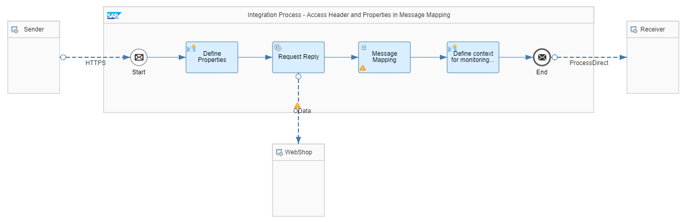

<!-- loio4f2a8c9c588947d7bde463b5959c17aa -->

# Access Header and Properties in Message Mapping

Learn how to access header and exchange properties in a message mapping.

This section shows you how you can access both header and exchange property values within a message mapping in order to map the same to a target structure.

For more information about the message-mapping capabilities, see [Message Mapping](message-mapping-459ccdf.md).

In order to access headers and exchange properties in a message mapping, you need to create a new script or assign an existing script to the mapping expression within the mapping editing. See section 9 in [Creating Message Mapping](creating-message-mapping-as-a-flow-step-3d5cb7f.md).

See [Define Script](define-a-local-script-step-03b32eb.md) for more details about custom Java scripts or Groovy scripts.


<a name="loio4f2a8c9c588947d7bde463b5959c17aa__section_fv5_zmg_smb"/>

## Implementation

To showcase the access of headers and exchange properties in a message mapping, refer to the sample integration flow defined in [Sender-Initiated Scenario (with HTTPS Sender Adapter)](https://help.sap.com/viewer/368c481cd6954bdfa5d0435479fd4eaf/Cloud/en-US/ccdb189ad99a4db0908150c799cbe9e3.html "Create a simple integration scenario that is initiated by a sender (using the HTTPS sender adapter).") :arrow_upper_right: from the [Get Started with Integration Flow Development](https://help.sap.com/viewer/368c481cd6954bdfa5d0435479fd4eaf/Cloud/en-US/e5724cd84b854719973afe0356ea128b.html "Learn how to develop and run your first integration flow.") :arrow_upper_right: documentation. The sample integration flow has been enhanced by adding a message mapping that maps the product information to an order.

The example integration flow *Modeling Basics - Access Header and Properties in Message Mapping* is designed the following way:



The example scenario works as follows:

The integration flow receives a message through an HTTPS adapter. In the message body, a product identifier and a quantity are provided. Furthermore, an order ID is passed to the integration flow as http header.

In a *Content Modifier* step, 2 exchange properties are defined holding the product identifier and the quantity value:


<table>
<tr>
<td valign="top">

***Action***

</td>
<td valign="top">

***Name***

</td>
<td valign="top">

***Type***

</td>
<td valign="top">

***Data Type***

</td>
<td valign="top">

***Value***

</td>
</tr>
<tr>
<td valign="top">

Create

</td>
<td valign="top">

quantity

</td>
<td valign="top">

XPath

</td>
<td valign="top">

java.lang.String

</td>
<td valign="top">

//quantity

</td>
</tr>
<tr>
<td valign="top">

Create

</td>
<td valign="top">

productID

</td>
<td valign="top">

XPath

</td>
<td valign="top">

java.lang.String

</td>
<td valign="top">

//productIdentifier

</td>
</tr>
</table>

In a *Request Reply* step, product data is read from an external source through the OData protocol \(using the OData receiver adapter\). For our scenario, we use the ESPM WebShop, which is based on the Enterprise Sales and Procurement Model \(ESPM\) provided by SAP. The demo application can be accessed at the following address: [https://refapp-espm-ui-cf.cfapps.eu10.hana.ondemand.com/webshop/index.html](https://refapp-espm-ui-cf.cfapps.eu10.hana.ondemand.com/webshop/index.html).

The query is defined as follows:

```
$select=ProductId,Category,CategoryName,CurrencyCode,DimensionDepth,DimensionHeight,DimensionUnit,DimensionWidth,LongDescription,Name,PictureUrl,Price,QuantityUnit,ShortDescription,SupplierId,Weight,WeightUnit&$filter=ProductId eq '${property.productID}'
```

Next, in a message mapping, the response from the OData request as well as the header information and the quantity exchange property are mapped to an order structure.

Prerequisite is that the following Groovy script has been uploaded to the resources of the integration flow and assigned to the functions of the message mapping. It contains 2 functions, *getProperty* for reading exchange property values, and *getHeader* for reading HTTP header values.

```
import com.sap.it.api.mapping.MappingContext

def String getProperty(String propertyName, MappingContext context) {
    def propertyValue = context.getProperty(propertyName);
    return propertyValue;
}

def String getHeader(String headerName, MappingContext context) {
    def headerValue = context.getHeader(headerName);
    return headerValue;
}

```

Once the script has been assigned to the mapping, the new functions are accessible from the custom functions.

In the message mapping, the *getHeader* function is used to retrieve the value of the header. We use a constant function where we maintain the header name, here *OrderId*, which is mapped to the input parameter of the *getHeader* function. The output is then mapped to the attribute *PurchaseOrder* of the target structure.


Calculating the total price with the help of *getProperty* functions like this: First, *getProperty* is used to retrieve the value of the exchange property quantity that is then mapped to the *Quantity* element of the target structure. Second, after *getProperty* has retrieved the exchange property quantity, the quantity value is used to calculate the total *Price* by multiplying *Quantity* with the *Price* per item.


