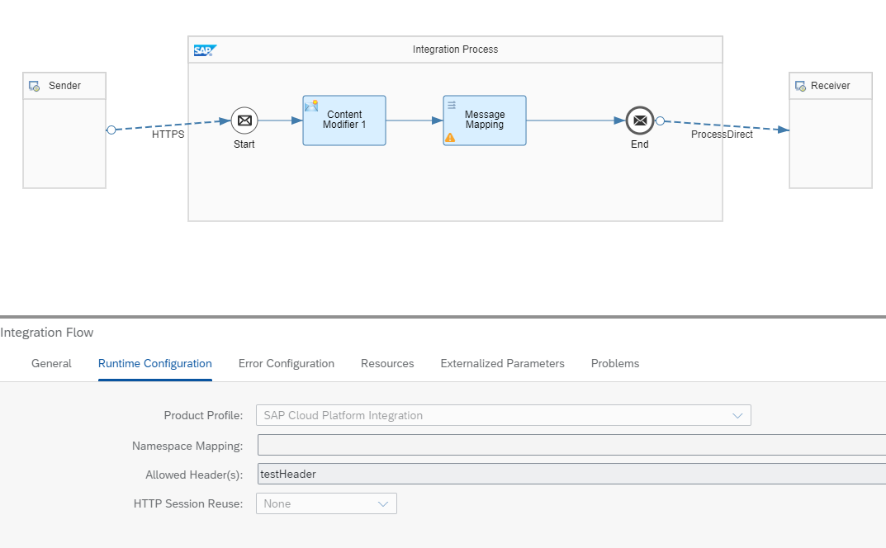
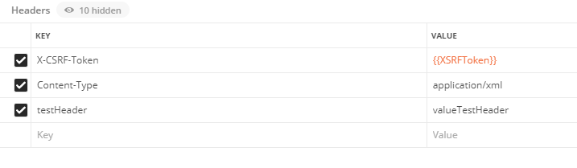
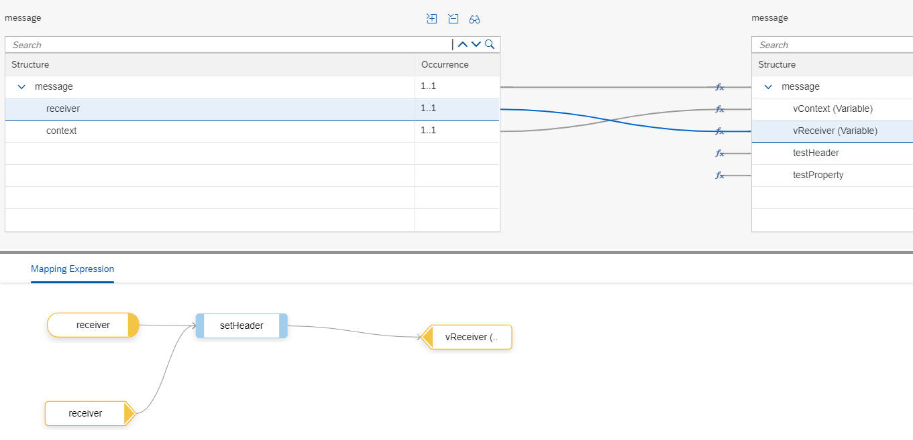

<!-- loio6bc5ed1fafb046178a39d0e4f2f2f6f6 -->

# Access Headers and Properties in Scripts

To illustrate this rule, see the *Scripting - Mapping Functions* integration flow. This integration flow represents the use case in which properties and headers are accessed in a message mapping by means of scripts.



To call this integration flow, use the corresponding request from Postman collection. The fields of the payload are set as headers in the message mapping. In addition, in the Postman call, the header *testHeader* is provided, which is read in the message mapping.



For testing purposes, the integration flow creates a new test property in the first step.

In the next step, a message mapping is called, which will use the following library:

> ### Sample Code:  
> ```
> def String getheader(String header_name, MappingContext context) {
>     def headervalue= context.getHeader(header_name);
>     return headervalue;
> }
> 
> def String getProperty(String property_name, MappingContext context) {
>     def propValue= context.getProperty(property_name);
>     return propValue;
> }
> 
> def String setHeader(String header_name, String header_value, MappingContext context) { 
>     context.setHeader(header_name, header_value);   
>     return header_value;
> }
> 
> def String setProperty(String property_name, String property_value, MappingContext context) {
>     context.setProperty(property_name, property_value);    
>     return header_value;
> }
> 
> ```

The function *setHeader* is used in the mapping for setting the headers *receiver* and *context*, which are needed for the generic receiver. They're populated with the values coming from the payload.



The function *getHeader* is used for reading the header *testHeader* provided in the Postman call and is set as new field in the payload. The header is set as allowed headers in the runtime configuration of the iFlow.


The function *getProperty* is used for reading the test property created in the first content modifier of the iFlow.

