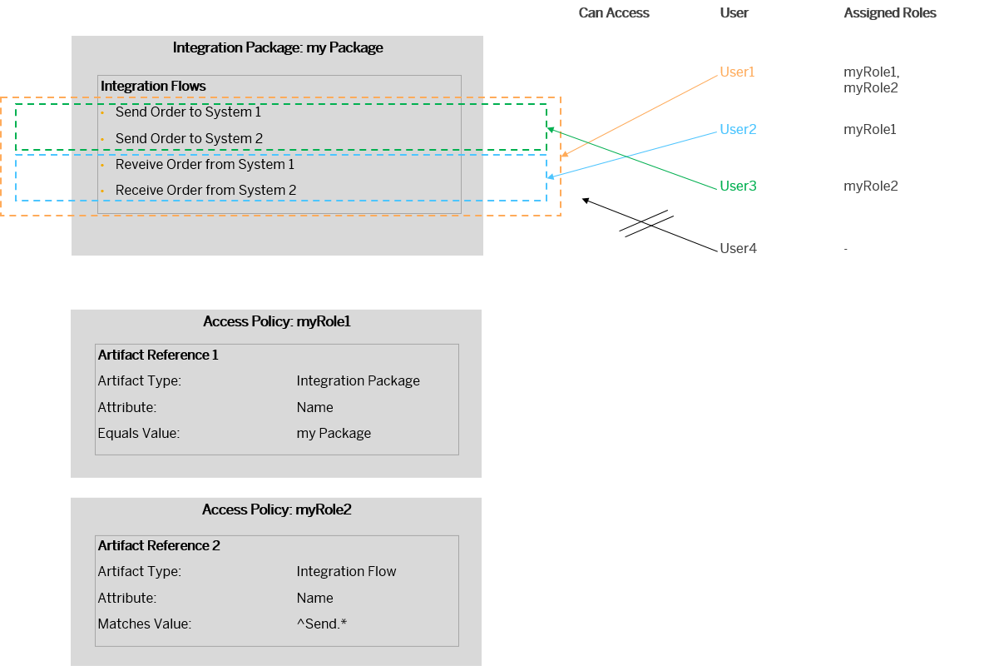
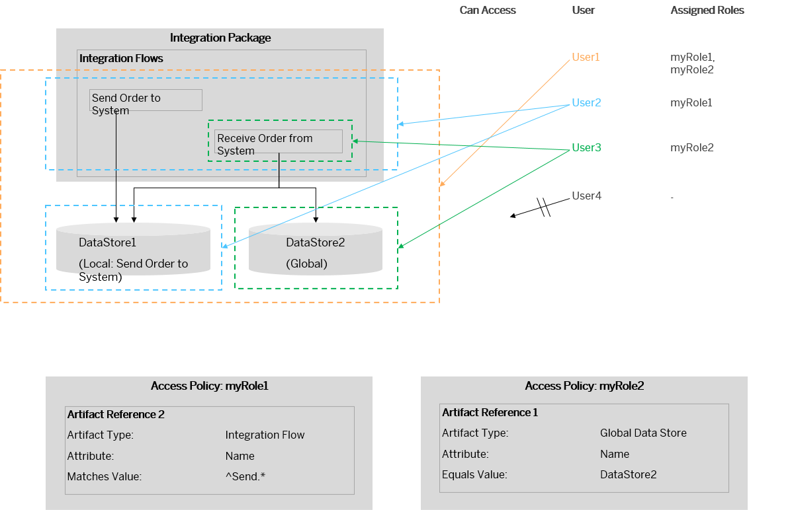

<!-- loiof1dc1a7a475b484bb72a5dffcc275bd5 -->

# Access Policies Examples

Learn more about access policies based on examples.

<a name="loiof1dc1a7a475b484bb72a5dffcc275bd5__section_ix3_n41_r1c"/>

## Access Policy for Integration Package

This example demonstrates an access policy for an integration package. Furthermore, this example demonstrates how access policies defined for integration packages and access policies defined for specific artifacts within the same package interact with each other.

Let's assume that two access policies are defined.

-   Access policy \(associated with rule *myRole1*\) protects all artifacts of integration package *my Package*.

-   Access policy \(associated with rule *myRole2*\) protects all integration flows with a name starting with *Send*.

The diagram shows how both access policies together affect the access capabilities of individual users with different role assignments.

The individual users can access the data in the following way:

<table>
<tr>
<th valign="top">

User

</th>
<th valign="top">

Can Access ...

</th>
</tr>
<tr>
<td valign="top">

*User1* \(assigned to roles *myRole1* and *myRole2*\)

</td>
<td valign="top">

All integration flows of the integration package.

</td>
</tr>
<tr>
<td valign="top">

*User2* \(assigned to role *myRole1*\)

</td>
<td valign="top">

All integration flows not protected by the access policy associated with *myRole2*.

</td>
</tr>
<tr>
<td valign="top">

*User3* \(assigned to role *myRole2*\)

</td>
<td valign="top">

All integration flows that are protected by the access policy associated with *myRole2*, but no additional artifacts.

</td>
</tr>
<tr>
<td valign="top">

*User4* \(no role assigned\)

</td>
<td valign="top">

No artifact or data illustrated in the diagram.

</td>
</tr>
</table>

<a name="loiof1dc1a7a475b484bb72a5dffcc275bd5__section_x33_441_r1c"/>

## Interaction of Access Policies Defined for Integration Flows and Data Stores

Integration flows can use *Data Store Operations* steps to store data in local or global data stores at runtime \(see [Data Storages](data-storages-31efe35.md)\).

Access policies protect both operations that you can perform with artifacts \(such as saving an artifact\) and data stored and processed by these artifacts. Therefore, access policies for integration flows and data stores are interconnected in the following way:

-   An access policy defined for an integration flow protects also data stored in local data store associated with this integration flow.

-   This access policy, however, has no impact on any global data store defined on the tenant. Note that a global data store can be accessed to by multiple integration flows.

The following example illustrates this use case.

Assume that two integration flows are deployed on the tenant and there's a global and a local data store. The local data store is associated with integration flow *Send Order to System*.

Let's assume that two access policies are defined.

-   Access policy \(associated with rule *myRole1*\) protects all integration flows with a name starting with *Send*.

-   Access policy \(associated with rule *myRole2*\) protects the global data store \(with the name *DataStore2*\).

The diagram shows how both access policies together affect the access capabilities of individual users with different role assignments.

The individual users can access the data in the following way:

<table>
<tr>
<th valign="top">

User

</th>
<th valign="top">

Can Access ...

</th>
</tr>
<tr>
<td valign="top">

*User1* \(assigned to roles *myRole1* and *myRole2*\)

</td>
<td valign="top">

All integration flows and the content stored in all data stores.

</td>
</tr>
<tr>
<td valign="top">

*User2* \(assigned to role *myRole1*\)

</td>
<td valign="top">

All integration flows and the content of the local data store.

As this user doesn't have *myRole2* \(associated with the access policy protecting the global data store\), the global data store isn't accessible for this user.

</td>
</tr>
<tr>
<td valign="top">

*User3* \(assigned to role *myRole2*\)

</td>
<td valign="top">

The integration flow that is **not** protected by the access policy associated with *myRole1* and the content of the global data store.

</td>
</tr>
<tr>
<td valign="top">

*User4* \(no role assigned\)

</td>
<td valign="top">

No artifact or data illustrated in the diagram.

</td>
</tr>
</table>

