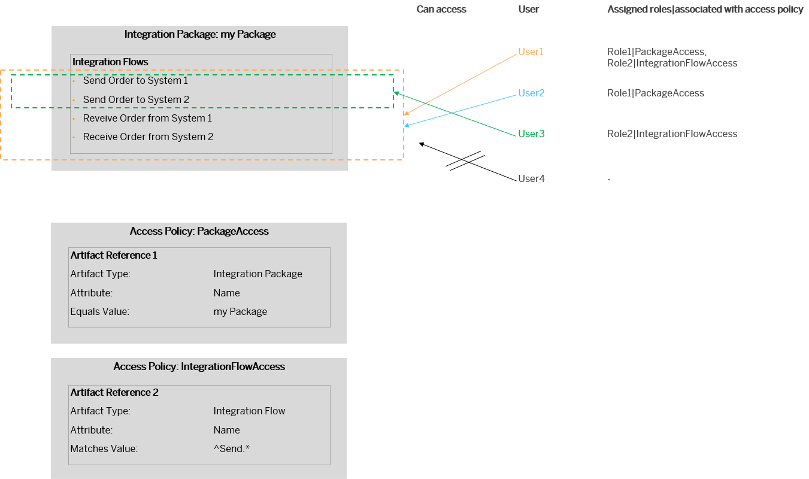
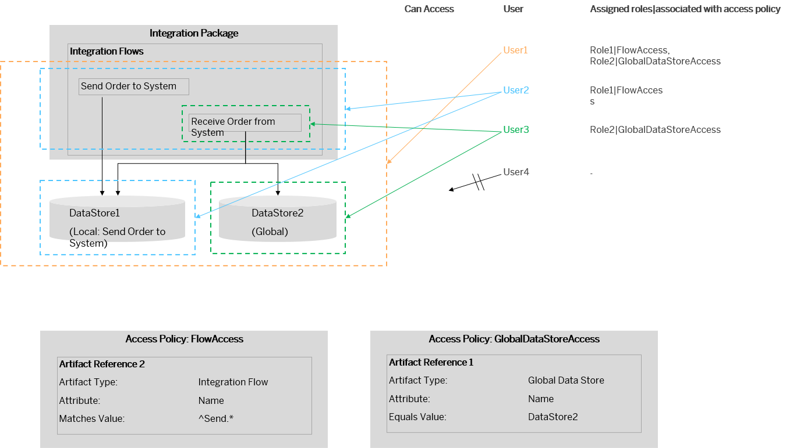

<!-- loiof1dc1a7a475b484bb72a5dffcc275bd5 -->

# Access Policies Examples

Learn more about access policies based on examples.

<a name="loiof1dc1a7a475b484bb72a5dffcc275bd5__section_ix3_n41_r1c"/>

## Access Policy for Integration Package

This example demonstrates an access policy for an integration package. Furthermore, this example demonstrates how access policies defined for integration packages and access policies defined for specific artifacts within the same package interact with each other.

Let's assume that two access policies are defined.

-   Access policy *PackageAccess* \(associated with role *Role1*\) protects all artifacts of integration package *my Package*.

-   Access policy *IntegrationFlowAccess* \(associated with role *Role2*\) protects all integration flows with a name starting with *Send*.

The diagram shows how both access policies together affect the access capabilities of individual users with different role assignments.

To now provide targeted access to the protected artifacts, the tenant administrator defines dedicated roles and assigns them to different users.

The individual users have the following access permissions:

<table>
<tr>
<th valign="top">

User

</th>
<th valign="top">

Assigned role

</th>
<th valign="top">

Role associated with access policy

</th>
<th valign="top">

Can Access ...

</th>
</tr>
<tr>
<td valign="top">

*User1* 

</td>
<td valign="top">

*Role1*

*Role2*

</td>
<td valign="top">

*PackageAccess*

*IntegrationFlowAccess*

</td>
<td valign="top">

All integration flows of the integration package.

</td>
</tr>
<tr>
<td valign="top">

*User2* 

</td>
<td valign="top">

*Role1* 

</td>
<td valign="top">

*PackageAccess* 

</td>
<td valign="top">

All integration flows of the integration package.

*User2* has role *Role1* that is associated with access policy *PackageAccess*.

Therefore, *User2* can access all artifacts of the *protected* integration package.

</td>
</tr>
<tr>
<td valign="top">

*User3* 

</td>
<td valign="top">

*Role2* 

</td>
<td valign="top">

*IntegrationFlowAccess* 

</td>
<td valign="top">

All integration flows that are protected by access policy *IntegrationFlowAccess*, but no additional artifacts.

*User3* has role *Role2* that is associated with access policy *IntegrationFlowAccess*. Therefore, they can access the integration flows protected by this access policy. However, the other integration flows are protected from this user by access policy *PackageAccess*.

</td>
</tr>
<tr>
<td valign="top">

*User4* 

</td>
<td valign="top">

\(no role assigned\)

</td>
<td valign="top">

n.a.

</td>
<td valign="top">

No artifact or data illustrated in the diagram.

</td>
</tr>
</table>

Having a role associated with an access policy means: The string that is specified for the *Values* attribute of the role matches the name of the access policy \(see [Creating Custom Roles for Access Policies](creating-custom-roles-for-access-policies-7db3c87.md)\).

<a name="loiof1dc1a7a475b484bb72a5dffcc275bd5__section_x33_441_r1c"/>

## Interaction of Access Policies Defined for Integration Flows and Data Stores

Integration flows can use *Data Store Operations* steps to store data in local or global data stores at runtime \(see [Data Storages](data-storages-31efe35.md)\).

Access policies protect both operations that you can perform with artifacts \(such as saving an artifact\) and data stored and processed by these artifacts. Therefore, access policies for integration flows and data stores are interconnected in the following way:

-   An access policy defined for an integration flow protects also data stored in local data stores \(and local variables\) associated with this integration flow.

-   This access policy, however, has no impact on any global data store defined on the tenant. Note that a global data store can be accessed to by multiple integration flows. The same applies for message queues.

The following example illustrates this use case.

Assume that two integration flows are deployed on the tenant, and there's a global and a local data store. The local data store is associated with integration flow *Send Order to System*.

Let's assume that two access policies are defined on the tenant.

-   Access policy *FlowAccess* \(associated with role *Role1*\) protects all integration flows with a name starting with *Send*.

-   Access policy *GlobalDataStoreAccess* \(associated with role *Role2*\) protects the global data store \(with the name *DataStore2*\).

The diagram shows how both access policies together affect the access capabilities of individual users with different role assignments.

To now provide targeted access to the protected artifacts, the tenant administrator defines dedicated roles and assigns them to different users.

The individual users have the following access permissions:

<table>
<tr>
<th valign="top">

User

</th>
<th valign="top">

Assigned role

</th>
<th valign="top">

Role associated with access policy

</th>
<th valign="top">

Can access ...

</th>
</tr>
<tr>
<td valign="top">

*User1* 

</td>
<td valign="top">

*Role1*

*Role2*

</td>
<td valign="top">

*FlowAccess*

*GlobalDataStoreAccess*

</td>
<td valign="top">

All integration flows and the content stored in all data stores.

</td>
</tr>
<tr>
<td valign="top">

*User2* 

</td>
<td valign="top">

*Role1* 

</td>
<td valign="top">

*FlowAccess* 

</td>
<td valign="top">

All integration flows and the content stored in the local data store.

*User2* can access both integration flows, including the one that is protected by access policy *FlowAccess*. The reason for this: *User2* has *Role1* that is associated with access policy *FlowAccess*.

An integration flow-related access policy also covers data stored and processed by the protected integration flow. Therefore, *User2* has also access to the content of the **local** data store used by integration flow *Send Order to System*.

However, as *User2* doesn't have *Role2* \(associated with access policy *GlobalDataStoreAccess*\), the global data store isn't accessible for it.

</td>
</tr>
<tr>
<td valign="top">

*User3* 

</td>
<td valign="top">

*Role2* 

</td>
<td valign="top">

*GlobalDataStoreAccess* 

</td>
<td valign="top">

The integration flow that is **not** protected by access policy *FlowAccess* and the content of the global data store.

Integration flow *Send Order to System* is protected by access policy *FlowAccess*. As *User3* doesn't have the role associated with this access policy, they are unable to access this integration flow.

Although the content of the global data store is protected by access policy*GlobalDataStoreAccess*, *User3* is able to access its content. The reason is: they have *Role2* that is associated with access policy *GlobalDataStoreAccess*.

</td>
</tr>
<tr>
<td valign="top">

*User4* 

</td>
<td valign="top">

\(no role assigned\)

</td>
<td valign="top">

n.a.

</td>
<td valign="top">

No artifact or data illustrated in the diagram.

</td>
</tr>
</table>

