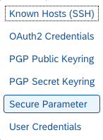
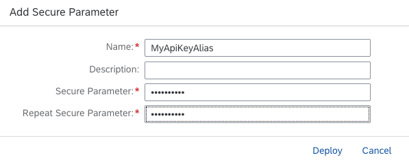
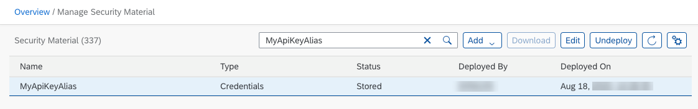
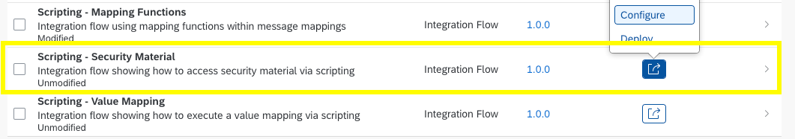
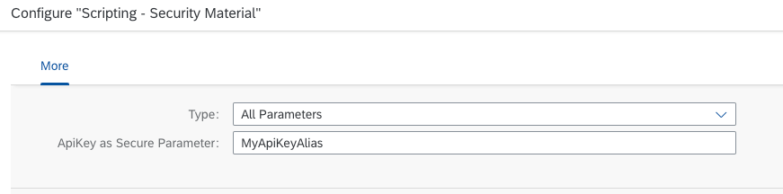

<!-- loiofdf4ce34e7f846568cad8ab98b0369aa -->

# Access Secure Parameters in Scripts

The integration flow *Scripting – Security Material* represents the use case in which a secure parameter is read from the security material deployed on the tenant by means of a script. An `ApiKey`, which is used for a target system, is stored as a secure parameter.


The integration flow performs the following steps:

1.  The *Get ApiKeyAlias* Content Modifier defines a property for the alias of the secure parameter. The value is externalized to make it easy to configure and run the integration flow for a dedicated secure parameter.

2.  The *readApiKeyAlias* Script step contains a Groovy script that reads the content from the secure parameter.

3.  The *Define context for monitoring* Content Modifier defines the name of the Data Store in which the result of the integration flow is stored.


To call this integration flow, use the corresponding request from the Postman collection.


As a prerequisite for calling this integration flow, the `ApiKey` of your target system must be deployed using the *Monitor* section \(*Security Material* tile under *Manage Security*\). For testing purposes, any value can be added to the secure parameter, as the integration flow reads the secure parameter in the script: The integration flow reads the value provided in the secure parameter artifact fields *Secure Parameter* and *Repeat Secure Parameter* and stores it in the Data Store entry created by the Generic Receiver. However, it is important to note that the result is stored in the header of the result message. You can easily test it by creating a secure parameter by using a Secure Parameter key, running the integration flow with the Postman collection. Finally, you can download the resulting Data Store entry from the Data Store with the name *Scripting-SecurityMaterial*\). You find a body and a header part. The header part contains the secure parameter value in the `api-key` header.

1.  Select *Secure Parameter* from the *Add*context menu.

    

2.  Add a *Name* and the *Secure Parameter*.

    

    > ### Note:  
    > The possible length of the secure parameter varies:
    > 
    > -   for **Cloud Foundry: 4096 characters max. \(including spaces\)

3.  You can now see the *Secure Parameter* under *Manage Security Material*:

    

4.  Configure the integration flow and provide the alias of the previously stored secure parameter. Click *Save* and *Deploy*. You can also overwrite the value that reads TestApiKey per default.

    




In the integration flow, the value for the secure parameter is read by means of a script.

> ### Sample Code:  
> ```
> import com.sap.gateway.ip.core.customdev.util.Message;
> import java.util.HashMap;
> import com.sap.it.api.ITApiFactory;
> import com.sap.it.api.mapping.ValueMappingApi
> import com.sap.it.api.securestore.SecureStoreService
> import com.sap.it.api.securestore.UserCredential
> import com.sap.it.api.securestore.exception.SecureStoreException
> 
> def Message processData(Message message) {
>     def apikey_alias = message.getProperty("ApiKeyAlias")
>     def secureStorageService =  ITApiFactory.getService(SecureStoreService.class, null)
>     try{
>         def secureParameter = secureStorageService.getUserCredential(apikey_alias)
>         def apikey = secureParameter.getPassword().toString()
>         message.setHeader("api-key", apikey)
>     } catch(Exception e){
>         throw new SecureStoreException("Secure Parameter not available")
>     }
>     return message;
> }
> 
> 
> ```

> ### Caution:  
> The sample script stores security-related information as a header. Note that this not a good practice when designing a productive scenario. The reason is that when you store sensible information as a header or a property, you take the risk of exposing this data accidentally. For example, a header can be sent to a receiver system if you take no further actions to prevent this. Therefore, use this example script for demo or testing purposes only.

