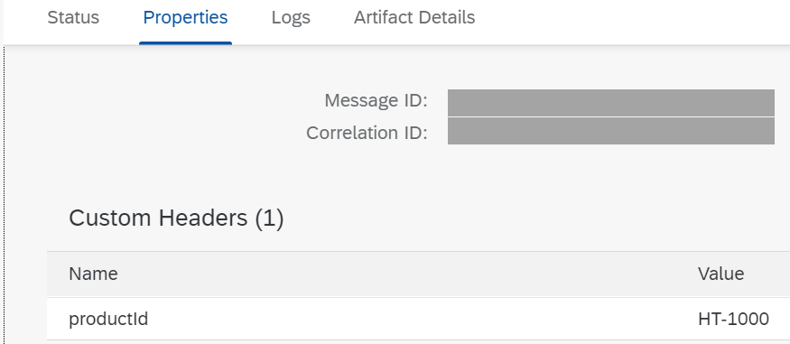

<!-- loioe8e928373b66488b8d78fb5a314b8a9e -->

# Add Information to the Message Processing Log

You can use the Script step to add information to the message processing log \(MPL\).

You can address the MPL using the `MessageLogFactory` and `MessageLog` interfaces.

-   `MessageLogFactory`: Provides access to the message processing log.

-   `MessageLog`: Supports writing properties and adding attachments to the message processing log.


The `MessageLogFactory` interface can be used through the `messageLogFactory` variable in order to retrieve an instance of `MessageLog`.

The following table provides examples of how to use the Script step with these interfaces.

****


<table>
<tr>
<th valign="top">

Use Case

</th>
<th valign="top">

Example Requests/More Information

</th>
</tr>
<tr>
<td valign="top">

Create MPL attachments

</td>
<td valign="top">

You can apply the following method on an instance of `MessageLog` in order to create an MPL attachment:

`addAttachmentAsString(String name, String text, String mediaType)`

The following Groovy Script stores the message body in an MPL attachment \(`My Attachment`\):

```
def Message processData(Message message) {
    def body = message.getBody(java.lang.String)
    def messageLog = messageLogFactory.getMessageLog(message)
    if (messageLog != null) {
        messageLog.addAttachmentAsString('My Attachment', body, 'text/plain')
    }
    return message
}
```

> ### Note:  
> You can simplify this expression in the following way using idiomatic Groovy style:
> 
> ```
> Message processData(Message message) {
>     messageLogFactory.getMessageLog(message)?.addAttachmentAsString('My Attachment', message.getBody(String), 'text/plain')
>     return message
> }
> 
> ```

When monitoring the message in the Cloud Integration *Monitor* section under *Monitor Message Processing*, the attachment is displayed in the *Attachments* tab when the corresponding integration flow is selected.

You find an example scenario here: [Create MPL Attachments in Scripts](create-mpl-attachments-in-scripts-17dba92.md).

</td>
</tr>
<tr>
<td valign="top">

Set property in the MPL

> ### Note:  
> Properties added by the Script step are only visible in the MPL if the log level has been set to *Debug* or *Trace*.


</td>
<td valign="top">

You can apply the following methods on an instance of `MessageLog` in order to set a property of a given type in the message processing log:

`setStringProperty(String name, String value)`

`setIntegerProperty(String name, Integer value)`

`setLongProperty(String name, Long value)`

`setBooleanProperty(String name, Boolean value)`

`setFloatProperty(String name, Float value)`

`setDoubleProperty(String name, Double value)`

`setDateProperty(String name, Date value)`

The following Groovy Script allows you to set a string property:

```
def messageLog = messageLogFactory.getMessageLog(message)
messageLog.setStringProperty("Greeting", "Hello World!")
```

The following JavaScript allows you to set a string property:

```
var messageLog = messageLogFactory.getMessageLog(message)
messageLog.setStringProperty("Greeting", "Hello World!")
```

> ### Note:  
> The properties provided by the Script step are displayed in alphabetical order in the resulting MPL. That means that the sequence of properties in the MPL does not necessarily reflect the sequence applied in the script.


</td>
</tr>
<tr>
<td valign="top">

Add a longer, structured document to the MPL

</td>
<td valign="top">

Use the `addAttachmentAsString` method to add a longer, structured document to the MPL. Only use the `setStringProperty` method for short strings \(containing one or a few words\).

If the value `"null"` is specified for the `mediaType` parameter, the `"text/plain"` value is assumed as the media type.

</td>
</tr>
<tr>
<td valign="top">

Set custom header properties for message search

</td>
<td valign="top">

The `addCustomHeaderProperty` method allows you to add user-defined attributes \(name/value pairs\) to the message processing log. These attributes are then persisted and can be used for message search.

The following Groovy Script reads the header `productId` and creates a custom header property based on it:

```
def Message processData(Message message) {
	def messageLog = messageLogFactory.getMessageLog(message);
	def productId = message.getHeaders().get("productId");       
        if(messageLog != null){
                messageLog.addCustomHeaderProperty("productId", productId);   
        }
        return message;
}
```

When monitoring the message in the Cloud Integration *Monitor* section under *Monitor Message Processing*, the custom header property is displayed in the *Properties* tab when the corresponding integration flow is selected.



You find an example scenario following the next link: [Use Custom Header Properties to Search for Message Processing Logs](use-custom-header-properties-to-search-for-message-processing-logs-d4b5839.md).

</td>
</tr>
</table>

