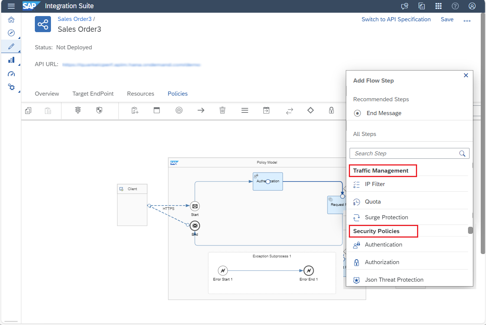
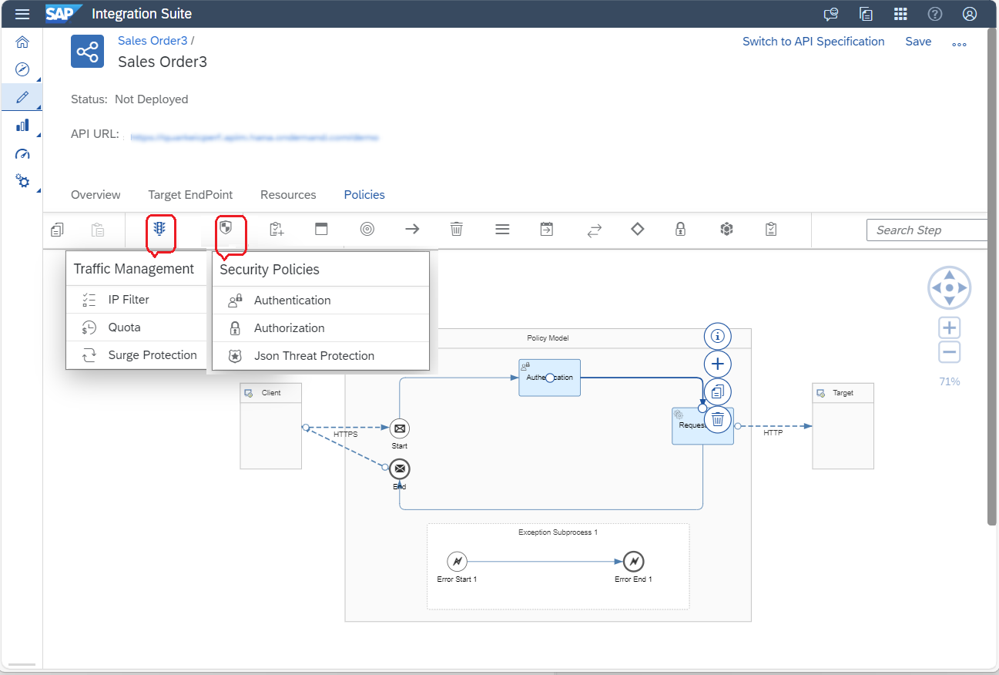
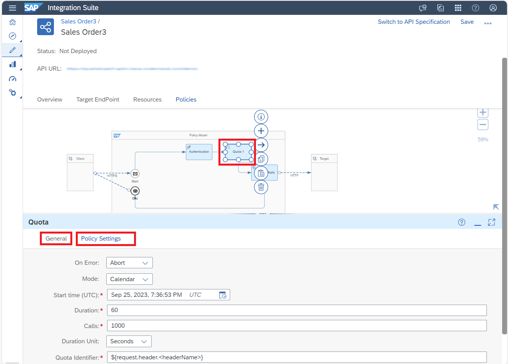

<!-- loioc2b3e56272d14ff58a626ba7d390f501 -->

<link rel="stylesheet" type="text/css" href="../css/sap-icons.css"/>

# Add Policies to the API Artifact

To enforce security or control API traffic, you can set rules on the API by adding policies and integration steps to the API artifact.

<a name="loioc2b3e56272d14ff58a626ba7d390f501__prereq_xyg_4s2_jxb"/>

## Prerequisites

-   You have a thorough understanding on policies and the various flows it can be attached to. For more information, see [Policy Definition and Types of Policies](policy-definition-and-types-of-policies-c744df5.md).

## Context

Add a policy to the API artifact you've created.

You can also add integration flow steps to the artifacts. To know more about configuring the flow steps, see [Configure Integration Flow Components](https://help.sap.com/docs/integration-suite/sap-integration-suite/configure-integration-flow-components?version=CLOUD&q=Configure%20Integration%20Flow%20Components).

To know more about the available flow steps for Edge Integration Cell, see [Edge Integration Cell Runtime Scope](https://help.sap.com/docs/integration-suite/sap-integration-suite/supported-features-and-limitations-of-edge-integration-cell?version=CLOUD).

## Procedure

1.  Log on to SAP Integration Suite.

2.  From the left navigation pane, choose *Design* \> *Integrations and APIs* to view the list of integration packages.

3.  Select the *<integration package\>* where you want to add an API artifact and choose *Edit*.

4.  Navigate to an API artifact within a package, then go to the *Policies* tab and click *Edit*.

    Use *Policy Model* to add a policy to the API artifact.

    You can add both traffic management and security policies to the API artifact.

    > ### Remember:  
    > -   Policies are allowed only on request flow and not on response flow.
    > 
    > -   The position of the authentication policy on the flow is immutable and it is the first policy on the flow.
    > 
    > -   Authentication policy is a mandatory policy and is added to request flow by default. Neither you can remove this step, nor you can add another authentication policy to the flow.
    > 
    > -   All other policies can be added to the flow multiple times except authentication policy.
    > 
    > -   Only a policy can be added between two policies. You can't add integration steps between two policies.
    > 
    > -   Policies must precede integration steps.

5.  To add a policy, click on the request flow and choose :heavy_plus_sign: .

    

6.  Select the necessary policy from the *Add Flow Step* dialog.

    

    Alternatively, select the :shield: icon from the palette and choose from the following options:

    -   Authorization

    -   Authentication

    -   JSON Threat Protection

    Similarly, select the  Traffic Management policies icon from the palette and choose from the following options:

    -   Quota Policy

    -   Surge Protection

    -   IP Filter

    

7.  Configure the policies that you've added to the *Policy Model*.

    Double-click on the policy, and fill in all the necessary details under the *General* and the *Policy Settings* tab. For more information on the *Policy Settings* , see [Traffic Management Policies](traffic-management-policies-165db68.md) and [Security Policies](security-policies-aebf968.md).

    

8.  Once you’ve added and configured all the required policies for the API, you can select one of the following actions for the API:

    <table>
    <tr>
    <th valign="top">

    Action
    
    </th>
    <th valign="top">

    Description
    
    </th>
    </tr>
    <tr>
    <td valign="top">
    
    *Save* 
    
    </td>
    <td valign="top">
    
    Saves the artifact as *Draft* version.
    
    </td>
    </tr>
    <tr>
    <td valign="top">
    
    *Save as version* 
    
    </td>
    <td valign="top">
    
    Creates a new version of the artifact.

    Specify the version in the *Version Information* dialog. In the *Comment* section, you can add additional information specific to the artifact for later reference. This helps you determine the purpose of each version.
    
    </td>
    </tr>
    <tr>
    <td valign="top">
    
    *Deploy* 
    
    </td>
    <td valign="top">
    
    Deployes the API artifact.
    
    </td>
    </tr>
    <tr>
    <td valign="top">
    
    *Delete* 
    
    </td>
    <td valign="top">
    
    Deletes the API artifact from the package.
    
    </td>
    </tr>
    <tr>
    <td valign="top">
    
    *Cancel* 
    
    </td>
    <td valign="top">
    
    Ends your edit session without saving any of the changes you have made.
    
    </td>
    </tr>
    </table>
    

