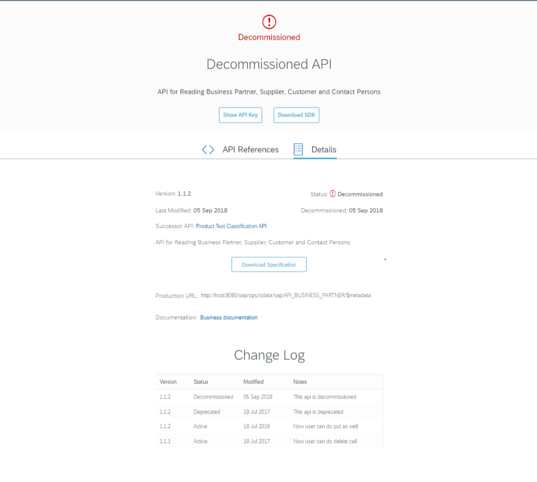

<!-- loio4ab4c8e7a09d4608abf91c04ea51f9e3 -->

# Additional Attributes in OpenAPI Specification

OpenAPI Specification allows you to define additional attributes or custom extensions that start with `x-`, such as `x-servers`.

You can use an OpenAPI Specification to describe extra functionality of the API that is not covered by the standard OpenAPI Specification.

Additional attributes or custom extensions are supported on the `root` level of the OpenAPI Specification and in the following places:

-   `info` section
-   `paths` section
-   `responses` section
-   `tags`
-   Security schemes

The following additional attributes have been introduced for use with API designer. All these attributes must be defined at the root level of the OpenAPI Specification.

**List of additional attributes**


<a name="loio4ab4c8e7a09d4608abf91c04ea51f9e3__section_fvf_j22_rsb"/>

## x-sap-api-type

> ### Sample Code:  
> ```
> 
> {
>   "x-sap-api-type": "ODATA"
> }
> ```

You can use this attribute to display the API type. For example:

The API Type is set according to the following rules of precedence:

1.  If EDMX file is present, then the type is set as ODATA.
2.  If WSDL file is present, then the type is set as SOAP.
3.  If x-sap-api-type is mentioned in the swagger, then the respective value is set. For OData APIs, to differentiate the V2, and V4 OData APIs, you will need to specify the following values in swagger for the x-sap-api-type attribute:


    <table>
    <tr>
    <th valign="top">

    Type of API
    
    </th>
    <th valign="top">

    Input
    
    </th>
    </tr>
    <tr>
    <td valign="top">
    
    OData V2 API
    
    </td>
    <td valign="top">
    
    ODATA
    
    </td>
    </tr>
    <tr>
    <td valign="top">
    
    OData V4 API
    
    </td>
    <td valign="top">
    
    ODATAV4
    
    </td>
    </tr>
    </table>
    
4.  The default is REST.


<a name="loio4ab4c8e7a09d4608abf91c04ea51f9e3__section_zcj_p22_rsb"/>

## x-sap-shortText

The `x-sap-shortText` attribute is used to display a short description of your APIs.

> ### Note:  
> The `x-sap-shortText` is a mandatory attribute that must be defined in the API definition file.

> ### Sample Code:  
> ```
> 
>  {
>   "info": {
>     "title": "SAP Workflow service API",
>     "description": "Provides functionality to work with SAP Workflow service. You can, for example, start new workflow instances and work with tasks."
>   },
>   "x-sap-shortText": " Work with the SAP Workflow service."
> }
> 
> ```

The text should not exceed 180 characters. The following characters are allowed in the x-sap-shortText:


<table>
<tr>
<th valign="top">

Character

</th>
<th valign="top">

Description

</th>
</tr>
<tr>
<td valign="top">

A-Z

</td>
<td valign="top">

Latin letters, case insensitive

</td>
</tr>
<tr>
<td valign="top">

0-9

</td>
<td valign="top">

Numbers

</td>
</tr>
<tr>
<td valign="top">

 

</td>
<td valign="top">

Space

</td>
</tr>
<tr>
<td valign="top">

\_

</td>
<td valign="top">

Underscore

</td>
</tr>
<tr>
<td valign="top">

\- — –

</td>
<td valign="top">

Different Hyphens

</td>
</tr>
<tr>
<td valign="top">

.

</td>
<td valign="top">

Dot

</td>
</tr>
<tr>
<td valign="top">

,

</td>
<td valign="top">

Comma

</td>
</tr>
<tr>
<td valign="top">

\(\)

</td>
<td valign="top">

Paranthesis

</td>
</tr>
<tr>
<td valign="top">

's

</td>
<td valign="top">

Possession apostrophe

</td>
</tr>
</table>

Make sure a short text doesn't contain special characters like $, &, !, %, \\, /, \*, ; and so forth.

Do not use semicolons to separate two sentences. Rather, make it two separate sentences.

Please note, though forward slash is not an allowed character to use, it is allowed in a product name, such as S/4HANA or combination of words country/region.


<a name="loio4ab4c8e7a09d4608abf91c04ea51f9e3__section_ysv_y22_rsb"/>

## x-sap-stateInfo

You use `x-sap-stateInfo` attribute to display the current status of an API.

> ### Note:  
> The `x-sap-stateInfo` is an optional attribute. That is, if you do not use this attribute in your API definition file, then by default, the current status of an API is marked as `Active`. However, If you want to publish your API in the `Beta` status or you have decided to transition your API from `Active` to `Deprecated` or `Decommissioned` status, then it is mandatory to use this attribute to indicate the new status of your API.


### API status

An API can be marked with any of the following statuses:

-   Beta

    The following is a sample code snippet of an API definition file in which `x-sap-stateInfo` attribute is used to indicate that the current status of the API is `Beta`.

    > ### Sample Code:  
    > ```
    > {
    >    "swagger": "2.0",
    >    "info": {
    >       "title": "Business API",
    >       "version": "1.1.0",
    >       "description": "API for Reading Business Partner, Supplier, Customer  and Contact Persons"
    >    },
    >    
    >    "x-sap-stateInfo": {
    >       "state": "Beta"
    >    }
    > }
    > ```

-   Active

    If `x-sap-stateInfo` attribute is not defined or left empty, then the default status of the API is taken as `Active`.

-   Deprecated

    The following is a sample code snippet of an API definition file in which `x-sap-stateInfo` attribute is used to indicate that the current status of the API is deprecated as on 14th August 2018, and a new version of the API is available:

    > ### Sample Code:  
    > ```
    > {
    >    "swagger": "2.0",
    >    "info": {
    >       "title": "Business API",
    >       "version": "1.1.2",
    >       "description": "API for Reading Business Partner, Supplier, Customer  and Contact Persons"
    >    },
    >    
    >    "x-sap-stateInfo": {
    >       "state": "Deprecated",
    >       "deprecationDate": "2018-08-14",
    >       "successorApi": "http://api.sap.com/api/product_text_classification_api"
    >    }
    > }
    > ```

    > ### Note:  
    > You must enter the `deprecationDate` in the format `yyyy-mm-dd`

-   Decommissioned

    The following is a sample code snippet of an API definition file in which `x-sap-stateInfo` attribute is used to indicate that the current status of the API is decommissioned as on 05th September 2018, and a new version of the API is available:

    > ### Sample Code:  
    > ```
    > {
    >    "swagger": "2.0",
    >    "info": {
    >       "title": "Business API",
    >       "version": "1.1.2",
    >       "description": "API for Reading Business Partner, Supplier, Customer  and Contact Persons"
    >    },
    >    
    >    "x-sap-stateInfo": {
    >       "state": "Decommissioned",
    >       "decommissionedDate": "2018-10-05",
    >       "successorApi": "http://api.sap.com/api/product_text_classification_api"
    >    }
    > }
    > ```


### Change Log

If you have defined the `x-sap-stateInfo` attribute, then you must also ensure that you have entered the change log information in the *Artifact.json* file of your API package.

> ### Note:  
> If you do not enter the changelog information in *Artifact.json* file, then it results in unsuccessful builds.

**Change Log for a deprecate API**: The following is a sample code snippet of the *Artifact.json* file in which `changelog` attribute is used to indicate the most recent state of the API.

> ### Sample Code:  
> ```
> {
>   "type": "API",
>   "changelog": [
>     {
>       "state": "Deprecated",
>       "date": "2018-09-14",
>       "version": "1.0",
>       "notes": "New api with enhanced functionality is available"
>     },
>     {
>       "state": "Active",
>       "date": "2018-01-18",
>       "version": "1.0.0",
>       "notes": "Some bug fixes and performance enhancement"
>     },
>     {
>       "state": "Active",
>       "date": "2021-01-08",
>       "version": "1.0.0",
>       "notes": "Notifications API has been moved out of Equipment API. <a href=\"https://api.sap.com/api/NotificationsAPI/resource\">Visit Notifications API</a>"
>     }
> 
>   ]
> }
> 
> ```

> ### Note:  
> You must enter the `date` in the format `yyyy-mm-dd`. The most recent state of the API must appear as the first entry under `changelog`, and the values defined for the `state` attribute in `API definition` file and `Artifact.json` file must be same. It is a good practice to indicate the recent changes made to the API using the `notes` attribute. This will help your API consumers to know if they need to follow certain rules or conditions before using the API.

The following images show a sample API, which is marked `Deprecated` on the SAP Business Accelerator Hub:


**Change Log for a decommissioned API** The following is a sample code snippet of the *Artifact.json* file in which `changelog` attribute is used to indicate the decommissioned state of the API.

> ### Note:  
> When you transition an API from one state to another, you must enter the changelog information in *Artifatct.json* file. SAP Content pipeline strongly recommends the following:
> 
> -   You add the changelog information if you are publishing the first or intial version of an API.
> -   You add the changelog information for every consecutive update of an already published API.

> ### Sample Code:  
> ```
> {
>   "type": "API",
>   "changelog": [
>     {
>       "state": "Decommissioned",
>       "date": "2018-10-05",
>       "version": "1.1.2",
>       "notes": "This API is decommissioned"
>     },
>     {
>       "state": "Deprecated",
>       "date": "2018-07-18",
>       "version": "1.0",
>       "notes": "This API is deprecated"
>     },
>     {
>       "state": "Active",
>       "date": "2018-01-18",
>       "version": "1.0.0",
>       "notes": "Some bug fixes and performance enhancement"
>     }
>   ]
> }
> 
> ```

> ### Note:  
> You must enter the `date` in the format `yyyy-mm-dd`. The most recent recent state of the API must appear as the first entry under `changelog`, and the values defined for the `state` attribute in `API definition` file and `Artifact.json` file must be same. It is a good practice to indicate the recent changes made to the API using the `notes` attribute. This will help your API consumers to know if they need to follow certain rules or conditions before using the API.

The following images shows a sample API, which is marked `Decommissioned` on the SAP Business Accelerator Hub:




### Deprecating API Operation or Parameter

**Marking an API operation or parameter as deprecated** 

> ### Note:  
> In OpenAPI 2.0 specification, you have the provision to mark only an API operation as deprecated whereas in OpenAPI 3.0 specification, you can mark both API operation and a parameter as deprecated.

In OpenAPI 2.0, use `deprecated: true` to mark an API operation as deprecated.

> ### Sample Code:  
> operation deprecation
> 
> ```
> {
>     "paths": {
>         "/list": {
>             "get": {
>                 "responses": {
>                     "200": {
>                         "description": "This API Operation is deprecated."
>                     }
>                 }
>             },
>             "deprecated": true
>         }
>     }
> }
> ```

In OpenAPI 3.0, use `deprecated: true` to mark an API operation and parameter as deprecated.

> ### Sample Code:  
> operation deprecation
> 
> ```
> {
>     "paths": {
>         "/list": {
>             "get": {
>                 "responses": {
>                     "200": {
>                         "description": "This API Operation is deprecated."
>                     }
>                 }
>             },
>             "deprecated": true
>         }
>     }
> }
> ```

> ### Sample Code:  
> parameter deprecation
> 
> ```
> {
>     "in": "query",
>     "name": "id",
>     "required": true,
>     "schema": {
>         "type": "string"
>     },
>     "deprecated": true,
>     "description": "Deprecated, use 'itemId' parameter instead."
> }
> ```

For more information, see [API Deprecation Policy](https://help.sap.com/doc/DRAFT/6a987e2f83f247649f52baa43d89eb1b/Dev/en-US/CTO%20Circle%20-%20API%20Deprecation%20final.pdf).


<a name="loio4ab4c8e7a09d4608abf91c04ea51f9e3__section_dns_wg2_rsb"/>

## x-sap-csrf-token-path

You use this attribute to provide a path relative to the basepath of your API for fetching X-CSRF-Token. That is, this attribute must contain the path of a resource that handles the fetching of x-csrf token requests. The relative path provided must not include server and transfer protocol information.

> ### Sample Code:  
> ```
> {
> 	"host": "api.workflow.com",
> 	"schemes": [
> 		"https"
> 	],
> 	"basePath": "/workflow-service/rest",
> 	"x-sap-csrf-token-path": "/<relative_path for_handling_csrf_token_fetch>"
> }
> ```

> ### Note:  
> The relative\_path must be a path relative to the basepath that you have provided in your API.

> ### Sample Code:  
> Example
> 
> ```
> {
> 	"host": "api.workflow.com",
> 	"schemes": [
> 		"https"
> 	],
> 	"basePath": "/workflow-service/rest",
> 	"x-sap-csrf-token-path": "/v1/xsrf-token"
> }
> ```


<a name="loio4ab4c8e7a09d4608abf91c04ea51f9e3__section_lx2_hh2_rsb"/>

## x-sap-software-min-version

You use this attribute to provide the minimum software version. For example:

> ### Sample Code:  
> ```
> 
> 
> {
>   "x-sap-software-min-version": "SAP NetWeaver 2.0"
> }
> ```


<a name="loio4ab4c8e7a09d4608abf91c04ea51f9e3__section_fwq_mh2_rsb"/>

## x-sap-ext-overview

You can use this attribute to provide stakeholder-specific information. For example:

> ### Sample Code:  
> ```
> 
> {
> "x-sap-ext-overview": [{
> "name": "Communication Scenarios",
> "values": ["SAP_COM_0025 Name of SAP_COM_0025", "SAP_COM_0028 Name of SAP_COM_00028"]
> },
> {
> "name": "Additional Property",
> "values": ["EntryValue1", "EntryValue2", "EntryValue3"]
> }]
> }
> 
> ```

> ### Remember:  
> Authentication details must not be a part of the x-sap-ext-overview. Add authentication details in the security scheme section.


<a name="loio4ab4c8e7a09d4608abf91c04ea51f9e3__section_fmr_tly_g1b"/>

## x-servers

The Open API specification 2.0 does not support multiple hosts \(and ports\), neither are path templating or patterns supported. Some APIs need support for both multiple hosts and path templating in the host parameter. This is because the host and landscape vary between regions.

These features is supported in the `servers` property in the Open API specification v3.0. However, in Open API specification v2.0, the required configuration values can be added via the custom extension `x-servers`.

For more information about how to specify sandbox url and multiple hosts or production servers in OpenAPI 3.0, see the Sandbox and Configure Information sections in [Governance Guidelines for API Packages](https://help.sap.com/viewer/4fb3aee633a84254a48d3f8c3b5c5364/Cloud/en-US/1e1cd898d3984bc79f214202e12ad5b5.html "A checklist to ensure your APIs have been correctly packaged before they are published on the SAP Business Accelerator Hub.") :arrow_upper_right:

See [here](https://blogs.sap.com/2018/01/05/open-api-spec-2.0-vs-3.0/) to know more information about the differences between OpenAPI 2.0 and Open API 3.0 specifications

If values are supplied for host, schemes, and basepath, then they together form the root URL of the API. The root URL points to a Sandbox system or a test system wherein the API can be tested.

> ### Sample Code:  
> ```
> 
> {
>   "host": "sandbox.api.sap.com",
>   "schemes": [
>     "https"
>   ],
>   "basePath": "/sap/v1"
> }
> ```

For more information on how to define schemes, host and basepath in the API specification, see [API Designer](api-designer-51f3ca1.md).

`x-servers` attribute is used when you want to specify multiple hosts, for example, to specify values for different servers located across various geographical boundaries. The example below shows how multiple hosts with path templates can be defined using x-servers attribute.

```
{
  "info": {
    "title": "This sample is a reference service, which runs on SAP BTP  showcasing the e-commerce APIs for products, and suppliers.",
    "version": "1.0"
  },
  "x-servers": [
    {
      "url": "https://{appname}{accountname}.{landscapehost}/espm-cloud-web/espm.svc/secure",
      "description": "ESPM OData endpoints",
      "templates": {
        "appname": {
          "default": "espm",
          "description": "The application name used while deploying the ESPM application"
        },
        "accountname": {
          "description": "The SAP BTP subaccount id where the application is deployed"
        },
        "landscapehost": {
          "enum": [
            "hana.ondemand.com",
            "us1.hana.ondemand.com",
            "us2.hana.ondemand.com",
            "ap1.hana.ondemand.com",
            "hanatrial.ondemand.com"
          ],
          "default": "hana.ondemand.com",
          "description": "The region(host) where the application is deployed."
        }
      }
    }
  ]
}
```


<a name="loio4ab4c8e7a09d4608abf91c04ea51f9e3__section_mgp_dlr_hvb"/>

## x-sap-direction

You can use this optional attribute to indicate the direction in which an API operates.

The value for this field would be one of the following:

-   `inbound` \(default\)
-   `outbound`
-   `mixed` \(both inbound and outbound\)

> ### Sample Code:  
> ```
> {
>   "x-sap-direction": "outbound"
> }
> ```


<a name="loio4ab4c8e7a09d4608abf91c04ea51f9e3__section_pzk_dyb_xwb"/>

## x-sap-extensible

This optional attribute lets you indicate that a particular API is extensible.

The value for this field would be one of the following:

-   `Manual`: API can be extended manually by custom fields in some business contexts.
-   `Automatic`: API can be extended automatically using tools by custom fields in some business contexts.
-   `No`: API can't be extended.

> ### Sample Code:  
> ```
> {
>   "x-sap-extensible": {
>     "supported": "manual",
>     "description": "API can be extended by custom fields on the following business contexts (field usage for this API needs to be selected):\r\n* Procurement: Purchasing Document (MM_PURDOC_HEADER)\r\n* Procurement: Purchasing Document Item (MM_PURDOC_ITEM)\r\n\r\n[How to add an extension field to an API](https://help.sap.com/viewer/9a281eac983f4f688d0deedc96b3c61c/latest/en-US/57909455bf7c4fdd8bcf48d76c1eae33.html)"
>   },
> }
> ```


<a name="loio4ab4c8e7a09d4608abf91c04ea51f9e3__section_ajz_ykr_31c"/>

## x-targetEndpoint

For an API artifact to be working, you need to specify the target endpoint.

> ### Sample Code:  
> ```
> {
>   "info": {
>     "title": "SAP Workflow service API",
>     "description": "Provides functionality to work with SAP Workflow service. You can, for example, start new workflow instances and work with tasks."
>   },
>   "x-targetEndpoint": "
> https://sap.com"
> }
> ```


<a name="loio4ab4c8e7a09d4608abf91c04ea51f9e3__section_lbv_z1r_31c"/>

## Handcrafting your Open API Specification

Handcrafting your Open API Specification to create a valid API artifact.

For an API artifact to be working, you need to have a valid base path, virtual host, and target endpoint.

For example,

> ### Sample Code:  
> ```
> {
>   "info": {
>     "title": "SAP Workflow service API",
>     "description": "Provides functionality to work with SAP Workflow service. You can, for example, start new workflow instances and work with tasks."
>   },
>   "x-targetEndpoint": "
> https://sap.com"
> }
> ```

Virtual Host and Base Path information can be indicated using different attributes depending on the OpenAPISpecification version.

Here’s an example for OpenAPISpecification 3.0:

> ### Sample Code:  
> ```
> {
> "servers": [
> 	{
> 	  "url": "
> https://vh1.com/apipath1"
> 	}
>   ]
> }
> ```

Where vh1.com indicates the virtual host and "apipath1" is the base path.

Here’s an example for Swagger 2.0:

> ### Sample Code:  
> ```
> 
> {
> 	"host": "https://vh1.com:443"
> 	"basePath": "apipath1"
> }
>  
> 
> ```

Where vh1.com indicates the VH and "apipath1" is the base path

