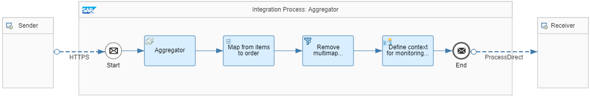

<!-- loio5f5e01bfa534465eab55c8751f72a5bc -->

# Aggregator

You want to combine related individual messages so that they can be processed in bulk. Using an Aggregator pattern, you can collect and store individual messages until a complete set of related messages has been received. The aggregated message is then sent to the actual receiver.


<a name="loio5f5e01bfa534465eab55c8751f72a5bc__section_hqz_1qz_tjb"/>

## Use Case

You want to collect individual product items related to the same order. The aggregated items are to be sent as one single order with multiple items.

Before aggregation, the messages have the following structure:

> ### Sample Code:  
> ```
> <?xml version='1.0' encoding='UTF-8'?>
> <ns0:Item xmlns:ns0="http://demo.sap.com/eip/aggregator" ItemNumber="10" PurchaseOrderNumber="81001">
> <ProductId>HT-1030</ProductId>
> <ProductName>Ergo Screen</ProductName>
> <Category>Flat Screen</Category>
> <Quantity>2</Quantity>
> <CurrencyCode>EUR</CurrencyCode>
> <Price>460.00</Price>
> <LastMessageIndicator/>
> </ns0:Item>
> ```

> ### Sample Code:  
> ```
> <?xml version='1.0' encoding='UTF-8'?>
> <ns0:Item xmlns:ns0="http://demo.sap.com/eip/aggregator" ItemNumber="20" PurchaseOrderNumber="81001">
> <ProductId>HT-1101</ProductId>
> <ProductName>Smart Design</ProductName>
> <Category>Software</Category>
> <Quantity>10</Quantity>
> <CurrencyCode>EUR</CurrencyCode>
> <Price>799.00</Price>
> <LastMessageIndicator/>
> </ns0:Item>
> ```

> ### Sample Code:  
> ```
> <?xml version='1.0' encoding='UTF-8'?>
> <ns0:Item xmlns:ns0="http://demo.sap.com/eip/aggregator" ItemNumber="30" PurchaseOrderNumber="81001">
> <ProductId>HT-1000</ProductId>
> <ProductName>Notebook Basic 15</ProductName>
> <Category>Notebooks</Category>
> <Quantity>1</Quantity>
> <CurrencyCode>EUR</CurrencyCode>
> <Price>956.00</Price>
> <LastMessageIndicator>X</LastMessageIndicator>
> </ns0:Item>
> ```

After aggregation, the message has the following structure:

> ### Sample Code:  
> ```
> <?xml version='1.0' encoding='UTF-8'?>
> <ns0:PurchaseOrder xmlns:ns0="http://demo.sap.com/eip/aggregator" PurchaseOrderNumber="81001">
> <Items>
> <Item ItemNumber="10">
> <ProductId>HT-1030</ProductId>
> <ProductName>Ergo Screen</ProductName>
> <Category>Flat Screen</Category>
> <Quantity>2</Quantity>
> <CurrencyCode>EUR</CurrencyCode>
> <Price>460.00</Price>
> </Item>
> <Item ItemNumber="20">
> <ProductId>HT-1101</ProductId>
> <ProductName>Smart Design</ProductName>
> <Category>Software</Category>
> <Quantity>10</Quantity>
> <CurrencyCode>EUR</CurrencyCode>
> <Price>799.00</Price>
> </Item>
> <Item ItemNumber="30">
> <ProductId>HT-1000</ProductId>
> <ProductName>Notebook Basic 15</ProductName>
> <Category>Notebooks</Category>
> <Quantity>1</Quantity>
> <CurrencyCode>EUR</CurrencyCode>
> <Price>956.00</Price>
> </Item>
> </Items>
> </ns0:PurchaseOrder>
> ```


<a name="loio5f5e01bfa534465eab55c8751f72a5bc__section_r4v_bqz_tjb"/>

## Implementation

The *Pattern Aggregator* integration flow illustrates how to implement this use case with a simple scenario.



The Aggregator step collects the message stream in a single message. How the step performs this task is specified by the following Correlation Expression: *//@PurchaseOrderNumber*.

The following Aggregation strategy has been defined for the Aggregator step:


<table>
<tr>
<th valign="top">

Attribute

</th>
<th valign="top">

Value

</th>
</tr>
<tr>
<td valign="top">

Incoming Format

</td>
<td valign="top">

XML \(Same Format\)

</td>
</tr>
<tr>
<td valign="top">

Aggregation Algorithm

</td>
<td valign="top">

Combine

</td>
</tr>
<tr>
<td valign="top">

Last Message Condition \(XPath\)

</td>
<td valign="top">

ns0:Item/LastMessageIndicator='X'

</td>
</tr>
<tr>
<td valign="top">

Completion Timeout \(in min\)

</td>
<td valign="top">

2

</td>
</tr>
<tr>
<td valign="top">

Data Store Name

</td>
<td valign="top">

Aggregator-EIP

</td>
</tr>
</table>

As a result, the aggregator either waits until the messages have a `Last Message` status, or it waits for 2 minutes.

This step results in the following message:

> ### Sample Code:  
> ```
> <?xml version='1.0' encoding='UTF-8'?>
> <multimap:Messages xmlns:multimap="http://sap.com/xi/XI/SplitAndMerge">
> <multimap:Message1>
> <ns0:Item xmlns:ns0="http://demo.sap.com/eip/aggregator" ItemNumber="10" PurchaseOrderNumber="81001">
> <ProductId>HT-1030</ProductId>
> <ProductName>Ergo Screen</ProductName>
> <Category>Flat Screen</Category>
> <Quantity>2</Quantity>
> <CurrencyCode>EUR</CurrencyCode>
> <Price>460.00</Price>
> <LastMessageIndicator/>
> </ns0:Item>
> <ns0:Item xmlns:ns0="http://demo.sap.com/eip/aggregator" ItemNumber="20" PurchaseOrderNumber="81001">
> <ProductId>HT-1101</ProductId>
> <ProductName>Smart Design</ProductName>
> <Category>Software</Category>
> <Quantity>10</Quantity>
> <CurrencyCode>EUR</CurrencyCode>
> <Price>799.00</Price>
> <LastMessageIndicator/>
> </ns0:Item>
> <ns0:Item xmlns:ns0="http://demo.sap.com/eip/aggregator" ItemNumber="30" PurchaseOrderNumber="81001">
> <ProductId>HT-1000</ProductId>
> <ProductName>Notebook Basic 15</ProductName>
> <Category>Notebooks</Category>
> <Quantity>1</Quantity>
> <CurrencyCode>EUR</CurrencyCode>
> <Price>956.00</Price>
> <LastMessageIndicator>X</LastMessageIndicator>
> </ns0:Item>
> </multimap:Message1>
> </multimap:Messages>
> ```

The *ItemNumber* element with the value *30* has the *Last Message* indicator *<LastMessageIndicator\>X</LastMessageIndicator\>*.

The subsequent Message Mapping step maps from multimap items to a multimap order.

> ### Tip:  
> If you migrate your integration scenario from SAP Process Orchestration to SAP Integration Suite, you can connect to your Enterprise Services Repository and upload the message mapping, as described in [Importing Content from SAP Process Orchestration System](IntegrationSettings/importing-content-from-sap-process-orchestration-system-53db5fb.md). Otherwise, you can create the Message Mapping from scratch.

Source and target message types are specified in the Message Mapping \(the occurrence of the target message is set to *unbound*\).

In the Message Mapping, the *Item* node of the source structure is mapped to the *Item* node of the target structure.

This step results in the following message:

> ### Sample Code:  
> ```
> <?xml version="1.0" encoding="UTF-8"?>
> <ns1:Messages xmlns:ns1="http://sap.com/xi/XI/SplitAndMerge">
> <ns1:Message1>
> <ns0:PurchaseOrder PurchaseOrderNumber="81001" xmlns:ns0="http://demo.sap.com/eip/aggregator">
> <Items>
> <Item ItemNumber="10">
> <ProductId>HT-1000</ProductId>
> <ProductName>Notebook Basic 15</ProductName>
> <Category>Notebooks</Category>
> <Quantity>1</Quantity>
> <CurrencyCode>EUR</CurrencyCode>
> <Price>956.00</Price>
> <LastMessageIndicator>X</LastMessageIndicator>
> </Item>
> <Item ItemNumber="20">
> <ProductId>HT-1101</ProductId>
> <ProductName>Smart Design</ProductName>
> <Category>Software</Category>
> <Quantity>10</Quantity>
> <CurrencyCode>EUR</CurrencyCode>
> <Price>799.00</Price>
> </Item>
> <Item ItemNumber="30">
> <ProductId>HT-1000</ProductId>
> <ProductName>Notebook Basic 15</ProductName>
> <Category>Notebooks</Category>
> <Quantity>1</Quantity>
> <CurrencyCode>EUR</CurrencyCode>
> <Price>956.00</Price>
> </Item>
> </Items>
> </ns0:PurchaseOrder>
> </ns1:Message1>
> </ns1:Messages>
> ```

The subsequent Filter step removes the multimapping from the message. It uses the following XPath expression:

*//ns0:PurchaseOrder*

> ### Note:  
> The corresponding namespace mapping is maintained in the *Runtime Configuration* tab of the integration flow: *xmlns:ns0=http://demo.sap.com/eip/aggregator*.

**Related Information**  


[Define Aggregator](define-aggregator-aa23816.md "")

