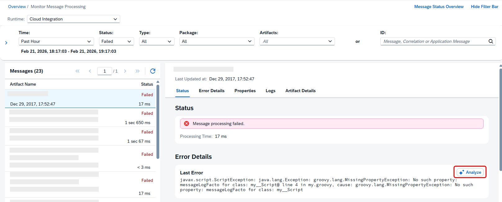
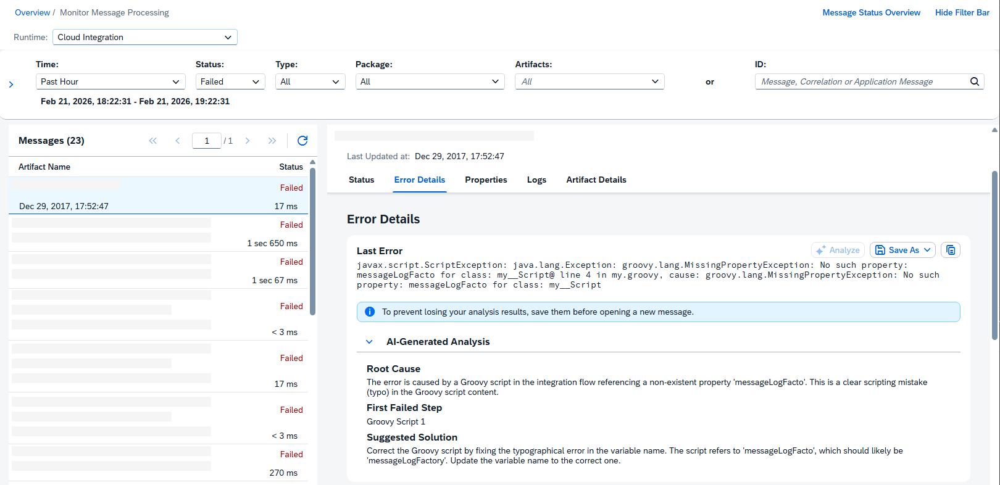

<!-- loiof27f95d7b90b4f13aea22b399418b702 -->

# AI-assisted Error Resolution

Use artificial intelligence to analyze and resolve message processing errors efficiently.

## Prerequisites

> ### Note:  
> AI features are accessible only with the Premium and Enhanced Editions. These are provided as a free promotion through June 2026 and will be commercialized later as AI features using AI Units. For more information on availability of these AI features across SAP BTP regions, see [3463620](https://me.sap.com/notes/3463620).

-   Enable the *AI-assisted Error Resolution* feature in your SAP Integration Suite tenant. For more information, see [Artificial Intelligence](https://help.sap.com/docs/integration-suite/sap-integration-suite/artificial-intelligence?locale=en-US&state=DRAFT&version=DEV).
-   Ensure that you have the role PI\_Integration\_Developer or PI\_Administrator assigned.

## Context

You can use AI assistance to analyze failed message processing logs. The AI assistant identifies the main error cause and proposes a solution.

> ### Remember:  
> This feature is only available for *Failed* MPLs.

To access the message monitor, select a tile in the *Monitor Message Processing* area. The system displays messages based on the tile's filter settings.

## Procedure

1.  Select a failed message from the list to view more information.

2.  In the *Error Details* section, choose the *Analyze* button to start the error analysis.

    

    > ### Note:  
    > AI analysis may not run if users reach the usage quota. A fair usage limit is available each month. Every AI analysis request uses quota, and this quota resets monthly.

3.  The AI agent analyzes the error and displays the following results:

    -   *Root Cause*: The primary reason for the error, based on the analysis of the failing step.
    -   *First Failed Step*: The earliest step where the processing stopped. Use this as the starting point for troubleshooting. This field is specifically helpful in case of parallel processing flow steps, such as parallel multicast, parallel splitting, and aggregation.
    -   *Suggested Solution*: An actionable recommendation to resolve the issue.

    > ### Example:  
    > 

4.  *Copy* the AI-generated analysis into a secure location, or select *Save As* to download the results to your local file system.

    > ### Tip:  
    > The system doesn't save the analysis. To prevent data loss and avoid the need to regenerate error analyses, save your analysis before opening a new message.

    There are two options under *Save As*:

    -   *New File*. The default, editable file name is based on the integration flow name.

    -   *Existing File*. You can use an existing file to collect related MPL failure analyses in one sheet. This enables correlation across multiple analyses.

    > ### Tip:  
    > Save your analysis in a shared folder and reuse saved files when possible. This helps prevent early quota exhaustion, especially when multiple integration developers use the feature. Audit log trails identify users leveraging the AI feature for collaboration purposes.

5.  Apply the suggested solution to your integration artifact to solve the error.

<a name="task_cwt_wgc_m3c"/>

<!-- task\_cwt\_wgc\_m3c -->

## Troubleshooting

If the following warning or error messages pop up when analyzing errors, perform the corresponding actions:

<table>
<tr>
<th valign="top">

Message

</th>
<th valign="top">

Action

</th>
</tr>
<tr>
<td valign="top">

The \[integration flow\] and its dependencies have been updated, which may have resolved the issue. Do you still want to analyze the error?

</td>
<td valign="top">

Some dependencies have changed since the MPL was created. This update might affect the accuracy of the analysis. You can either confirm to start the analysis or cancel the process.

</td>
</tr>
<tr>
<td valign="top">

\[integration flow\] references some artifacts that are currently undeployed, and the analysis may be inaccurate. Do you still want to analyze the error?

</td>
<td valign="top">

During dependency checking, the system found related artifacts \(e.g. correlated integration flows, or script collections\) that aren't deployed. This can affect the accuracy of the analysis. You can either confirm to start the analysis or cancel the process.

</td>
</tr>
<tr>
<td valign="top">

AI analysis is temporarily unavailable because you reached the monthly usage limit. Try again after the limit resets.

</td>
<td valign="top">

AI analysis can't run because you reached the fair usage limit. Try again after the quota resets.

> ### Note:  
> The quota resets each month.

</td>
</tr>
<tr>
<td valign="top">

The error could not be analyzed because \[integration flow\] is currently undeployed.

</td>
<td valign="top">

AI analysis cannot run because the main integration flow for the specified MPL ID is not deployed. Deploy your artifact and try again.

</td>
</tr>
<tr>
<td valign="top">

The error could not be analyzed because no message processing log exists with this ID.

</td>
<td valign="top">

The system can't find any MPLs with the provided ID.

</td>
</tr>
</table>

