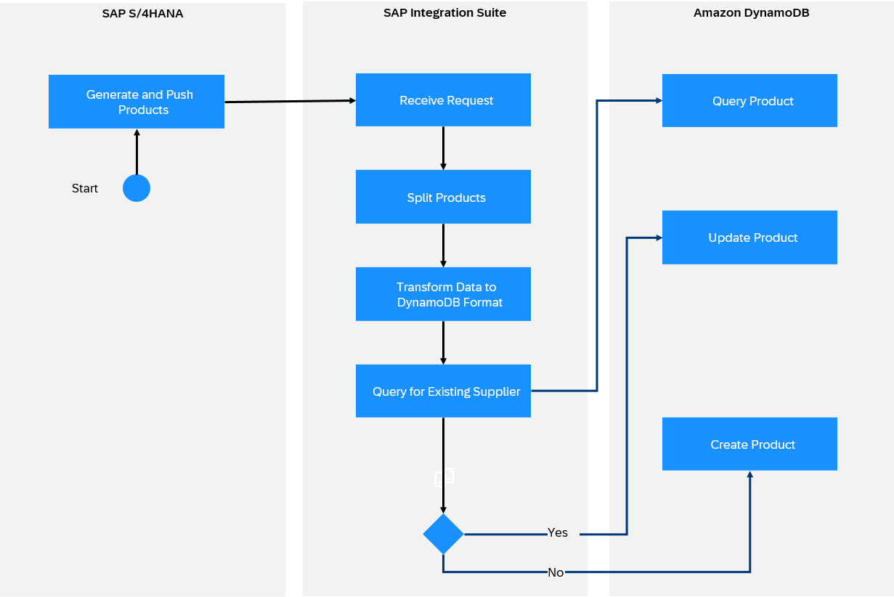

<!-- loio36620d58456d4d409ddc09e8c6722694 -->

# Amazon DynamoDB Receiver Adapter

The Amazon DynamoDB receiver adapter enables you to connect SAP Integration Suite to Amazon DynamoDB.

> ### Note:  
> This adapter is available on SAP Business Accelerator Hub.
> 
> For more information, see [Consuming Integration Adapters from SAP Business Accelerator Hub](consuming-integration-adapters-from-sap-business-accelerator-hub-b9250fb.md).
> 
> The availability of the adapter is dependent on your SAP Integration Suite service plan. For more information about different service plans and their supported feature set, see SAP Notes [2903776](https://launchpad.support.sap.com/#/notes/2903776) and [3188446](https://launchpad.support.sap.com/#/notes/3188446).

> ### Note:  
> This adapter exchanges data with a remote component that might be outside the scope of SAP. Make sure that the data exchange complies with your company’s policies.

<a name="loio36620d58456d4d409ddc09e8c6722694__section_gmq_kpz_bcc"/>

## How the Amazon DynamoDB Receiver Adapter Works

If you have configured a Amazon DynamoDB receiver adapter, the data exchange is performed as follows at runtime: SAP Integration Suite sends the data request to DynamoDB \(this is a receiver system\), DynamoDB works on the request and sends back the data to the SAP.

For example, SAP S4/HANA generates and pushes the list of Products to be copied to DynamoDB. SAP Integration Suite the request and transforms it to the required DynamoDB format. SAP Integration Suite then queries the existing Products in DynamoDB. It executes the UPDATE operation if data exists or else, INSERTS a new record for non-existent Products.

The following diagram illustrates the example.

<a name="loio36620d58456d4d409ddc09e8c6722694__section_ez4_3pz_bcc"/>

## Configuring the Amazon DynamoDB Receiver Adapter

Select the *Connection* tab and provide values in the fields as follows.

**Connection**

<table>
<tr>
<th valign="top">

Parameter

</th>
<th valign="top">

Description

</th>
</tr>
<tr>
<td valign="top">

*Region Name* 

</td>
<td valign="top">

Select the AWS region where the S3 bucket resides.

Example: *eu-west-1 Europe \(Ireland\)*

</td>
</tr>
<tr>
<td valign="top">

*Authentication* 

</td>
<td valign="top">

The authentication method used is *Access Key and Secret Key*.

</td>
</tr>
<tr>
<td valign="top">

*Access Key Alias* 

</td>
<td valign="top">

Specify the name of the *Secure Parameter* artifact which stores the AWS access key.

</td>
</tr>
<tr>
<td valign="top">

*Secret Key Alias* 

</td>
<td valign="top">

Specify the name of the *Secure Parameter* that stores the AWS secret key.

</td>
</tr>
<tr>
<td valign="top">

*Connection Timeout \(in ms\)* 

</td>
<td valign="top">

Specify the connection timeout in milliseconds. You can configure the maximum waiting time for SAP until a response is received from DynamoDB.

Example: `3000`

</td>
</tr>
<tr>
<td valign="top">

*Response Timeout \(in ms\)* 

</td>
<td valign="top">

Specify the maximum waiting time \(in milliseconds\) for a response message.

Example: `6000`

</td>
</tr>
</table>

The *Processing* tab contains all the operational configurations for the Amazon DynamoDB adapter.

**Processing**

<table>
<tr>
<th valign="top">

Parameter

</th>
<th valign="top">

Description

</th>
</tr>
<tr>
<td valign="top">

*Item Operation* 

</td>
<td valign="top">

Select the operation to be performed.

</td>
</tr>
<tr>
<td valign="top">

*Table Name* 

</td>
<td valign="top">

Specify the target table in DynamoDB.

</td>
</tr>
<tr>
<td valign="top">

*Statement* 

</td>
<td valign="top">

Specify the partiQL statement representing the action to be performed.

</td>
</tr>
<tr>
<td valign="top">

*Next Token* 

</td>
<td valign="top">

Specify this value to get the remaining results, if `NextToken` was returned in the statement response.

</td>
</tr>
<tr>
<td valign="top">

*Index Name* 

</td>
<td valign="top">

Specify the name of the secondary index for query and scan.

Example: `ind1`

</td>
</tr>
<tr>
<td valign="top">

*Specify Expression Manually* 

</td>
<td valign="top">

Manually specify the attributes for filter and projection.

</td>
</tr>
<tr>
<td valign="top">

*Partition Key Value* 

</td>
<td valign="top">

Specify the value for partition key. Data with Partition Key is stored together for ease of querying.

Example: `product_id`

</td>
</tr>
<tr>
<td valign="top">

*Condition for Sort Key* 

</td>
<td valign="top">

Select the conditional operator to be applied on the Sort Key. You have the following options:

-   *Between*

-   *Equal to*

-   *Greater than*

-   *Greater than or Equal to*

-   *Less than*

-   *Less than or Equal to*

</td>
</tr>
<tr>
<td valign="top">

*Sort Key Value* 

</td>
<td valign="top">

Specify the value for Sort Key. Sort Key determines how data with the same partition is ordered.

Example: `timestamp`

</td>
</tr>
<tr>
<td valign="top">

*And \(Sort Key Value\)* \(Only available if *Condition for Sort Key* is set to *Between*\)

</td>
<td valign="top">

Specify the upper limit for Sort Key.

</td>
</tr>
<tr>
<td valign="top">

*Specify Attributes to Project* 

</td>
<td valign="top">

Specify the attributes that you want to project. The fields should be comma separated..

Example: `Account_ID, creationDate, CustomerName`

</td>
</tr>
<tr>
<td valign="top">

*Consistent Read* 

</td>
<td valign="top">

Enable to opt for the read consistency model.

If enabled the operation uses strongly consistent reads otherwise it uses eventually consistent reads.

</td>
</tr>
<tr>
<td valign="top">

*Return Consumed Capacity* 

</td>
<td valign="top">

Select the level of detail for provisioned throughput consumption to be returned in the response.

Acceptable Values: *Indexes*, *None*, *Total*

</td>
</tr>
<tr>
<td valign="top">

*Limit* 

</td>
<td valign="top">

Specify the maximum number of items to be evaluated before the matching condition returns the result set of rows.

> ### Note:  
> *Limit* applies to the result set fetched from the table before *Filter* is applied.

Example: `50`

</td>
</tr>
<tr>
<td valign="top">

*Filters* 

</td>
<td valign="top">

Set a filter condition on an attribute as a post-processing action on the records fetched.

Example:

Filter Attribute Name `Create_Date`

Type `Number`

Condition `Between`

Filter Attribute Value `2023-01-01`

And `2023-12-12`

</td>
</tr>
<tr>
<td valign="top">

*Scan Index Forward* 

</td>
<td valign="top">

Select to specify the order of index traversal.

If enabled, traversal is performed in ascending order.

If unchecked, traversal is performed in descending order.

</td>
</tr>
<tr>
<td valign="top">

*Response Payload Format* 

</td>
<td valign="top">

Specify the request and response payload format. Responses are only available in JSON format.

</td>
</tr>
<tr>
<td valign="top">

*Request Headers* 

</td>
<td valign="top">

Enter a list of custom headers, separated by a pipe \(`|`\), to send to the target system.

By default, no custom headers are sent. Use an asterisk \(`*`\) to send all custom headers to the target system.

</td>
</tr>
<tr>
<td valign="top">

*Response Headers* 

</td>
<td valign="top">

Enter a list of headers coming from the target system's response, separated by a pipe \(`|`\), to be received in the message.

Use an asterisk \(`*`\) to receive all the headers from the target system, which is also the default value.

Default: `*`

</td>
</tr>
</table>

