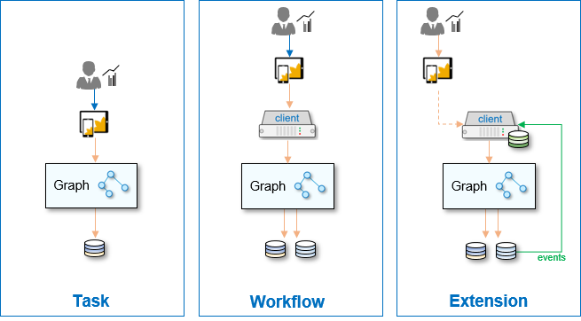

<!-- loio4db0c0b7d83f4080a45ae702dfe97dbc -->

# Application Archetypes

Client application scenarios range from a simple task performed by an authorized user to complex extensions with stateful and multitenant business logic involving event notifications from multiple data sources.

The illustration shows three archetypical ways of creating client applications that use Graph. Each archetype represents somewhat different coding considerations, security requirements, and best practices.

<a name="loio4db0c0b7d83f4080a45ae702dfe97dbc__section_pty_5q5_yrb"/>

## Task

The *Task* architecture shows a simple web client application, often implemented as a Single Page Application \(SPA\) interacting directly with Graph, without any server-side component. The application accesses the data on behalf of a corporate business user, who must first be authenticated. Such applications can be developed with low-code/no-code tools, focusing on simple workflow tasks that typically interact with one or more data sources. Simple mobile or Fiori applications fall into this category as well.

> ### Note:  
> Applications based on the *Task* architecture must use an extended form of the OAuth protocol called Proof Key for Code Exchange \(PKCE\) that supports user authentication without storing a secret. Since the SAP Authorization and Trust Management service does not handle PKCE, this archetype is not yet supported by Graph.

<a name="loio4db0c0b7d83f4080a45ae702dfe97dbc__section_nkc_2r5_yrb"/>

## Workflow

The *Workflow* is the most common server-side client architecture with a web or mobile user interface. Users are optionally authenticated and interact with the application to directly access SAP-managed data. This type of "full-stack" application architecture is very common and better suited for more complex business logic, involving multiple data sources, some state information, etc. Workflow applications are often implemented in Java or Node.js.

<a name="loio4db0c0b7d83f4080a45ae702dfe97dbc__section_nps_zq5_yrb"/>

## Extension

The *Extension* architecture is a more complex server-side client \(often called *headless*\), which interacts with data sources independently of users, who may optionally communicate with the client app at different times. This archetype is best suited for arbitrarily complex and asynchronous extension scenarios triggered by events or timers, and often includes additional state and persistence. You could use this type of architecture to prepare complex information \(reports, dashboards\) in the background, that will be available to business users who log in at a later time.

