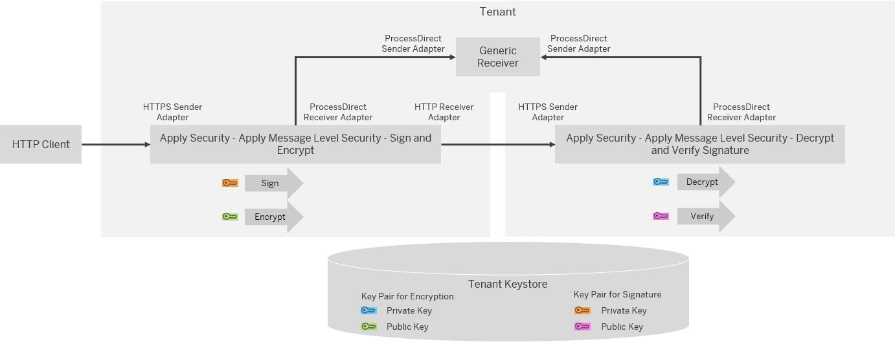
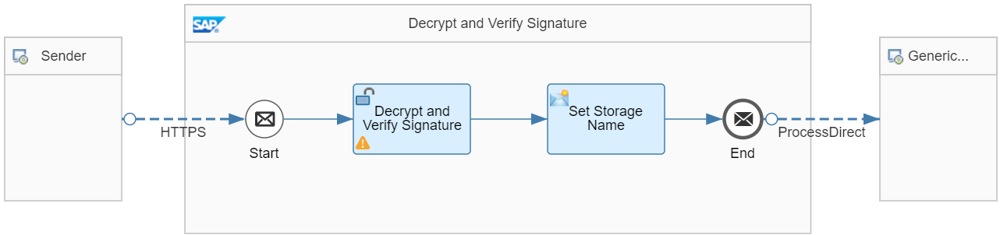

<!-- loio9036c0c6446648a781fe2c200475ffa2 -->

# Apply Message-Level Security

Message-level security features allow you to digitally encrypt/decrypt or sign/verify a message \(or both\).

Protocols that include transport-level security \(like HTTPS or SFTP\) only protect the data in transfer between the communication endpoints. Once the data is received, it's decrypted and available in clear text. For example, while SFTP takes care about a secure transfer over the wire, it doesn't protect the files stored on the SFTP server.

If a higher level of protection is required, consider using message-level security. Message-level security is also the option to go if transport-level security can't be implemented \(for example, if a legacy communication endpoint doesn't support this option\).

For more information on the encryption formats supported by SAP Integration Suite , see [Message-Level Security](../40-RemoteSystems/message-level-security-463a908.md).

Another dimension of message-level security is payload signing. This allows you to verify the authorship and integrity of the received message payload. Using this option you can verify that a message wasn't tampered with during transmission via the involved communication hops. The supported signing standards are the same as for encryption and additionally XML Signature and WS-Security.

> ### Note:  
> If you're exchanging encrypted and signed messages with partners, the partner must also be able to process those encryption algorithms.

Both, encryption and signing in SAP Integration Suite are based on asymmetric cryptographic algorithms that require a key pair consisting of a private and public key. For encryption, the sending party uses the public key of the receiver and only the receiver can decrypt the message with its private key.

For signing, the sending party uses its own private key to encrypt a hash of the complete message payload and transmits this signature together with the actual message. The receivers who want to verify the authorship and integrity of the message payload decrypt the signature. For that purpose, they're using the public key of the sender. They also generate a hash of the payload, using the same hashing algorithm as the sender. If the decrypted hash value of the received message equals the hash value generated from the received message, it's ensured, that the massage payload wasn't changed during transmission.

For more information how this process works \(when using standard OpenPGP\), see [How OpenPGP Works](../40-RemoteSystems/how-openpgp-works-29bc188.md).

<a name="loio9036c0c6446648a781fe2c200475ffa2__section_ylg_pyn_slb"/>

## Implementation

In a real-life scenario that uses encryption and signing, key pairs owned by the tenant administrator and key pairs owned by the administrator of the connected receiver system are involved.

-   To encrypt a message \(to be sent to a receiver\), an integration flow needs the public key of the external party. This key needs to be imported into the SAP Cloud Integration keystore.

-   To decrypt an encrypted message \(received from a sender\), an integration flow needs a private key. This key needs to be imported into the SAP Integration Suite keystore. Furthermore, the corresponding public key must be shared with sender party to allow generating the encrypted message \(that can only be decrypted by the SAP Integration Suite system\).

> ### Tip:  
> For signing and signature validation, the roles of private and public key are exchanged. Consequently, a different key pair is required on sender and receiver side.

To minimize the configuration effort and to enable you running the example integration flows without modifications and setup tasks outside of SAP Cloud Integration, we provide the following example scenario setup: There are 2 integration flows that call each other for a local roundtrip on the SAP Integration Suite system.

The first example integration flows signs and encrypts a message and sends it to a receiver \(through an HTTP receiver channel\). The 2nd integration flow receives the message \(through an HTTPS sender channel\), decrypts the payload and then verifies the signature.

Using this setup, it's sufficient to import 2 key pairs into the SAP Integration Suite keystore.

-   One key pair for encryption and decryption of the message

-   One key pair for signing and verifying the message

In this guideline, the PKCS\#7/CMS format is used, the other protocol options for encryption and signing can be configured in a similar way.

As shown in the figure, both integration flows also send a message to the *Generic Receiver*. The first integration flow sends the encrypted message to the *Generic Receiver* integration flow where it's stored as Data Store entry. The 2nd integration flow sends the decrypted message to the *Generic Receiver* integration flow where it's stored as Data Store entry. As separate Data Store entries are stored \(both with a timestamp in the entry ID\), you can easily compare the encrypted and the decrypted message after the message processing run.

> ### Note:  
> In a productive scenario, the involved public key certificate for signature verification is to be signed by a trusted certificate authority \(CA\) to ensure the authenticity of the sending and signing party. In the example integration flow of this guideline, we omit this important step for sakes of simplicity \(and to enable the user to run the scenario out-of-the-box.

To create the required key pair, you've the following options:

-   Create a new key pair using the SAP Integration Suite Monitor application \(see [Creating a Key Pair/SSH Key Pair](creating-a-key-pair-ssh-key-pair-b8a8601.md)\).

-   Create a new key pair using a tool such like OpenPGP or Kleopatra and import the resulting key pair into the tenant keystore.

-   Use a key pair that exists already in the tenant keystore \(see [Keys Provided by SAP](../40-RemoteSystems/keys-provided-by-sap-9d8a60b.md)\).

To execute this guideline, we recommend using the first option and to create new key pairs using the SAP Integration Suite Monitor application. For this guideline, we assume that you use 2 key pairs with the following aliases:

-   `keypair_for_encryption`

-   `keypair_for_signature`

More information: [Creating a Key Pair/SSH Key Pair](creating-a-key-pair-ssh-key-pair-b8a8601.md)

The integration flows *Apply Security - Apply Message Level Security - Sign and Encrypt* and *Apply Security - Apply Message Level Security - Decrypt and Verify Signature* work in the following way.

> ### Note:  
> For the example integration flows, Postman has the role of the original sender. To apply CSRF protection, there are 2 Postman requests: In a 1st GET request, Postman fetches the CSRF token, and in a 2nd POST request Postman sends the message payload \(clear text\) \(see [Use CSRF Protection](use-csrf-protection-a0765d5.md)\).

The first integration flow *Apply Security - Apply Message Level Security - Sign and Encrypt* works the following way:

1.  The integration flow receives the message \(send by Postman\) via an HTTPS sender channel.

2.  The PKCS7/CMS Encryptor step *Sign and Encrypt* signs the message payload with the configured private key and encrypts the message with the public key.

    As the step uses encryption and signing, 2 key pairs are to be referred to. As default setting, the following key pair aliases are preconfigured:

    `keypair_for_encryption`

    `keypair_for_signature`

3.  The Content Modifier *Set Storage Name* creates the header that is used by the *Generic Receiver* integration flow to create the Data Store entry ID for the encrypted payload. When you check the Content Modifier \(tab *Message Header*\), you notice that a timestamp is generated that becomes part of the header sent to the *Generic Receiver* integration flow. To create the timestamp, the expression `${date:now:yyyyMMdd_HHmmss_SSS}` is used. The final entry ID consists of the timestamp and the suffix `-encrypted`, for example `20200602_095831_988-encrypted`.

    > ### Note:  
    > The Data Store name is provided by the HTTP client in a header \(`context`\). The Data Store name is: `ApplySecurity-ApplyMessageLevelSecurity`.

4.  The Request Reply step *Store Encrypted Payload*, stores sends the encrypted payload through the ProcessDirect adapter to the *Generic Receiver* integration flow \(where it's stored as Data Store entry\).

5.  The integration flow sends the message to the 2nd integration flow via an HTTP receiver channel.

In a productive scenario, in the PKCS7/CMS Encryptor step you can choose the configuration parameters as the *Content Encryption Algorithm*, the *Block Size*, and *Secret Key Length* according to your needs. The values of *Public Key Alias* for encryption and of *Private Key Alias* for signing are externalized \(with default values `keypair_for_encryption` and `keypair_for_signature`\).

The 2nd integration flow *Apply Security - Apply Message Level Security - Decrypt and Verify Signature* works the following way:

1.  The integration flow receives the encrypted and signed message \(send by the first integration flow\) via an HTTPS sender channel.

2.  The PKCS7/CMS Decryptor step *Decrypt and Verify Signature* decrypts the payload and verifies the signature with the configured public key.

    To find the right key for verifying the message, the step refers to the associated key pair alias `keypair_for_signature`.

    > ### Note:  
    > The alias for the 2nd key pair \(that contains the private key required to decrypt the message\) isn't needed in the step configuration. The reason is that the encrypted message contains a reference that enables the system to automatically and uniquely identify the required private key. To be more precise, for the PKCS\#7/CMS Decryptor, the message contains an issuer distinguished name and an issuer-specific serial number that uniquely identify the certificate of the corresponding public key that was used for encryption at sender side.
    > 
    > Therefore, even though the SAP Cloud Integration tenant keystore can contain multiple key pairs, the Decryptor step doesn't require to explicitly configure the alias for the private key to be used.

3.  The Content Modifier *Set Storage Name* creates the header that is used by the *Generic Receiver* integration flow to create the Data Store entry ID for the decrypted payload. When you check the Content Modifier \(tab *Message Header*\), you notice that the header is created based on the timestamp generated by the first integration flow. The final entry ID consists of the timestamp and the suffix `-decrypted`, for example `20200602_095831_988-decrypted`.

4.  The integration flow sends the decrypted message to the *Generic Receiver* integration flow via a ProcessDirect adapter.

    Finally, the decrypted message payload is stored as data store entry.

The aliases for the 2 key pairs have been externalized \(with default values `keypair_for_encryption` and `keypair_for_signature`\). If other keystore aliases are to be used, you can configure it accordingly before deployment.

You can verify that the payload was encrypted, by inspecting the data store entries \(data store name *ApplySecurity-ApplyMessageLevelSecurity* for integration flow *ApplySecurityGenericReceiver*\).

-   Entry with the ID ending with *\-encrypted* contains the encrypted payload \(for the integration flow executed at the time indicated by the timestamp\).

-   Entry with the ID ending with *\-decrypted* contains the encrypted payload \(for the integration flow executed at the time indicated by the timestamp\).

More information: [HCI Encrypt with PGP](https://blogs.sap.com/2018/10/11/hci-encrypt-with-pgp/) \(SAP Community Blog\)

**Related Information**  

[Message-Level Security](../40-RemoteSystems/message-level-security-463a908.md "Several standards are supported to protect the message content (message-level security).")

[Security Aspects of Data, Data Flow](https://help.sap.com/viewer/368c481cd6954bdfa5d0435479fd4eaf/Cloud/en-US/702ddb59a8564c99aabe81e9d9e4239b.html "All data in transit, either exchanged with remote components or internal, can be protected by methods such as encryption.") :arrow_upper_right:

[Security Aspects of Data, Data Flow for Cloud Integration](../60-Security/security-aspects-of-data-data-flow-for-cloud-integration-7895724.md "All data in transit, either exchanged with remote components or internal, can be protected by methods such as encryption.")

[Keys Provided by SAP](../40-RemoteSystems/keys-provided-by-sap-9d8a60b.md "")

