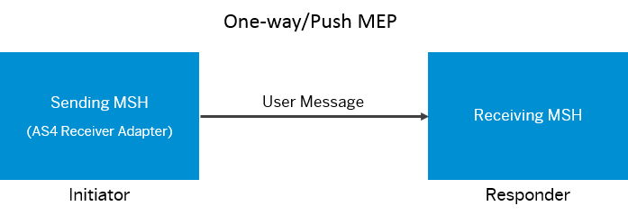

<!-- loio3a2fde8f52cf4ac38770eb843d3b3943 -->

# AS4 Receiver Adapter

Provides basic insights on how the AS4 messaging protocol enables message exchange between message service handlers \(MSHs\).

<a name="loio3a2fde8f52cf4ac38770eb843d3b3943__section_pfdb_p2n_kvd_sfb"/>

## Use

The SAP Applicability Statement 4 \(AS4\) receiver adapter is a secure, reliable, and payload-agnostic protocol. It uses Web services to transmit business-to-business documents. For more information on AS4 conformance profile defined by OASIS standard, see [AS4 Profile of ebMS 3.0 Version 1.0](http://docs.oasis-open.org/ebxml-msg/ebms/v3.0/profiles/AS4-profile/v1.0/AS4-profile-v1.0.html).

The SAP AS4 receiver adapter uses the Light Client conformance profile to address the functional requirements of e-commerce and e-governance services. The profile only supports message pushing for sending MSH and selective message pulling for receiving MSH. The adapter uses secure SAML tokens for authentication and authorization between two MSHs.

<a name="loio3a2fde8f52cf4ac38770eb843d3b3943__section_awz_4cz_ldb"/>

## Message Exchange Patterns \(MEPs\)

The AS4 receiver adapter uses the following message exchange patterns \(MEPs\) for exchanging business documents:

-   **One-way/push**: In this pattern, the AS4 receiver adapter is the sending MSH \(initiator\) that transfers business documents to the receiving MSH. The initiator receives a acknowledgment as part of the HTTP response.

    

-   **One-way/selective pull**: In this pattern, the AS4 receiver adapter is the receiving MSH \(initiator\) and sends a selective pull request to the sending MSH. The sending MSH initiates the pull request by identifing the specific user message using the message ID provided by the initiator.

    

Visit the [blog](https://blogs.sap.com/2018/05/13/configuring-sap-as4-receiver-adapter-for-ato-integration/), to understand how to integrate Business-to-Authority \(B2A\) Manager of SAP with ATO \(Australian Taxation Office\).

**Related Information**  

[Configure Receiver Channel with ebMS3 Push](configure-receiver-channel-with-ebms3-push-449f6e9.md "Configure the AS4 receiver channel as a sending Message Service Handler (MSH) to send business documents.")

[Configure Receiver Channel with ebMS3 Pull](configure-receiver-channel-with-ebms3-pull-7cdde30.md "Configure the AS4 receiver channel as a receiving MSH to exchange business documents.")

