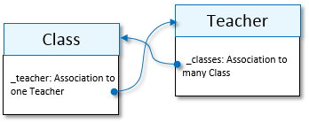

<!-- loio3eb61094d6674178beb9726e3a8e0990 -->

<link rel="stylesheet" type="text/css" href="../css/sap-icons.css"/>

# Attributes

The guidelines for attribute names and attribute types.

<a name="loio68627239a5be455d93c5d6173e2b202d"/>

<!-- loio68627239a5be455d93c5d6173e2b202d -->

## Attribute Names

Attribute names start with a lowercase letter and use lower camelCase, with only ASCII alphanumeric characters and underscores.

Attribute names must be precise and unambiguous in defining the semantics, interpreted in the context of an entity. For example, an entity `Student` has an attribute age, rather than `studentAge`. By convention, acronyms remain in capital letters, such as `baseURL`, except at the beginning of the name: `iataCode`.

Custom entities should be designed to have only one unique key attribute, by convention called `id`. We also recommend to have an additional attribute called `displayId`, which is the preferred value to display on UIs. Often, `id` and `displayId` map to the same source attribute value, but since Graph uses the `id` field to encode additional \(opaque\) information, it shouldn't be used for UIs.

<a name="loio38ca8c48464048efb22635f8b07fc78f"/>

<!-- loio38ca8c48464048efb22635f8b07fc78f -->

## Attribute Types

When creating a custom entity, you can use several kinds of attributes.

Graph's supported attribute types are a subset of the core data services types. For more information, see [Core Data Services \(CDS\) primitive types](https://cap.cloud.sap/docs/cds/types).


<a name="loio38ca8c48464048efb22635f8b07fc78f__section_wfp_r2q_dvb"/>

## Primitive

Primitive attributes are the simplest unstructured attributes, usually of type `String` or `Integer`. Primitive attribute names are singular. Primitive attributes that are `Boolean` should be named as positive and prefixed with a modal or auxiliary verb like *is*, *can*, or *has*. For example, `isActive` rather than `isInactive` or `active`.


<a name="loio38ca8c48464048efb22635f8b07fc78f__section_c4d_v2q_dvb"/>

## Structured

You can group certain attributes as a structure. A good example is attributes that together form an address. You can create a structured attribute by specifying the attribute name using a dotted path. Each path segment adds an additional nesting layer. For example:

```
{
  "entity": "bestrun.Customer",
  "attributes": [
    { "name": "address.street", "source": ["Street"] },
    { "name": "address.city", "source": ["City"] },
    { "name": "address.zip", "source": ["ZipCode"] }
  ]
}

```

`address` and `zip` are path-segments. Clients see the data as a nicely nested JSON object. For example:

```
  :
  address: {
    street: "Main Street";
    city: "Plains";
    zip: "44345";
  }
  :

```

> ### Note:  
> Graph doesn't support *Composition of one*, which would yield a similar result.


<a name="loio38ca8c48464048efb22635f8b07fc78f__section_gf2_z2q_dvb"/>

## Arrays of Primitive Values

Arrays of primitive values can be defined using the `arrayFill` transform. Attribute names that represent an array are plural, and must be followed by open and closed square brackets `[]` as a suffix. For example, `children[]` or `contacts[]`. The array base type is inferred from the source's first entry, but can be overwritten by the `property` type. All primitive types are allowed.

```
{
  "entity": "bestrun.Customer",
  "attributes": [
    { "name": "tags[]", "transform": "arrayFill", "source": ["Tag1", "Tag2", "Tag3"], "type": "String(21)" }
  ]
}

```


<a name="loio38ca8c48464048efb22635f8b07fc78f__section_grw_cfq_dvb"/>

## Compositions of Many \(Arrays of Sub-Entities\)

A composition is an attribute that represents a nested array of a structured type, a contained subentity, with a whole-and-parts semantics: the subentity doesn’t exist without the whole part. Examples are the list of items on a sales order, or the chapters of a book. Most existing data sources and APIs don't support compositions and just use foreign keys or associations to another entity, without highlighting the whole-and-parts semantics of the composition. Composition names are plural, and must be followed by open and closed square brackets `[]` as a suffix.

As a modeler of a Graph custom entity, you can represent whole-and-parts semantics correctly as a real composition, as follows:

-   Specify a `[]` following the path segment that becomes the composition attribute, with a source property that represents a foreign key \(association to many\). Don't specify a transform or type.

-   Specify the composition substructure, attribute by attribute, using the same name syntax, and adding the attribute as a path segment.

-   Mark at least one subentity attribute as a key.


The following example shows an attribute, called `addresses`, which is an inline composition of many addresses.

```
{
  "entity": "bestrun.Customer",
  "attributes": [
    { "name": "addresses[]","source": ["to_Addresses[]"] },
    { "name": "addresses[].id", "source": ["to_Addresses[].AddressID"], "key": true },
    { "name": "addresses[].street", "source": ["to_Addresses[].Street"] },
    { "name": "addresses[].city", "source": ["to_Addresses[].City"] }
  ]
}

```


<a name="loio38ca8c48464048efb22635f8b07fc78f__section_l3j_ffq_dvb"/>

## Compositions of Many Different Data Source APIs

In the *Compositions of Many \(Arrays of Sub-Entities \)* section, the composition attribute and the subentity are linked in the same data source API, and a foreign key exists in the data source. You can also create a composition where the subentity is part of a different API, possibly even in a different system. This could be the case, for example, when an extension application was created side by side with the main application.

If there is no foreign key or *Association to many* in the data source, a slightly different syntax must be used. Use the join transform for the composition attribute, with an explicit `sourceEntity` and without a source. Subsequent composition substructure attributes are specified as before, but since their source is in a different `sourceEntity`, it must be explicitly specified. Here's an example:

```
{
  "entity": "bestrun.Customer",
  "sourceEntities": [
    { "name": "sap.s4.A_Customer" },
    { "name": "sap.s4.A_BusinessPartnerAddress", "join": [["Customer", "BusinessPartner"]] }
  ],

  "attributes": [
    { "name": "addresses[]", "transform": "join", "sourceEntity": "A_BusinessPartnerAddress" },
    { "name": "addresses[].id", "source": ["AddressID"], "sourceEntity": "A_BusinessPartnerAddress", "key": true },
    { "name": "addresses[].street", "source": ["Street"], "sourceEntity": "A_BusinessPartnerAddress" },
    { "name": "addresses[].city", "source": ["City"], "sourceEntity": "A_BusinessPartnerAddress" }
  ]
}

```


<a name="loio38ca8c48464048efb22635f8b07fc78f__section_k2p_3fq_dvb"/>

## Associations to-One

Associations are relations based on an equality match of an underlying attribute \(sometimes called the *foreign key*\) with the key of the associated target entity. For example, you can model an association from a `Class` to one `Teacher` in your source model. The foreign key is defined as a string. For composite keys, the associating entity must have corresponding foreign keys in the source entity.

By convention, association to-one attribute names are singular, and prefixed with an underscore.

To describe an association:

-   Specify `Association` as the type and specify the `associationTarget` as a reference to the full entity name that your association points at.

-   Add a path-segment mapping to the attribute name for each key of the association target with a corresponding source.


The target entity usually has only one key, as in the following example:

```
{
  "entity": "bestrun.SalesOrder",
  "attributes": [
    {"name": "_sellTo", "type": "Association", "associationTarget": "sap.s4.A_Customer"}
    {"name": "_sellTo.Customer", "source": ["soldToParty"] } // Customer is the name of the key in A_Customer
  ]
}

```


<a name="loio38ca8c48464048efb22635f8b07fc78f__section_chr_nfq_dvb"/>

## Associations to-Many

An association to-many is a relationship to many target records that match on their key attribute. Such an association requires the existence of a corresponding to-one association in the other direction \(a backlink\).



To create an association to-many, you specify `Association` as the type and use the `on` clause to specify the to-one association \(backlink\) attribute in the target entity. Association to-many attribute names are plural, followed by open and closed square brackets `[]`. And by convention, they are prefixed with an underscore `_`.

```
"entity": "Teacher",
:
"attributes": [
   { "name": "_classes[]", "type": "Association", "associationTarget": "my.new.Class", "on": "_teacher" }
:

```

<a name="loio28c634acc884470c8b7591b17b2b899e"/>

<!-- loio28c634acc884470c8b7591b17b2b899e -->

## Attribute Properties

A list of attribute properties that can be found in project definition files.


<a name="loio28c634acc884470c8b7591b17b2b899e__section_f53_vfq_dvb"/>

## `name`

The name of the new attribute. For example:

```
lastName 		// attribute of scalar type at root level
mainAddress.country 	// primitive attribute country in a sub-structure mainAddress
addresses[] 		// to-many composition on root level (or array if the source attribute is defined as an array)
addresses[].country 	// primitive property country in to-many composition (or array) addresses

```


<a name="loio28c634acc884470c8b7591b17b2b899e__section_jcz_xfq_dvb"/>

## `key`

Indicates that this attribute, called `id`, is the entity key. Custom entities must have exactly one key at the root level, and convention dictates that you should call this key `id`. We also recommend to introduce an attribute called `displayId`, which provides a human-friendly version of the key, even if they share the same source.

```
{ "name": "id", "key": true, "source": ["Product"], type: String(70) } // rename "Product" to key "id"
{ "name": "displayId", "source": ["Product"], type: String} 

```


<a name="loio28c634acc884470c8b7591b17b2b899e__section_zgt_1gq_dvb"/>

## `source`

The source attribute for the transform, which is an array of one or more parameters. When both the source and transform are not specified, the default of the source is the same `name` in the source entity.

```
{ "name": "firstName", "source": ["FirstName"] } // rename "FirstName" to "firstName", inferred type is from source
{ "name": "FirstName" } // implied source is also called "FirstName" 

```


<a name="loio28c634acc884470c8b7591b17b2b899e__section_rq1_dgq_dvb"/>

## `sourceEntity`

The full name of the mirrored source entity to which this attribute mapping applies. The first source entity in the `sourceEntities` header property is used as the default source entity.


<a name="loio28c634acc884470c8b7591b17b2b899e__section_i42_ggq_dvb"/>

## `type`

This optional property defines the type of the custom entity attribute. If not specified, the default type is inferred from the mapped source attribute or the specified transform. The type attribute can be used as a typecast to overwrite the default. Graph supports two versions of `String` and `Decimal`. The `String` type doesn't provide a max-length \(expressed as a character count\) intentionally, but you can specify a maximal string length, as in `String(10)`. Similarly, the `Decimal` type can be specified explicitly with a precision and scale, as in `Decimal(5,2)`. Date and time formats follow [ISO 8601](https://en.wikipedia.org/wiki/ISO_8601).

The following are supported types \(type names are capitalized\):


<table>
<tr>
<th valign="top">

Type

</th>
<th valign="top">

Description

</th>
<th valign="top">

Example

</th>
</tr>
<tr>
<td valign="top">

String

</td>
<td valign="top">

String of unspecified length.

</td>
<td valign="top">

Alphanumeric text

</td>
</tr>
<tr>
<td valign="top">

String \(length\)

</td>
<td valign="top">

String of maximum length; longer strings are truncated.

</td>
<td valign="top">

Alphanumeric text

</td>
</tr>
<tr>
<td valign="top">

Integer

</td>
<td valign="top">

A whole number.

</td>
<td valign="top">

`52` 

</td>
</tr>
<tr>
<td valign="top">

Decimal

</td>
<td valign="top">

A whole and fractional number.

</td>
<td valign="top">

`17.63` 

</td>
</tr>
<tr>
<td valign="top">

Decimal \(precision, scale\)

</td>
<td valign="top">

A decimal value witha specification of precision and scale.

</td>
<td valign="top">

`Decimal(3,2) => 7.56` 

</td>
</tr>
<tr>
<td valign="top">

Boolean

</td>
<td valign="top">

Boolean values.

</td>
<td valign="top">

True, False

</td>
</tr>
<tr>
<td valign="top">

Date

</td>
<td valign="top">

Date as yyyy-mm-dd.

</td>
<td valign="top">

`2016-01-24` 

</td>
</tr>
<tr>
<td valign="top">

DateTime

</td>
<td valign="top">

Date and time as yyyy-mm-dd T hh:mm:ss.

</td>
<td valign="top">

`2016-11-24T16:11:45` 

</td>
</tr>
<tr>
<td valign="top">

Time

</td>
<td valign="top">

Time as hh:mm:ss.

</td>
<td valign="top">

`16:11:45` 

</td>
</tr>
<tr>
<td valign="top">

Timestamp

</td>
<td valign="top">

High-precision date and time.

</td>
<td valign="top">

`2016-11-24 16:11:32.4209753` 

</td>
</tr>
<tr>
<td valign="top">

Association

</td>
<td valign="top">

Association, specified with the `associationTarget` property.

</td>
<td valign="top">


</td>
</tr>
</table>

Example:

```
{ "name": "FirstName", "type": "String" } // implied source is also called "FirstName", overrides source type "String(127)".
```

> ### Note:  
> All values \(unless the attribute is explicitly defined as non-null\) can have a null value. For example, an attribute of type Boolean can be true, false, or null.

**Conversion Types**


<table>
<tr>
<th valign="top">

To

From

</th>
<th valign="top">

String

</th>
<th valign="top">

String \(L\)

</th>
<th valign="top">

Integer

</th>
<th valign="top">

Decimal

</th>
<th valign="top">

Boolean

</th>
<th valign="top">

Date

</th>
<th valign="top">

DateTime

</th>
<th valign="top">

Time

</th>
<th valign="top">

Time Stamp

</th>
</tr>
<tr>
<td valign="top">

`String` 

</td>
<td valign="top">

<span style="color:#2B7D2B;"><span class="SAP-icons-V5"></span></span> \(3\)

</td>
<td valign="top">

\(1\)

</td>
<td valign="top">

Must be an integer.

</td>
<td valign="top">

Must match a decimal.

</td>
<td valign="top">

<span style="color:#BB0000;"><span class="SAP-icons-V5"></span></span> 

</td>
<td valign="top">

<span style="color:#2B7D2B;"><span class="SAP-icons-V5"></span></span> \(2\)

</td>
<td valign="top">

<span style="color:#2B7D2B;"><span class="SAP-icons-V5"></span></span> \(2\)

</td>
<td valign="top">

<span style="color:#2B7D2B;"><span class="SAP-icons-V5"></span></span> \(2\)

</td>
<td valign="top">

<span style="color:#2B7D2B;"><span class="SAP-icons-V5"></span></span> \(2\)

</td>
</tr>
<tr>
<td valign="top">

`Integer` 

</td>
<td valign="top">

<span style="color:#2B7D2B;"><span class="SAP-icons-V5"></span></span> 

</td>
<td valign="top">

<span style="color:#2B7D2B;"><span class="SAP-icons-V5"></span></span> 

</td>
<td valign="top">

<span style="color:#2B7D2B;"><span class="SAP-icons-V5"></span></span> 

</td>
<td valign="top">

<span style="color:#2B7D2B;"><span class="SAP-icons-V5"></span></span> 

</td>
<td valign="top">

<span style="color:#BB0000;"><span class="SAP-icons-V5"></span></span> 

</td>
<td valign="top">

<span style="color:#BB0000;"><span class="SAP-icons-V5"></span></span> 

</td>
<td valign="top">

<span style="color:#BB0000;"><span class="SAP-icons-V5"></span></span> 

</td>
<td valign="top">

<span style="color:#BB0000;"><span class="SAP-icons-V5"></span></span> 

</td>
<td valign="top">

<span style="color:#BB0000;"><span class="SAP-icons-V5"></span></span> 

</td>
</tr>
<tr>
<td valign="top">

`Decimal` 

</td>
<td valign="top">

<span style="color:#2B7D2B;"><span class="SAP-icons-V5"></span></span> 

</td>
<td valign="top">

<span style="color:#2B7D2B;"><span class="SAP-icons-V5"></span></span> 

</td>
<td valign="top">

<span style="color:#BB0000;"><span class="SAP-icons-V5"></span></span> 

</td>
<td valign="top">

<span style="color:#2B7D2B;"><span class="SAP-icons-V5"></span></span> 

</td>
<td valign="top">

<span style="color:#BB0000;"><span class="SAP-icons-V5"></span></span> 

</td>
<td valign="top">

<span style="color:#BB0000;"><span class="SAP-icons-V5"></span></span> 

</td>
<td valign="top">

<span style="color:#BB0000;"><span class="SAP-icons-V5"></span></span> 

</td>
<td valign="top">

<span style="color:#BB0000;"><span class="SAP-icons-V5"></span></span> 

</td>
<td valign="top">

<span style="color:#BB0000;"><span class="SAP-icons-V5"></span></span> 

</td>
</tr>
<tr>
<td valign="top">

Boolean

</td>
<td valign="top">

<span style="color:#BB0000;"><span class="SAP-icons-V5"></span></span> 

</td>
<td valign="top">

<span style="color:#BB0000;"><span class="SAP-icons-V5"></span></span> 

</td>
<td valign="top">

<span style="color:#BB0000;"><span class="SAP-icons-V5"></span></span> 

</td>
<td valign="top">

<span style="color:#BB0000;"><span class="SAP-icons-V5"></span></span> 

</td>
<td valign="top">

<span style="color:#2B7D2B;"><span class="SAP-icons-V5"></span></span> 

</td>
<td valign="top">

<span style="color:#BB0000;"><span class="SAP-icons-V5"></span></span> 

</td>
<td valign="top">

<span style="color:#BB0000;"><span class="SAP-icons-V5"></span></span> 

</td>
<td valign="top">

<span style="color:#BB0000;"><span class="SAP-icons-V5"></span></span> 

</td>
<td valign="top">

<span style="color:#BB0000;"><span class="SAP-icons-V5"></span></span> 

</td>
</tr>
<tr>
<td valign="top">

`Date` 

</td>
<td valign="top">

<span style="color:#2B7D2B;"><span class="SAP-icons-V5"></span></span> 

</td>
<td valign="top">

<span style="color:#2B7D2B;"><span class="SAP-icons-V5"></span></span> 

</td>
<td valign="top">

<span style="color:#BB0000;"><span class="SAP-icons-V5"></span></span> 

</td>
<td valign="top">

<span style="color:#BB0000;"><span class="SAP-icons-V5"></span></span> 

</td>
<td valign="top">

<span style="color:#BB0000;"><span class="SAP-icons-V5"></span></span> 

</td>
<td valign="top">

<span style="color:#2B7D2B;"><span class="SAP-icons-V5"></span></span> 

</td>
<td valign="top">

<span style="color:#2B7D2B;"><span class="SAP-icons-V5"></span></span> 

</td>
<td valign="top">

<span style="color:#BB0000;"><span class="SAP-icons-V5"></span></span> 

</td>
<td valign="top">

<span style="color:#2B7D2B;"><span class="SAP-icons-V5"></span></span> 

</td>
</tr>
<tr>
<td valign="top">

`DateTime` 

</td>
<td valign="top">

<span style="color:#2B7D2B;"><span class="SAP-icons-V5"></span></span> 

</td>
<td valign="top">

<span style="color:#2B7D2B;"><span class="SAP-icons-V5"></span></span> 

</td>
<td valign="top">

<span style="color:#BB0000;"><span class="SAP-icons-V5"></span></span> 

</td>
<td valign="top">

<span style="color:#BB0000;"><span class="SAP-icons-V5"></span></span> 

</td>
<td valign="top">

<span style="color:#BB0000;"><span class="SAP-icons-V5"></span></span> 

</td>
<td valign="top">

<span style="color:#2B7D2B;"><span class="SAP-icons-V5"></span></span> 

</td>
<td valign="top">

<span style="color:#2B7D2B;"><span class="SAP-icons-V5"></span></span> 

</td>
<td valign="top">

<span style="color:#BB0000;"><span class="SAP-icons-V5"></span></span> 

</td>
<td valign="top">

<span style="color:#2B7D2B;"><span class="SAP-icons-V5"></span></span> 

</td>
</tr>
<tr>
<td valign="top">

`Time` 

</td>
<td valign="top">

<span style="color:#2B7D2B;"><span class="SAP-icons-V5"></span></span> 

</td>
<td valign="top">

<span style="color:#2B7D2B;"><span class="SAP-icons-V5"></span></span> 

</td>
<td valign="top">

<span style="color:#BB0000;"><span class="SAP-icons-V5"></span></span> 

</td>
<td valign="top">

<span style="color:#BB0000;"><span class="SAP-icons-V5"></span></span> 

</td>
<td valign="top">

<span style="color:#BB0000;"><span class="SAP-icons-V5"></span></span> 

</td>
<td valign="top">

<span style="color:#BB0000;"><span class="SAP-icons-V5"></span></span> 

</td>
<td valign="top">

<span style="color:#BB0000;"><span class="SAP-icons-V5"></span></span> 

</td>
<td valign="top">

<span style="color:#2B7D2B;"><span class="SAP-icons-V5"></span></span> 

</td>
<td valign="top">

<span style="color:#BB0000;"><span class="SAP-icons-V5"></span></span> 

</td>
</tr>
<tr>
<td valign="top">

`TimeStamp` 

</td>
<td valign="top">

<span style="color:#2B7D2B;"><span class="SAP-icons-V5"></span></span> 

</td>
<td valign="top">

<span style="color:#2B7D2B;"><span class="SAP-icons-V5"></span></span> 

</td>
<td valign="top">

<span style="color:#BB0000;"><span class="SAP-icons-V5"></span></span> 

</td>
<td valign="top">

<span style="color:#BB0000;"><span class="SAP-icons-V5"></span></span> 

</td>
<td valign="top">

<span style="color:#BB0000;"><span class="SAP-icons-V5"></span></span> 

</td>
<td valign="top">

<span style="color:#2B7D2B;"><span class="SAP-icons-V5"></span></span> 

</td>
<td valign="top">

<span style="color:#2B7D2B;"><span class="SAP-icons-V5"></span></span> 

</td>
<td valign="top">

<span style="color:#BB0000;"><span class="SAP-icons-V5"></span></span> 

</td>
<td valign="top">

<span style="color:#2B7D2B;"><span class="SAP-icons-V5"></span></span> 

</td>
</tr>
</table>

\(1\) When reading, the string value is returned as is, and may, therefore, exceed the length. When writing, the operation fails when an attempt is made to write a string that is larger than the defined type.

\(2\) String must match ISO date\(time\) format, based on [Date.parse\(\)](https://developer.mozilla.org/en-US/docs/Web/JavaScript/Reference/Global_Objects/Date/parse). Timestamps are expected in UTC time zone. Nonmatching date/time formats are changed to null.

\(3\) `key` attributes, and the corresponding associations are treated as opaque local strings, and translated into *Qualified ID \(QID\)* format. A QID is a local ID or reference with a qualifier. When returning a response to a client, Graph adds a qualifier to each local ID and reference that it receives from a business system. When it receives a request from a client for a data item with a qualified reference, it removes the qualifier before sending the request to the business system.


<a name="loio28c634acc884470c8b7591b17b2b899e__section_rq4_mlq_dvb"/>

## `transform`

This property specifies the transformation function for the attribute value of the custom entity. The parameters of the transform are described by the source property. For more information, see [Transform Functions](transform-functions-cec1e73.md).


<a name="loio28c634acc884470c8b7591b17b2b899e__section_d4g_4lq_dvb"/>

## `annotations`

A list \(object\) of annotation properties. The following optional properties can be used:

-   `description` \(string\) - a comprehensive description of the attribute that is used in metadata documentation.

-   `readonly` \(boolean, default is false\): true if the attribute is treated as read-only.


