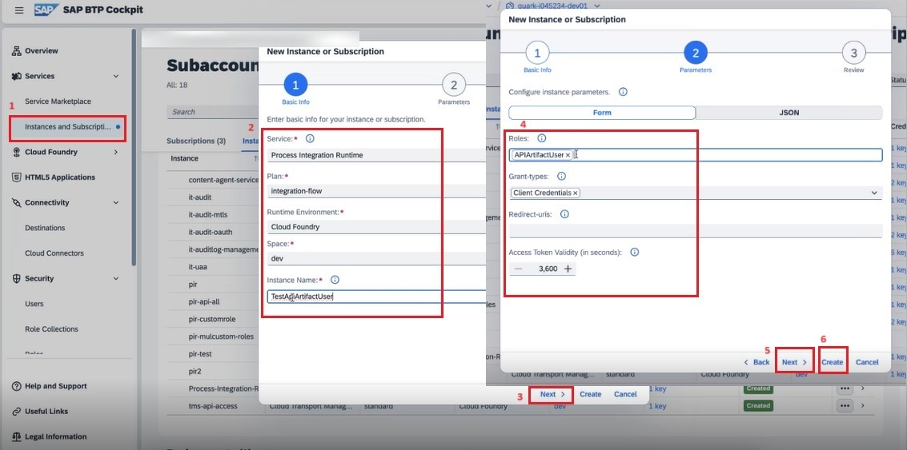

<!-- loiofa6eec4f9ffc45aa89f8a2155b855ca4 -->

# Authentication

Different API may have various authentication mechanisms. The authentication mechanisms that are currently supported are Basic authentication, Client Certificate, and oAuth.

**Policy Settings**

<table>
<tr>
<th valign="top">

Attribute

</th>
<th valign="top">

Description

</th>
</tr>
<tr>
<td valign="top">

Name

</td>
<td valign="top">

The internal name of the policy. The value of the name attribute can contain letters, numbers, spaces, hyphens, underscores, and periods. This value cannot exceed 255 characters.

</td>
</tr>
<tr>
<td valign="top">

Type

</td>
<td valign="top">

Select the appropriate authentication mechanism for your API.

Basic - Used in situations where simple userid/password-based authentication is sufficient.

Client Certificate – The user provides a digital certificate consisting of a public and private key, which the server verifies to provide access.

oAuth - Used in situations where third-party services are allowed to exchange your information without you having to give away your password.

> ### Note:  
> To execute the API with Authentication policy, configure the*Process Integration Runtime* instance, and access the endpoint using the client id/ secret or certificate from that instance.

</td>
</tr>
</table>

To create a *Process Integration Runtime* instance:

1.  In SAP BTP cockpit, choose *Instances and Subscription*.

2.  Fill in the details as shown in the screenshot below and choose *Create*:

    

3.  Create a *Service Key* associated with the *Process Integration Runtime* service instance.

    

    > ### Note:  
    > You can also create a certificate-based service key.

Now, if you execute the API, the Authentication policy should be able to successfully authenticate the request.

**Related Information**  

[Authorization](authorization-6658409.md "This policy evaluates whether a user should be permitted to access a protected API.")

[JSON Threat Protection](json-threat-protection-c4991a6.md "Minimizes the risk posed by content-level attacks by enabling specific limits on various JSON structures, such as arrays and strings.")

