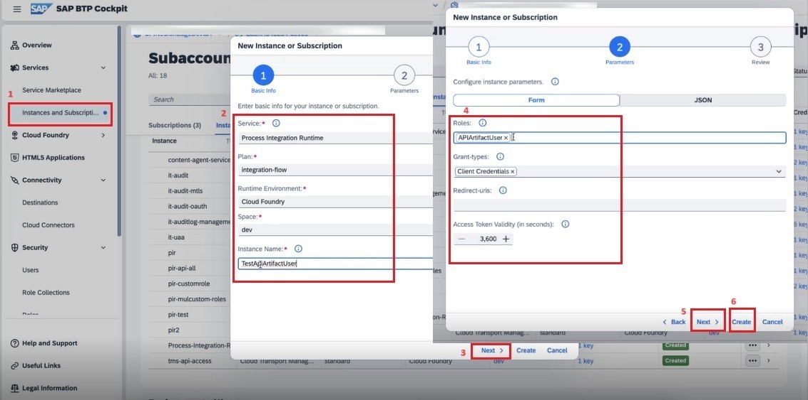
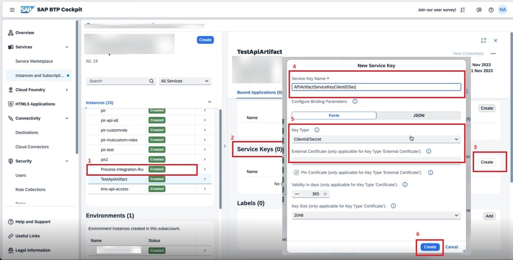

<!-- loio6658409a114a4c038572276335bea8b9 -->

# Authorization

This policy evaluates whether a user should be permitted to access a protected API.

Different iFlow sender channels may have different authorizations and roles. For API artifact, different resources may have different authorization and roles configured.

**Policy Settings**

<table>
<tr>
<th valign="top">

Attribute

</th>
<th valign="top">

Description

</th>
</tr>
<tr>
<td valign="top">

Name

</td>
<td valign="top">

The internal name of the policy. The value of the name attribute can contain letters, numbers, spaces, hyphens, underscores, and periods. This value can’t exceed 255 characters.

</td>
</tr>
<tr>
<td valign="top">

Scope

</td>
<td valign="top">

Scope represents the list of roles that allow access to the API endpoint.

Please make sure that the user attempting to invoke the API endpoint is assigned at least one of the roles defined in the scope field.

> ### Note:  
> Either the role entered in the scope field should be preconfigured in the *User Roles* section of the *Monitor* view under the *Manage Security* section or you must add the role you've entered in the scope field in *User Roles*. To learn how to configure the role, see [Managing User Roles](https://help.sap.com/docs/integration-suite/sap-integration-suite/managing-user-roles?q=Defining%20Permissions%20for%20Senders%20to%20Process%20Messages%20on%20a%20Runtime%20Node).

For example, if you’ve configured a role called "APIArtifactUser" in *User Roles*, you must enter the role exactly as it is \(including case sensitivity\) in the scope field or vice versa.

Once the "APIArtifactUser" role is configured in *User Roles*, it is automatically added to the *Roles* in SAP BTP Cockpit.

To execute an API with the Authorization policy successfully on the runtime node, the "APIArtifactUser" role should be associated to the *Process Integration Runtime* instance.

</td>
</tr>
</table>

To create a *Process Integration Runtime* instance:

1.  In SAP BTP cockpit, choose *Instances and Subscription*.

2.  Fill in the details as shown in the screenshot below and choose *Create*:

    

    > ### Note:  
    > In this example, I have used the "APIArtifactUser" role. Please make sure to enter the custom role that you have configured in the *Integration Suite* \> *Monitor* \> *User Roles* in the *Roles* field.

3.  Create a *Service Key* associated with the *Process Integration Runtime* service instance.

    

    > ### Note:  
    > You can also create a certificate-based service key.

Now, when you execute the API using the information available in the Service Key and make a call to the API, it will be authenticated by the Authentication policy and authorized by the Authorization policy. The Authorization policy validates the scope with which the API was modeled.

**Related Information**  

[Authentication](authentication-fa6eec4.md "Different API may have various authentication mechanisms. The authentication mechanisms that are currently supported are Basic authentication, Client Certificate, and oAuth.")

[JSON Threat Protection](json-threat-protection-c4991a6.md "Minimizes the risk posed by content-level attacks by enabling specific limits on various JSON structures, such as arrays and strings.")

[API Validation](api-validation-02ff41b.md "The API validation policy enables you to validate incoming request messages against an OpenAPI 3.0 Specification.")

