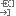

<!-- loio2b6e8657cc0645c696bb7761fe1ce0fc -->

# Bind to Data Source

> ### Remember:  
> This component or some of its features might not be available in the Cloud Foundry environment. For more information on the limitations, see SAP Note [2752867](https://me.sap.com/notes/2752867).

You have created an OData model in the Cloud Integration Web application. As a result, you can see OData objects associated with the model listed in a table on the Service Designer page.

Next, you need to bind or connect function imports and operations of entity sets to a data source. When you bind an OData object to a data source, a predefined integration flow is autogenerated and set up for you. You can modify this integration flow to suit your scenario.

> ### Note:  
> The externalise option is not visible for these autogenerated integration flows.

You can bind one or all five CRUDQ operations of an entity set to a data source. This means that each entity set can have multiple integration flows connecting to the same data source. You can also bind entity sets and function imports in an OData API artifact to different data sources.

The following data sources are currently supported:

-   SOAP

-   OData

-   REST

-   ODC

## Binding Status

To identify the graphical representations of the OData objects and their binding status on the Service Designer page, refer to the following table:

****

<table>
<tr>
<th valign="top">

OData Object

</th>
<th valign="top">

Description

</th>
</tr>
<tr>
<td valign="top">

</td>
<td valign="top">

Represents an entity set in an OData model.

</td>
</tr>
<tr>
<td valign="top">

</td>
<td valign="top">

Represents an operation associated with an entity set in an OData model.

</td>
</tr>
<tr>
<td valign="top">

</td>
<td valign="top">

Represents an operation bound to a data source with errors in the associated integration flow. You cannot deploy the OData API unless the errors are corrected.

</td>
</tr>
<tr>
<td valign="top">

</td>
<td valign="top">

Represents an operation bound to a data source with warnings in the associated integration flow. We recommend that you verify the warnings and take corrective measures where necessary before deploying the OData API.

</td>
</tr>
<tr>
<td valign="top">

</td>
<td valign="top">

Represents an operation bound to a data source with no errors or warnings.

</td>
</tr>
<tr>
<td valign="top">

</td>
<td valign="top">

Represents a function import in an OData model.

</td>
</tr>
<tr>
<td valign="top">

</td>
<td valign="top">

Represents a function import bound to a data source with errors in the associated integration flow. You cannot deploy the OData API unless the errors are corrected.

</td>
</tr>
<tr>
<td valign="top">

</td>
<td valign="top">

Represents a function import bound to a data source with warnings in the associated integration flow. We recommend that you verify the warnings and take corrective measures where necessary before deploying the OData API.

</td>
</tr>
<tr>
<td valign="top">

</td>
<td valign="top">

Represents a function import bound to a data source with no errors or warnings.

</td>
</tr>
</table>

## Unused Bindings

After binding an entity set or function import to a data source, if you rename or delete it in the OData Model Editor, the binding is no longer associated with it and becomes unused. You cannot deploy theOData API unless you update the binding. For more information, see [Managing Unused Bindings](managing-unused-bindings-585639c.md).

**Related Information**  

[Binding to SOAP](binding-to-soap-691301a.md "")

[Binding to OData](binding-to-odata-24ffe2d.md "")

[Binding to REST](binding-to-rest-e0103db.md "")

[Binding to ODC](binding-to-odc-460e172.md "")

