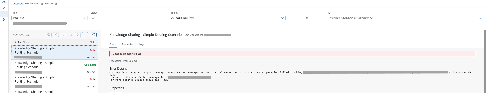

<!-- loio5612032c11aa4026a4860ac633a3a2cf -->

# Checking Out the Message Processing Log

In the *Operations* section, you can check out the status of processed messages.

In particular, you out if message processing has failed for dedicated integration flows.

To do that, open the *Operations* view and select a tile under *Monitor Message Processing*.

On clicking a tile, a dialog opens where you can select for individual integration flows.

When you click an integration flow for which message processing failed, a screen with more details opens. For failed messages, an error message is displayed which help already to analyze the issue.

If this information isn't sufficient to analyze the error, you can trace integration flow processing as described under [Tracing the Execution of an Integration Flow](tracing-the-execution-of-an-integration-flow-4ec27d3.md).

