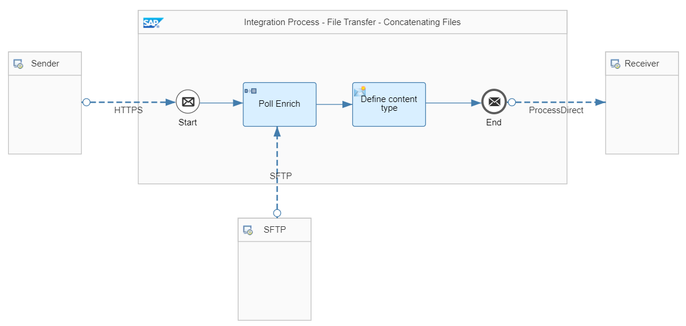
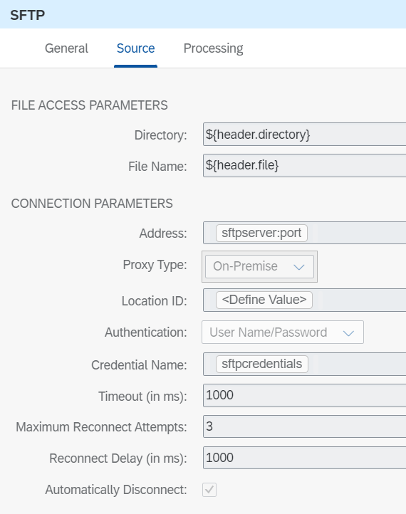
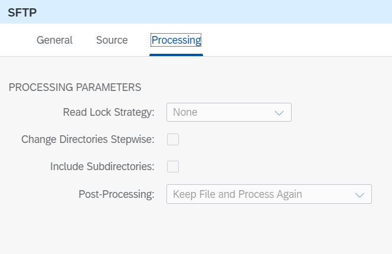
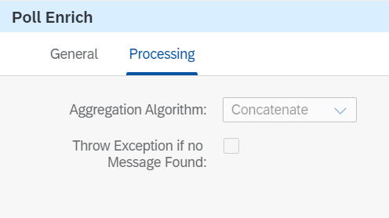

<!-- loio694a60b0252d4285ad36dfcc0fabed82 -->

# Concatenating Files via Poll Enrich

Learn how to enrich the payload with data retrieved from a file on the SFTP server using ‘Concatenate’ Aggregation Algorithm.


<a name="loio694a60b0252d4285ad36dfcc0fabed82__section_bcs_lbb_srb"/>

## Implementation

To showcase the poll enrich capability, use a simple scenario.

The example integration flow **File Transfer - Concatenating Files via Poll Enrich** is designed the following way:



Add the following file with the file name `products.xml` on your SFTP server:

> ### Sample Code:  
> ```
> <Product>
> 	<ProductId>HT-1101</ProductId>
> 	<ProductName>Smart Design</ProductName>
> 	<Quantity>3</Quantity>
> 	<CurrencyCode>EUR</CurrencyCode>
> 	<Price>799.00</Price>	
> </Product>
> <Product>
> 	<ProductId>HT-1103</ProductId>
> 	<ProductName>Smart Multimedia</ProductName>
> 	<Quantity>20</Quantity>
> 	<CurrencyCode>EUR</CurrencyCode>	
> 	<Price>1540.00</Price>
> </Product>
> 
> ```

In the *Source* tab of the *SFTP* sender adapter, enter the *Directory*, *Address* of the SFTP server `(host:port)`, *Proxy Type* \(On-Premise/Internet\), *Location ID*\(if On-Premise\) and *Credential Name* to access the SFTP server. Those parameters are externalized so that you can use your own SFTP server.See [Configure Externalized Parameters of an Integration Flow](configure-externalized-parameters-of-an-integration-flow-462a478.md).

*File Name* and *Directory* are set dynamically via message header.



For test purposes, the file is kept on the SFTP server after the message has been processed:



Change the parameter *Post-Processing* in the *Processing* tab of the SFTP adapter to ‘Delete file’ if you like this file getting removed from the SFTP server after the message has been processed.

In the *Processing* tab of *Poll Enrich* set the Aggregation Algorithm to ‘Concatenate’. In this case the message polled from the SFTP server will be added to the existing message:



To execute the scenario, expand the Postman collection *Modeling Basics* and the folder *FileTransfer* in the Postman client. There you can find the POST request *ConcatenatingFiles* including the following body:

> ### Sample Code:  
> ```
> <Product>
> 	<ProductId>HT-1000</ProductId>
> 	<ProductName>Notebook Basic 15</ProductName>
> 	<Quantity>1</Quantity>
> 	<CurrencyCode>EUR</CurrencyCode>
> 	<Price>956.00</Price>
> </Product>
> ```

Before running the scenario, maintain the value of the header directory of the Postman request corresponding to the folder on your sftp server where you put the file, see description above. Once the scenario is executed, it creates a new entry in the Data Store *FileTransfer-Concatenate* with the combined content. The body of the result should now contain three products:

> ### Sample Code:  
> ```
> <Product>
> 	<ProductId>HT-1000</ProductId>	
> 	<ProductName>Notebook Basic 15</ProductName>	
> 	<Quantity>1</Quantity>
> 	<CurrencyCode>EUR</CurrencyCode>
> 	<Price>956.00</Price>
> </Product>
> <Product>
> 	<ProductId>HT-1101</ProductId>
> 	<ProductName>Smart Design</ProductName>
> 	<Quantity>3</Quantity>
> 	<CurrencyCode>EUR</CurrencyCode>
> 	<Price>799.00</Price>
> </Product>
> <Product>
> 	<ProductId>HT-1103</ProductId>
> 	<ProductName>Smart Multimedia</ProductName>
> 	<Quantity>20</Quantity>
> 	<CurrencyCode>EUR</CurrencyCode>
> 	<Price>1540.00</Price>
> </Product>
> ```

