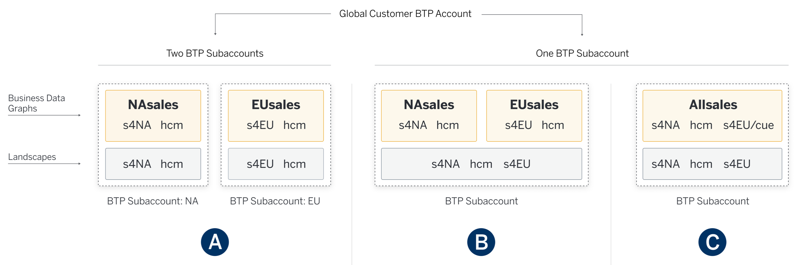

<!-- loio3652dcb1db4c434c9028d2eec8312600 -->

# Configuration Strategies - Use Cases

The strategy of configuring Graph starts with the question of what exactly is a landscape?

In this context, a landscape consists of a set of data sources that:

1.  Serve the same purpose and have the same scope.

2.  Is the minimal set of systems with data that is relevant to developers of Graph-based applications.


The goal of the enterprise administrator is to specify their landscapes and abstract them in the form of business data graphs that are used by developer-created apps to access the approved data.

The first two examples discussed here are simple landscapes. The third example is a more comprehensive discussion of a more complex use case, involving partitioned data. The fourth example shows how key mapping is configured to support cross-system navigation.


<a name="loio3652dcb1db4c434c9028d2eec8312600__section_tff_ht4_zqb"/>

## Example 1: A Landscape with One SAP S/4HANA System

The administrator and the Graph Key User decided that they want to create and expose a business data graph based only on a single SAP S/4HANA system. The following is an example of the business data graph configuration file. The SAP S/4HANA data source and its destinations are auto-discovered, and match the destinations in the SAP BTP subaccount:

```json
{ 
  "schemaVersion": "0.0.1", 
  "businessDataGraphIdentifier": "erp", 
  "graphModelVersion": "1.0.0", 
  "dataSources": [ { 
      "name": "mys4", 
      "services": [ 
        { "destinationName": "erp-bupa" }, 
        { "destinationName": "erp-product" }, 
          ... 
  ] } ], 
  "locatingPolicy": {  
    "rules": [ 
      { "name": "sap.*", "leading": "mys4" } 
    ] 
  }
```

As you can see, there isn’t much to do. You can rename the business data graph identifier, for example, to `erp` or `v1`, which you can use as a version indicator for your business data graph. If some of the destinations aren’t required in the use cases for this business data graph, you can comment these out. There’s only one locating rule: everything \(`sap.*`\) comes from the single SAP S/4HANA data source.


<a name="loio3652dcb1db4c434c9028d2eec8312600__section_qpn_tx4_zqb"/>

## Example 2: A Landscape with SAP S/4HANA and SAP Sales Cloud

The landscape is configured with a number of destinations to SAP S/4HANA APIs, as well as a destination to the SAP Sales Cloud tenant. The following is an example of a generated configuration file:

```json
{ 
  "schemaVersion": "0.0.1", 
  "businessDataGraphIdentifier": "crm", 
  "graphModelVersion": "1.0.0", 
  "dataSources": [ { 
      "name": "erp", "services": [ // SAP S/4HANA 
        { "destinationName": "erp4-bupa" }, 
        { "destinationName": "erp4-product" }, 
        { "destinationName": "erp4-clfn-product" }, 
        { "destinationName": "erp4-sales-order" }, 
        { "destinationName": "erp4-service-order" } 
      ] },      
      { "name": "c4c","services": [ // SAP Sales Cloud 
        { "destinationName": "c4c-odata" } 
  ] } ], 
  "locatingPolicy": { 
    "description": "sales scenarios",     
    "rules": [ 
      { "name": "sap.s4.*", "leading": "erp" }, 
      { "name": "sap.c4c.*", "leading": "c4c" }, 
      { "name": "sap.graph.*", "leading": "erp", "local": ["c4c"] }, 
      { "name": "sap.graph.CustomerQuote", "leading": "c4c", "local": ["s4"] } 
    ] 
  } 
}
```

This is a common scenario with multiple systems, each having its own policy. The locating policy shows that SAP S/4HANA \(`erp`\), is the leading source of truth for all `sap.s4` mirrored entities, and all unified entities, except for `CustomerQuote` \(in namespace `sap.graph`\), which comes from the SAP Sales Cloud system \(`c4c`\). In all cases, the locality-of-reference principle dictates that key-based references are handled locally.


<a name="loio3652dcb1db4c434c9028d2eec8312600__section_fpb_yx4_zqb"/>

## Example 3: A Landscape with Partitioned Data

Our third example describes a situation where certain data, for example sales orders, is partitioned over more than one system. Unlike the case of replicated data, in a partitioned scenario an entity is in only one business system. For example, the enterprise could have one instance of SAP S/4HANA for its North American sales operations, and another for its European sales. Or have data partitioned over two systems, because of regulatory or fiscal requirements, like one financial system for the holding company, and one for its subsidiary. To make it interesting, both lines of business share one human resource management system \(an SAP SuccessFactors system\) between them. How would you expose this to your developers?

Graph can’t access data from multiple systems using one query that represents a union. Therefore, there are two use cases to consider. In the first use case, all the users of the data are separated into two groups: European vs. North American sales teams. The application uses one or the other data source. In the second use case, the application user may require access to the data in both systems.

Graph offers you different alternative approaches to address this situation. Which of these approaches to choose from depends on the requirements of the extension applications that are used via Graph. It’s possible to use any of these solutions, or even use them in combination.

These three approaches are illustrated in the following diagram:



**Solution A** is used when a strong separation is required between different business users. You define two separate landscapes in two subaccounts \(which might be in different SAP BTP regions\), each with its own subset of systems, and its own business data graph. This is like two instances of example 2. You establish separate security for each landscape and provide selective access to application developers or users.

The other two solutions are used if the business user, for example the CFO of the company, needs access to the data in both systems. You create one subaccount with a landscape that includes all three systems. In **Solution B**, you create two different business data graphs, by activating two separate configuration files – one that establishes *s4EU* as the leading system, the other with *s4NA* as the leading system. The application developer uses either the *NAsales* or *EUsales* identifier in the Graph URL to select the business data graph from which to fetch the sales data. If necessary, it combines the data from multiple queries to show them in one view to the user.

**Solution C** is a simpler variation of solution B. Instead of creating and maintaining multiple business data graphs, requiring frequent shifting of different URLs, it’s often easier to add a cue to the data entity that is partitioned, for example, sales orders. The developer uses the same URL and only adds the cue to queries when the default locating rules need to be overwritten. The configuration file for solution C is as follows:

```json
{
  "businessDataGraphIdentifier": "allsales",
  "dataSources": [
    { "name": "s4NA", "services": [  ... ] },
    { "name": "s4EU", "services": [  ... ] },
    { "name": "hcm",  "services": [ {"destinationName": "SFSF" } ] }
  ],
  "locatingPolicy": {
    "description": "Locating policy using cues",
    "cues": [ 
      { "name": "EU", "description": "Euro sales" } 
    ],
    "rules": [
      { "name": "sap.s4.*", "leading": "s4NA", "local": ["s4EU"] },
      { "name": "sap.s4.A_SalesOrder", "leading": "s4EU", "local": ["s4NA"], "cues": ["EU"] },
      { "name": "sap.hcm.*", "leading": "hcm" },
      { "name": "sap.graph.*", "leading": "s4NA", "local": ["s4EU", "hcm"] },
      { "name": "sap.graph.SalesOrder", "leading": "s4EU", "local": ["s4NA"], "cues": ["EU"] }
    ]
  }
}
```


<a name="loio3652dcb1db4c434c9028d2eec8312600__section_b42_rjp_zqb"/>

## Example 4.1: Key Mapping

Key mapping must be configured to support navigation from one data source to another for the same entity. The most common example is when you need to allow access to a 360° view of an entity, starting from a unified entity. For example, a developer might want to run a request with a resource like: *sap.graph/CorporateAccount/21687/\_s4/…* or *sap.graph/CorporateAccount/21687/\_c4c/…*. If these two systems don't use the same key, then a key mapping must be defined between them to enable the requests.

In the following example, Graph supports mapping of an `IndividualCustomer` key from a data source called `myC4C` to the key in `myS4`, which is the leading system for this type of entity. `myC4C` is an instance of SAP Sales Cloud and `myS4` is an instance of SAP S/4HANA. Therefore, Graph is mapping keys from the entity `IndividualCustomerCollection` to the entity `A_BusinessPartner`.

```
"keyMapping": [
  {
    "foreignKey": {
      "dataSource": "myC4C",
      "entityName": "sap.c4c.IndividualCustomerCollection",
      "attributes": ["ExternalID"]
    },
    "references": {
      "dataSource": "myS4",
      "entityName": "sap.s4.A_BusinessPartner",
      "attributes": ["BusinessPartner"]
    }
  }
]
```


<a name="loio3652dcb1db4c434c9028d2eec8312600__section_vt3_lq3_lsb"/>

## Example 4.2: Key Mapping with Key Translation

In some scenarios, key mapping is not enough on its own and for some landscapes, the key's format differs between data sources. Depending on landscape configurations, `S4` may reference an entity in the format `ABCDE_123` while SAP Sales Cloud applies a different notation in the External ID field, for example `0000ABCDE.123` . Graph requires a "format" *strategy* to link the identical entities. The `strategy` field contains the `match` and `replace` attributes which provide a regular expression pattern that translates the keys in both directions.

```
"keyMapping": [
  {
    "foreignKey": {
      "dataSource": "myC4C",
      "entityName": "sap.c4c.ProductCollection",
      "attributes": ["ExternalID"],
      "strategy": {
        "name": "format",
        "match": "0{4}(?<category>.{5}).(?<num>[+ 0-9]{3})$",
        "replace": "$<category>_$<num>"
      }
    },
    "references": {
      "dataSource": "myS4",
      "entityName": "sap.s4.A_Product",
      "attributes": ["Product"],
      "strategy": {
        "name": "format",
        "match": "^(?<category>.{5})_(?<num>[+ 0-9]{3})$",
        "replace": "0000$<category>.$<num>"
      }
    }
  }
]
```

**Related Information**  


[Business Data Graph Configuration File](business-data-graph-configuration-file-e93d38c.md "The business data graph configuration file is a JSON file that specifies the configuration of a specific business data graph in a landscape.")

