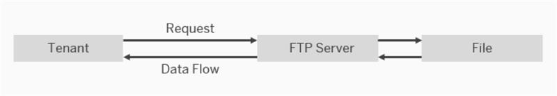

<!-- loio3eca3f8f518540ec98db8c9eb4c67f90 -->

# Configure the FTP Sender Adapter Used with the Poll Enrich Step

The FTP sender adapter connects an SAP Integration Suite tenant to a remote system using the TCP \(Transmission Control Protocol\) protocol to read files from the system. TCP File Transfer protocol is also referred to as File Transfer protocol \(or FTP\).

> ### Note:  
> In the following cases certain features might not be available for your current integration flow:
> 
> -   You are using a runtime profile other than the one expected. See: [Runtime Profiles](IntegrationSettings/runtime-profiles-8007daa.md).
> 
> -   A feature for a particular adapter or step was released after you created the corresponding shape in your integration flow.
> 
>     To use the latest version of a flow step or adapter – select the adapter and choose *Update Version* from the property sheet. See: [Updating your Existing Integration Flow](updating-your-existing-integration-flow-1f9e879.md).

> ### Note:  
> This adapter exchanges data with a remote component that might be outside the scope of SAP. Make sure that the data exchange complies with your company’s policies.

> ### Note:  
> This variant of the FTP sender adapter can only be used with the *Poll Enrich* step.
> 
> More information: [Define Poll Enrich](define-poll-enrich-f8c8c1d.md)

### How the Sender FTP Adapter Works

If you have configured a **sender** FTP adapter, message processing is performed as follows at runtime: The tenant sends a request to an FTP server \(think of this as the sender system\), but the data flow is in the opposite direction, from the FTP server to the tenant. In other words, the tenant reads files from the FTP server \(a process that is also referred to as *polling*\).

  
  
**FTP Sender Adapter: Tenant reads files from FTP server**

**General**

<table>
<tr>
<th valign="top">

Parameter

</th>
<th valign="top">

Description

</th>
</tr>
<tr>
<td valign="top">

*Name*

</td>
<td valign="top">

Enter the name of the FTP channel.

</td>
</tr>
</table>

Select the *Source* tab and provide values in the fields as follows.

**Source**

<table>
<tr>
<th valign="top">

Parameters

</th>
<th valign="top">

Description

</th>
</tr>
<tr>
<td valign="top">

*Directory* 

</td>
<td valign="top">

Relative path to read the file from a directory. Example: `parentdirectory/childdirectory`

You can configure this parameter by entering a dynamic expression such as `${property.property_name}` or `${header.header_name}` \(see: [Dynamically Configure Integration Flow Parameters](dynamically-configure-integration-flow-parameters-fff5b2a.md)\).

</td>
</tr>
<tr>
<td valign="top">

*File Name* 

</td>
<td valign="top">

Name of the file to be read. If you do not enter a file name and the parameter remains blank, all the files in the specified directory are read. When you use an expression to include files from subdirectories, the relative path from the root directory of the user and the actual file name are evaluated.

> ### Note:  
> For simple expressions:
> 
> -   Expressions, such as `ab*`, `a.*`, `*a*`, `*a`, `?b`, and so on, are supported.
> 
> -   The expression \* replaces no character or an arbitrary number of characters.
> 
> -   The expression ? replaces exactly one arbitrary character.
> 
> 
> Examples:
> 
> -   If you want to include files from subdirectories \(see *Property Include Subdirectories* in the *Processing Tab*\), you need to consider the relative path in your pattern, for example, by using `*file.txt`.
> 
> -   If you specify `file*.txt` as the *File Name*, the following files are polled by the adapter: `file1.txt`, `file2.txt`, as well as `file.txt` and `file1234.txt`, and so on.
> 
> -   If you specify `file?.txt` as the *File Name*, the following files are polled by the adapter: `file1.txt`, `file2.txt`, and so on, but **not** the files `file.txt` or `file1234.txt`.

> ### Caution:  
> Files with file names longer than 100 characters are processed as follows:
> 
> Note that the file name consists of the relative path from the root directory of the user and the actual file name.
> 
> -   If two files with names longer than 100 characters are available for processing, only one of these files is processed at a time. This means that both files are processed, but not in parallel. This is also the case if two runtime nodes/workers are available. If the node/worker fails multiple times while processing a file with a file name longer than 100 characters, none of the files sharing the first 100 characters with that file can be executed without manual intervention from the administrator.
> 
> -   The option *Keep File and Mark as Processed in Idempotent Repository* \(for sender channels under *Processing*\) will not work for these files.

You can configure this parameter by entering a dynamic expression such as `${property.property_name}` or `${header.header_name}` \(see: [Dynamically Configure Integration Flow Parameters](dynamically-configure-integration-flow-parameters-fff5b2a.md)\).

</td>
</tr>
<tr>
<td valign="top">

*Address* 

</td>
<td valign="top">

Host name or IP address of the FTP server and an optional port, for example,`wdfd00213123:22`.

You can configure this parameter by entering a dynamic expression such as `${property.property_name}` or `${header.header_name}` \(see: [Dynamically Configure Integration Flow Parameters](dynamically-configure-integration-flow-parameters-fff5b2a.md)\).

</td>
</tr>
<tr>
<td valign="top">

*Proxy Type* 

</td>
<td valign="top">

Proxy type that you're using to connect to the target system.

-   Select *Internet* if you're connecting directly to the FTP server.

-   Select *On-Premise* if you’re connecting to an on-premise FTP server.

    For more information, see [Using SAP Cloud Connector with Cloud Integration Adapters](../40-RemoteSystems/using-sap-cloud-connector-with-cloud-integration-adapters-65a60e7.md).

-   Select *Manual* to manually specify *Proxy Host* and *Proxy Port* \(using the corresponding entry field\).

    This option is only available if *Edge* has been selected as runtime.

-   Select *Dynamic* to let the system determine at runtime which proxy type to use. The value of property `SAP_FtpProxyType` is used for that purpose \(possible values `internet` or `onPremise`\).

    If you've selected this option and if the property isn't defined \(for example, in a preceding step\), an error is raised at runtime.

</td>
</tr>
<tr>
<td valign="top">

*Proxy Host*

\(only available if *Manual* is selected for *Proxy Type*\)

</td>
<td valign="top">

Enter the name of the proxy host to be used. For example: `proxy.mycompany.com`.

</td>
</tr>
<tr>
<td valign="top">

*Proxy Port*

\(only available if *Manual* is selected for *Proxy Type*\)

</td>
<td valign="top">

Enter the proxy port number to be used.

</td>
</tr>
<tr>
<td valign="top">

*Proxy Credential Name*

\(only available if *Manual* is selected for *Proxy Type*\)

</td>
<td valign="top">

Enter the referenced credential name used for proxy authentication.

</td>
</tr>
<tr>
<td valign="top">

*Location ID*

\(only if *On-Premise* is selected for *Proxy Type*\)

</td>
<td valign="top">

To connect to an SAP Cloud Connector instance associated with your account, enter the location ID that you defined for this instance in the destination configuration of SAP BTP cockpit.

You can configure this parameter by entering a dynamic expression such as `${property.property_name}` or `${header.header_name}` \(see: [Dynamically Configure Integration Flow Parameters](dynamically-configure-integration-flow-parameters-fff5b2a.md)\).

</td>
</tr>
<tr>
<td valign="top">

*Encryption* 

</td>
<td valign="top">

Specify the transport encryption. You can choose between the following options:

-   *Dynamic*: Select this option to let the system determine at runtime which encryption to use. The value of property `SAP_FtpEncryption` is used for that purpose. Possible values are `ftp`, `ftps` or `ftpes`.

    -   ftp: Plain FTP – no encryption

    -   ftps: Implicit FTPS

    -   ftpes: Explicit FTPS

    If you’ve selected this option and if the property isn’t defined \(for example, in a preceding step\), an error is raised at runtime.

-   *Explicit FTPS*: After an initial connection, the client with send `AUTH TLS` command to the server and initial the handshake this way. Afterwards, the communication will be encrypted. Unless you specified a port in the address, the default port will be 21.

-   *Implicit FTPS*: The client will connect to the server with a TLS connection. This means the client starts the handshake at the beginning of the communication. Unless you specified a port in the address, the default port is 990.

-   *Plain FTP - no encryption*: No encryption will be applied, for productive use \(not recommended\). Unless you specified a port in the address, the default port is 21.

</td>
</tr>
<tr>
<td valign="top">

*Credential Name* 

</td>
<td valign="top">

You can configure this parameter by entering a dynamic expression such as `${property.property_name}` or `${header.header_name}` \(see: [Dynamically Configure Integration Flow Parameters](dynamically-configure-integration-flow-parameters-fff5b2a.md)\).

</td>
</tr>
<tr>
<td valign="top">

*Timeout \(in ms\)* 

</td>
<td valign="top">

Maximum time \(in milliseconds\) to wait for the FTP server to be contacted while establishing a connection or performing a read operation. Enter a minimum value bigger than `0`, and smaller than or equal to the maximum value of `299999`. The default ist set to `10000`.

If the property `SAP_FtpTimeout` is defined, its value is used to specify this parameter at runtime.

</td>
</tr>
<tr>
<td valign="top">

*Maximum Reconnect Attempts* 

</td>
<td valign="top">

Maximum number of attempts allowed to reconnect to the FTP server before message processing starts. The default is set to `3`. Enter `0` to disable this behavior.

> ### Note:  
> The setting is only relevant for establishing the initial connection to the server. If the server connection is interrupted during message processing, the connection will not be recovered. The message will be fetched with the next scheduled poll interval.

If the property `SAP_FtpMaxReconnect` is defined, its value is used to specify this parameter at runtime.

</td>
</tr>
<tr>
<td valign="top">

*Reconnect Delay \(in ms\)* 

</td>
<td valign="top">

Time \(in milliseconds\) the system waits before attempting to reconnect to the FTP server; default Value: `1000`

If the property `SAP_FtpMaxReconDelay` is defined, its value is used to specify this parameter at runtime.

</td>
</tr>
<tr>
<td valign="top">

*Automatically Disconnect* 

</td>
<td valign="top">

Disconnect from the FTP server after each message processing.

If the property `SAP_FtpDisconnect` is defined, its value is used to specify this parameter at runtime \(possible values: `true` and `false`\).

</td>
</tr>
</table>

Select the *Processing* tab and provide values in the fields as follows.

**Processing**

<table>
<tr>
<th valign="top">

Parameters

</th>
<th valign="top">

Description

</th>
</tr>
<tr>
<td valign="top">

*Read Lock Strategy* 

</td>
<td valign="top">

Prevents files that are in the process of being written from being read from the FTP server. The endpoint waits until it has an exclusive read lock on a file before reading it. Select one of the following options based on the capabilities of the FTP server:

-   *None* \(default\): Does not use a read lock, which means that the endpoint can immediately read the file. *None* is the simplest option if the FTP server guarantees that a file only becomes visible on the server once the process of writing it to the server has been finished.

-   *Content Change*: Monitors changes in the file length/modification timestamp to determine if the write operation on the file is complete and the file is ready to be read. If you have selected this option, the system waits for at least one second until there are no more file changes. Therefore, if you select this option, files cannot be read as quickly as with the other two options.

-   *Done File Expected*: Uses a specific file to signal that the file to be processed is ready for consumption.

    If you have selected this option, enter the name of the .done-file. The .done-file signals that the file to be processed is ready for consumption. This file must be in the same folder as the file to be processed.

    Default naming pattern: `${file:name}.done`

    > ### Caution:  
    > Avoid using static file names in combination with recursive flags and/or file name wildcard patterns, but please stick to the default naming pattern to avoid running into errors. It's recommended to always pair an incoming file with a .done-file.
    > 
    > Example:
    > 
    > `hello.txt` is the file to be consumed, `hello.txt.done` is the associated .done-file.

-   *Rename*: Renames the file on the FTP server before reading it.

</td>
</tr>
<tr>
<td valign="top">

*Change Directories Stepwise* 

</td>
<td valign="top">

Select this option to change directory levels one at a time.

If the property `SAP_FtpStepwise` is defined, its value is used to specify this parameter at runtime \(possible values: `true` and `false`\).

</td>
</tr>
<tr>
<td valign="top">

*Include Subdirectories* 

</td>
<td valign="top">

Selecting this option allows you to look for files in all subdirectories of the directory.

</td>
</tr>
<tr>
<td valign="top">

*Post-Processing* 

</td>
<td valign="top">

Allows you to specify how files are to be handled after processing.

Note that only successfully processed messages can be post-processed. If message processing fails, the *Post-Processing* settings are not effective.

You can select one of the following options:

-   *Delete File* \(default\): The file is deleted after it has been processed successfully.

    If you've also selected *Done File Expected* as *Read Lock Strategy*, the file to be processed as well as the done file is deleted.

-   *Keep File and Process Again*: The file is preserved and might be processed again in another run or step. This option allows parallel access to the same file as there's no `inProgressRepository` entry written.

-   *Keep File and Mark as Processed in Idempotent Repository*: Prevents a file from being consumed twice. For that purpose, an idempotent repository is activated.

    The idempotent repository contains information about files already been consumed from the FTP server. Being stored in the idempotent repository, a file can be identified by the file name. When SAP Cloud Integration tries to process the file, the system can detect if the file has already been consumed \(based on its idempotent repository entry\) and that way can prevent it from being consumed a second time from the FTP server.

    Select this option for FTP servers that don't allow deletion or moving of files, but the files are to be read only once.

    > ### Note:  
    > The system only takes into account the file name to decide whether it's the same file or not. Attributes such like file size, timestamp, hash value, for example, are ignored.

    If you've also selected *Done File Expected* as *Read Lock Strategy*, an entry will be created in the idempotent repository; the done file won't be deleted.

-   *Move File*: The file is moved to another directory.

    If you select this option, you need to specify the target directory.

    If you've also selected *Done File Expected* as *Read Lock Strategy*, only the file to be processed is moved and the done file will be deleted.

</td>
</tr>
<tr>
<td valign="top">

*Archive Directory*

\(only if *Move File* is selected for *Post-Processing*\)

</td>
<td valign="top">

Specifies the target directory where to move the file.

Make sure that you specify a relative file path for the target directory. Note that the specified file path is defined relative to the directory specified with the *Directory* parameter. If you specify an absolute file path, it may occur that the file cannot be stored correctly at runtime. You can also specify the target directory dynamically, for example, using the timestamp of the message. The following example uses backup folders with timestamps and replaces the file extension with `bak: backup/${date:now:yyyyMMdd}/${file:name.noext}.bak`.

</td>
</tr>
</table>

