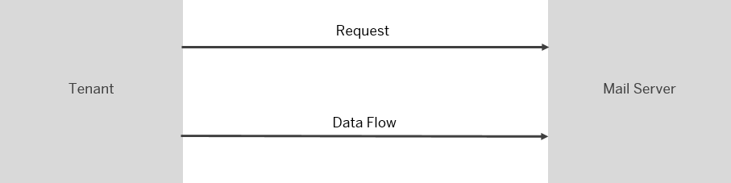

<!-- loiof68d5e03fd574f509f89474f6a6e272a -->

# Configure the Mail Receiver Adapter

You use the mail receiver adapter to send encrypted messages by e-mail.

> ### Note:  
> In the following cases certain features might not be available for your current integration flow:
> 
> -   You are using a runtime profile other than the one expected. See: [Runtime Profiles](IntegrationSettings/runtime-profiles-8007daa.md).
> 
> -   A feature for a particular adapter or step was released after you created the corresponding shape in your integration flow.
> 
>     To use the latest version of a flow step or adapter – edit your integration flow, delete the flow step or adapter, add the step or adapter, and configure the same. Finally, redeploy the integration flow. See: [Updating your Existing Integration Flow](updating-your-existing-integration-flow-1f9e879.md).

> ### Note:  
> This adapter exchanges data with a remote component that might be outside the scope of SAP. Make sure that the data exchange complies with your company’s policies.

The mail receiver adapter opens a connection to a mail server and sends messages \(as e-mail\) to it.

> ### Note:  
> For an example of how to configure the mail receiver adapter in a dedicated demo integration scenario, check out the following topic: [Create the Mail Receiver Channel](https://help.sap.com/viewer/368c481cd6954bdfa5d0435479fd4eaf/Cloud/en-US/a6966fd46aef4e61ada1dcd11dadfc8b.html "Add a Mail receiver channel to enable the integration flow to send messages to an e-mail account.") :arrow_upper_right:.
> 
> If you want to learn how to use the mail receiver adapter to send signed and/or encrypted mails, this blog is for you: [Cloud Integration - Sending Signed and/or Encrypted Mails in Mail Receiver Adapter](https://blogs.sap.com/2019/04/09/cloud-integration-sending-signed-andor-encrypted-mails-in-mail-receiver-adapter/)

Once you've created a receiver channel and selected the mail receiver adapter, you can configure the following attributes.

Select the *General* tab and provide values in the fields as follows.

**General**

<table>
<tr>
<th valign="top">

Parameter

</th>
<th valign="top">

Description

</th>
</tr>
<tr>
<td valign="top">

*Name*

</td>
<td valign="top">

Enter the name of the channel.

</td>
</tr>
</table>

Select the *Connection* tab and provide values in the fields as follows.

**Connection**

<table>
<tr>
<th valign="top">

Parameter

</th>
<th valign="top">

Description

</th>
</tr>
<tr>
<td valign="top">

*Address*

</td>
<td valign="top">

Specifies the host name and \(optionally\) a port number of the SMTP server.

An external mail server can be used.

Use one of the following open ports for external mail servers:

-   587 for SMTP+STARTTLS

-   465 for SMTPS

Example \(to connect to Yahoo mail server\):

`smtp.mail.yahoo.com:465`

> ### Note:  
> If no port is specified in the Address field, by default port 25 is used. This is not recommended. Recommended ports are 587 for SMTP+STARTTLS and 465 for SMTPS.

</td>
</tr>
<tr>
<td valign="top">

*Proxy Type*

</td>
<td valign="top">

The type of proxy that you’re using to connect to the target system.

Select *Internet* if you’re connecting to a cloud mail server.

Select *On-Premise* if you’re connecting to an on-premise mail server.

For more information, see [Using SAP Cloud Connector with Cloud Integration Adapters](../40-RemoteSystems/using-sap-cloud-connector-with-cloud-integration-adapters-65a60e7.md).

</td>
</tr>
<tr>
<td valign="top">

*Location ID* \(only if *On-Premise* is selected for *Proxy Type*\)

</td>
<td valign="top">

To connect to a cloud connector instance associated with your account, enter the location ID that you defined for this instance in the destination configuration on the cloud side.

</td>
</tr>
<tr>
<td valign="top">

*Timeout \(in ms\)* 

</td>
<td valign="top">

Specifies the network timeout for the connection attempt to the server.

The default value is 30000. The timeout must be larger than 0, but less than five minutes.

</td>
</tr>
<tr>
<td valign="top">

*Protection*

</td>
<td valign="top">

Defines whether encryption is used. The possible values are:

-   *Off*

    No encryption is initiated, whether the server requests it or not.

    > ### Note:  
    > If your on-premise mail server requires SMTPS, select *Off* for *Protection*. The SSL connection then needs to be configured in SAP Cloud Connector.

-   *STARTTLS Mandatory*

    If the server supports STARTTLS, the client initiates encryption using TLS. If the server doesn’t support this option, the connection fails.

-   *STARTTLS Optional*

    If the server supports the STARTTLS command, the connection is upgraded to Transport Layer Security encryption \(works with the normal port 25\).

    If the server supports STARTTLS, the client initiates encryption using TLS. If the server doesn’t support this option, client and server remain connected but communicate without encryption.

-   *SMTPS* \(only when *None* has been selected for *Proxy Type*\)

    The TCP connection to the server is encrypted using SSL/TLS. This step usually requires an SSL proxy on the server side and access to the port it runs on.

</td>
</tr>
<tr>
<td valign="top">

*Authentication* 

</td>
<td valign="top">

Specifies which mechanism is used to authenticate against the server with a user name and password combination. Possible values are:

-   *None*

    No authentication is attempted. No credential can be chosen.

-   *Plain User Name/Password*

    The user name and password are sent in plain text. Only use this option together with SSL or TLS, as otherwise an attacker could obtain the password.

-   *Encrypted User/Password* 

    The user name and password are hashed before being sent to the server. This authentication mechanism \(CRAM-MD5 and DIGEST-MD5\) is secure even without encryption.

-   *OAuth2 Authorization Code*

    The authentification is done via an authorization server as an intermediary step. The client can exchange the OAuth2 Authorization Code for an access token. Your user credentials are never shared with the client.

    See: [Deploying an OAuth2 Authorization Code](deploying-an-oauth2-authorization-code-081bfd7.md)

    > ### Note:  
    > *Personal Accounts:* Microsoft does not support OAuth for personal accounts for IMAP, POP3, and SMTP. This restriction does not exist for basic authentication.

-   See also: [Managing Security Material](managing-security-material-b8ccb53.md)

</td>
</tr>
<tr>
<td valign="top">

*Credential Name* \(only if *Plain User Name/Password* or *Encrypted User/Password* is selected for *Authentication*\)

</td>
<td valign="top">

Specifies the name of a deployed credential to use for authentication.

More information: [Deploying a User Credentials Artifact](deploying-a-user-credentials-artifact-6912d63.md)

</td>
</tr>
</table>

Select the *Processing* tab and provide values in the fields as follows.

**Processing**

<table>
<tr>
<th valign="top">

Parameter

</th>
<th valign="top">

Description

</th>
</tr>
<tr>
<td valign="top">

*From*

</td>
<td valign="top">

E-mail address that the message comes from.

</td>
</tr>
<tr>
<td valign="top">

*To*

</td>
<td valign="top">

E-mail address that the message is sent to.

If you want to configure multiple mail receivers, use a comma \(`,`\) to separate the addresses.

Example: `name1@example.com, name2@example.com, name3@example.com` 

</td>
</tr>
<tr>
<td valign="top">

*Cc*

</td>
<td valign="top">

Additional e-mail addresses that the e-mail is to be sent to.

These addresses are visible to the receiver.

If you want to configure multiple mail receivers, use a comma \(`,`\) to separate the addresses.

Example: `name1@example.com, name2@example.com, name3@example.com` 

</td>
</tr>
<tr>
<td valign="top">

*Bcc*

</td>
<td valign="top">

Additional e-mail addresses that the e-mail is to be sent to.

These addresses aren’t visible to the receiver.

If you want to configure multiple mail receivers, use a comma \(`,`\) to separate the addresses.

Example: `name1@example.com, name2@example.com, name3@example.com` 

</td>
</tr>
<tr>
<td valign="top">

*Subject*

</td>
<td valign="top">

Subject of the e-mail message.

</td>
</tr>
<tr>
<td valign="top">

*Mail Body*

</td>
<td valign="top">

Specifies the text of an e-mail message.

As default entry, the following expression is set:

`${in.body}`

If you keep the default setting, the message body \(as determined by this dynamic expression\) is sent to the receiver.

</td>
</tr>
<tr>
<td valign="top">

*Body MIME Type*

</td>
<td valign="top">

Specifies the type of the message body. This type determines how the message is displayed by different user agents.

You can select from the following MIME types:

-   *Text/Plain* \(default setting\)

-   *Text/CSV* 

-   *Text/HTML*

-   *Application/XML*

-   *Application/JSON*

-   *Application/Octet-Stream*

-   *Application/ZIP*

-   *Application/X-Gzip*

</td>
</tr>
<tr>
<td valign="top">

*Body Encoding*

</td>
<td valign="top">

Specifies the character encoding \(character set\) of the message body. The content of the input message is converted to this encoding, and any character that isn't available is replaced with a question mark \('?'\). To ensure that data is passed unmodified, select a Unicode encoding, for example, UTF-8.

You can select from the following encodings:

-   *UTF-8* \(default setting\)

-   *windows-1252*

-   *UTF-ASCII*

-   *ISO-8859-1*

</td>
</tr>
<tr>
<td valign="top">

*Name* \(under *Mail Attachments*\)

</td>
<td valign="top">

Specifies the file name of the attachment.

</td>
</tr>
<tr>
<td valign="top">

*MIME Type* \(under *Attachments*\)

</td>
<td valign="top">

The Multipurpose Internet Mail Extensions \(MIME\) type specifies the data format of the e-mail attachment.

You can select from the following MIME types:

-   *Text/Plain* 

-   *Text/CSV* 

-   *Text/HTML*

-   *Application/XML*

-   *Application/JSON*

-   *Application/Octet-Stream*

-   *Application/ZIP*

-   *Application/X-Gzip*

</td>
</tr>
<tr>
<td valign="top">

*Source* \(under *Attachments*\)

</td>
<td valign="top">

Specifies the source of the data.

-   *Body*

    If selected, the body of the input message is used.

-   *Header*

    If selected, the header of the input message is used.

</td>
</tr>
<tr>
<td valign="top">

*Header Name* \(under *Attachments*\)

</td>
<td valign="top">

If the source is *Header*, this parameter specifies the name of the header that is attached.

</td>
</tr>
<tr>
<td valign="top">

*Add Message Attachments* \(under *Attachments*\)

</td>
<td valign="top">

Select this option to add all attachments contained in the message exchange to the e-mail.

</td>
</tr>
<tr>
<td valign="top">

*Content Transfer Encoding*

</td>
<td valign="top">

Choose the content transfer encoding in which you send attachments to the mail server. This step can be required if the mail server expects a specific encoding. In most cases *Automatic* is sufficient.

You can choose between the following options:

-   *Automatic* \(default setting\)

-   *7Bit*

-   *8Bit*

-   *Base64*

-   *Binary*

-   *Quoted-Printable*

</td>
</tr>
</table>

> ### Note:  
> The parameters *From*, *To*, *Cc*, *Bcc*, *Subject*, *Mail Body* as well as the attachment name, can be dynamically set at runtime from message headers or content.

Select the *Security* tab and provide values in the fields as follows.

**Security**

<table>
<tr>
<th valign="top">

Parameter

</th>
<th valign="top">

Description

</th>
</tr>
<tr>
<td valign="top">

*Signature and Encryption Type* 

</td>
<td valign="top">

This parameter configures encryption and signature used for sending e-mails. The message body and attachments are encrypted with the selected scheme and can only be decrypted by the intended recipients.

You can choose between the following types:

-   *None* \(default setting\)

-   *S/MIME Encryption*

-   *S/MIME Signature*

-   *S/MIME Signature and Encryption*

</td>
</tr>
<tr>
<td valign="top">

*SIGNATURE* parameters \(only if for *Signature and Encryption Type* the option *S/MIME Signature* or *S/MIME Signature and Encryption* is selected\)

</td>
<td valign="top">

Specifies parameters for message signing.

You can specify the following parameters:

*Send Clear Text Signed Message*

If selected, the tenant sends the signed message as clear text, so that recipients who don't have S/MIME security are able to read the message.

Under *Signer Parameters*, add the reference to one or multiple private keys that can be that can be used to sign the message. For each key, specify the following parameters:

-   *Private Key Alias* 

    Specifies an alias for the private key that is to be used to sign the message. This key has to be part of the tenant keystore. The alias can be dynamically read from a header or property using an expression such like, for example, `${header.alias}`.

-   *Signature Algorithm*

    Specifies the algorithm used to sign the content using the private key.

    You can choose the following algorithms:

    -   *SHA/RSA*

    -   *SHA1withRSAandMFG1/RSA-PSS*

    -   *SHA223/RSA*

    -   *SHA256/RSA*

    -   *SHA256withRSAandMFG1/RSA-PSS*

    -   *SHA384/RSA*

    -   *SHA512withRSAandMFG1/RSA-PSS*

-   *Include Certificates*

    Specifies whether you allow recipients to send encrypted and signed messages to you. To allow that, make sure that this field is set to *true*, so that your signing certificates are selected.

</td>
</tr>
<tr>
<td valign="top">

*ENCRYPTION* parameters \(only if for *Signature and Encryption Type* the option *S/MIME Encryption* or *S/MIME Signature and Encryption* is selected\)

</td>
<td valign="top">

Specifies parameters for message encryption.

You can specify the following parameters for the secret key \(used to encrypt the message\):

-   *Content Encryption Algorithm*

    Specifies the symmetric \(block\) cipher.

    You can choose the following algorithms:

    -   *AES/CBC/PKCS5Padding*

    -   *AES/GCM/NoPadding*

    -   *DESede/CBC/PKCS5Padding*

        Choose this option only if the destination system or mail client doesn’t support AES.

-   *Secret Key Length*

    Specifies the key size of the previously chosen symmetric cipher. To increase the security, choose the maximum key size supported by the destination.

Under *Receiver Public Key*, specify one or more certificates \(from the tenant keystore\) to be used to encrypt the secret key. Choose *Add* to add a new entry. For each entry, specify the following parameters:

-   *Public Key* 

    Specifies an alias for the receiver public key.

    The alias can be dynamically read from a header or property using an expression such like `${property.alias}` or `${header.alias}`.

    You can also use expressions such like `pd:${header.PartnerID}:${header.ParameterID}:Binary` or `pd:${property.PartnerID}:${property.ParameterID}:Binary` to dynamically read URI parameters from the Partner Directory \(if configured\).

-   *Key Encryption Algorithm*

    Specifies the key encryption algorithm.

</td>
</tr>
</table>

To understand the parameters available in the section *ENCRYPTION*, you need to know the following: Message content encryption works as a process where secret keys and a private/public key pair are involved. A simplified process is depicted in the following figure. The figure only shows one receiver system, but note that the tenant can send an email to multiple receivers.

The following steps are accomplished behind the scenes when a message is encrypted:

1.  The tenant encrypts the content of the message with a secret key.

    The secret key is generated randomly per encrypted email.

    The secret key has a length as given by the *Secret Key Length* parameter, and encryption is accomplished with a symmetric encryption method that is specified by the *Content Encryption Algorithm* parameter.

2.  The tenant encrypts the secret key with one or more public keys from the tenant keystore. The public keys to be used are specified under *Receiver Public Key*.

    Each public key is associated with a public / private key pair owned by a receiver.

    > ### Tip:  
    > To give an idea of a typical setup, for each email receiver a separate public key is specified.

3.  The tenant sends the encrypted message content together with the encrypted secret key to one or more receivers.

    The secret key is removed after this step. For reasons of security, it's also not stored anywhere.

4.  Each receiver uses a private key to decrypt the secret key.

    Only a private key that is associated with one of the public keys specified in the mail adapter can be used to decrypt the secret key.

5.  Each receiver uses the decrypted secret key to finally decrypt the message content.

For more information, see the following blog: [Cloud Integration – Sending Signed and/or Encrypted Mails in Mail Receiver Adapter](https://blogs.sap.com/2019/04/09/cloud-integration-sending-signed-andor-encrypted-mails-in-mail-receiver-adapter/).

**Related Information**  

[Generating a Key Pair](../40-RemoteSystems/generating-a-key-pair-abb324d.md "")

[Options to Protect Mail Connections](options-to-protect-mail-connections-94bd058.md "")

[Headers and Exchange Properties Provided by the Integration Framework](headers-and-exchange-properties-provided-by-the-integration-framework-d0fcb09.md "")

[https://blogs.sap.com/2020/08/20/cloud-intgration-connect-to-microsoft-365-mail-with-oauth2/](https://blogs.sap.com/2020/08/20/cloud-intgration-connect-to-microsoft-365-mail-with-oauth2/)

