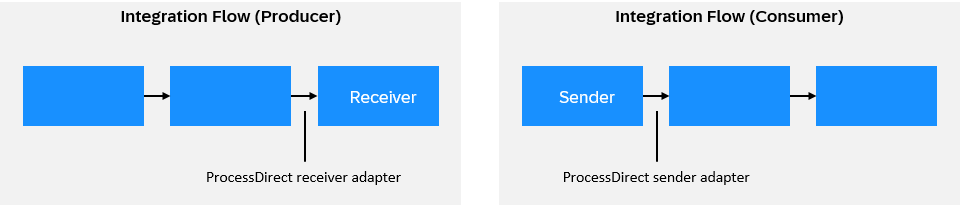

<!-- loioe340d4c4bce948d4ba6cc5b4fc24ad45 -->

# Configure the ProcessDirect Sender Adapter

You use the ProcessDirect sender adapter to establish fast and direct communication between integration flows by reducing latency and network overhead provided both of them are available within a same tenant.

Two integration flows, a producer integration flow, and a consumer integration flow, can be directly connected using the ProcessDirect adapter. As shown in the figure, the producer integration flow utilizes a ProcessDirect receiver adapter to send a message to the consumer integration flow, which, in turn, uses a ProcessDirect sender adapter to receive the message.

Once you have created a sender channel and selected the ProcessDirect sender adapter, you can configure the following attributes. See [Overview of Integration Flow Editor](overview-of-integration-flow-editor-db10beb.md).

Select the *General* tab and provide values in the fields as follows.

**General**

<table>
<tr>
<th valign="top">

Parameter

</th>
<th valign="top">

Description

</th>
</tr>
<tr>
<td valign="top">

*Name*

</td>
<td valign="top">

Enter the name of the channel.

</td>
</tr>
</table>

Select the *Connection* tab and provide values in the fields as follows.

**Parameters of the ProcessDirect Adapter**

<table>
<tr>
<th valign="top">

Parameter

</th>
<th valign="top">

Description

</th>
</tr>
<tr>
<td valign="top">

Address

</td>
<td valign="top">

Address of the ProcessDirect sender adapter in the consumer integration flow. The producer integration flow uses this address to reach the sender adapter in the consumer integration flow.

Example:

`/myConsumerIntegrationFlow`

> ### Note:  
> It may or may not start with "/". It can contain alphanumeric characters and special characters such as underscore "\_" or hyphen "-". You can also use simple expressions, for example, $\{header.address\}.

</td>
</tr>
</table>

> ### Remember:  
> -   If the consumer has an *<Escalated End Event\>* in the *<Exception Sub-Process\>*, then in case of exception in the consumer, the MPL status for the producer varies based on the following cases:
>     -   If the producer integration flow starts with *<Timer\>*, the MPL status for the consumer will be ***Escalated*** and for Producer, it will be Completed.
> 
>     -   If the producer integration flow starts with *<HTTP\>* Sender, the MPL status for the consumer will be ***Escalated*** and for producer, it will be Failed.
> 
> 
> -   The combination of *<Iterating Splitter\>* and *<Aggregator\>* in the producer integration flow might generate an extra MPL \(Aggregator MPL\) due to the default behavior of Aggregator.
> -   The *<Send\>* component is incompatible with the ProcessDirect adapter as the adapter supports asynchronous mode for message exchange and it expects a response.

To learn more about the adapter, see [blog on ProcessDirect Adapter in SAP Community](https://blogs.sap.com/2018/02/14/processdirect-adapter/).

