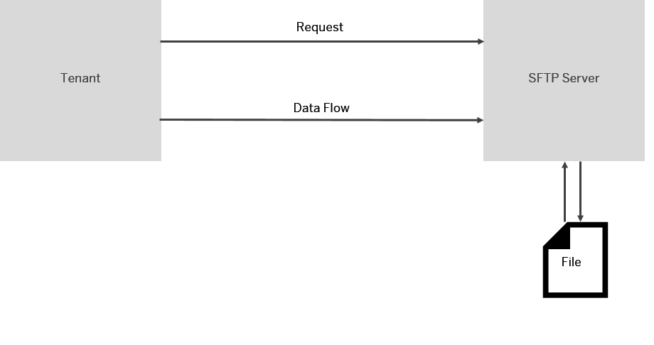

<!-- loio4ef52cf6c89b44219ab7c23ef8a1df31 -->

# Configure the SFTP Receiver Adapter

The SFTP receiver adapter connects an SAP Integration Suite tenant to a remote system using the SSH File Transfer protocol to write files to the system. SSH File Transfer protocol is also referred to as Secure File Transfer protocol \(or SFTP\).

> ### Note:  
> In the following cases certain features might not be available for your current integration flow:
> 
> -   You are using a runtime profile other than the one expected. See: [Runtime Profiles](IntegrationSettings/runtime-profiles-8007daa.md).
> 
> -   A feature for a particular adapter or step was released after you created the corresponding shape in your integration flow.
> 
>     To use the latest version of a flow step or adapter – edit your integration flow, delete the flow step or adapter, add the step or adapter, and configure the same. Finally, redeploy the integration flow. See: [Updating your Existing Integration Flow](updating-your-existing-integration-flow-1f9e879.md).

> ### Note:  
> This adapter exchanges data with a remote component that might be outside the scope of SAP. Make sure that the data exchange complies with your company’s policies.

### How the Receiver SFTP Adapter Works

If you have configured a **receiver** SFTP adapter, message processing is performed as follows at runtime: The tenant sends a request to an SFTP server \(think of this as the receiver system\), and the data flow is in the same direction, from the tenant to the SFTP server. In other words, the tenant writes files to the SFTP server \(from where the communication partner can read them\).

  
  
**SFTP Receiver Adapter: Tenant writes file to SFTP server**

> ### Note:  
> This adapter does **not** support connections to FTP servers.
> 
> See: [FTP Adapter](ftp-adapter-4464f89.md).

[Overview of Integration Flow Editor](overview-of-integration-flow-editor-db10beb.md).

As a prerequisite to use this adapter, you need to set up a connection to an SFTP server as described under: [Setting Up Outbound SFTP Connections \(Details\)](../40-RemoteSystems/setting-up-outbound-sftp-connections-details-15401a7.md).

Once you have created a receiver channel and selected the SFTP receiver adapter, you can configure the following attributes. See *General* tab and provide values in the fields as follows.

<table>
<tr>
<th valign="top">

Parameter

</th>
<th valign="top">

Description

</th>
</tr>
<tr>
<td valign="top">

*Name*

</td>
<td valign="top">

Enter the name of the SFTP channel.

</td>
</tr>
</table>

Select the *Target* tab. Once you have created a receiver channel and selected the SFTP receiver tab and provide values in the fields as follows.

<table>
<tr>
<th valign="top">

Parameters

</th>
<th valign="top">

Description

</th>
</tr>
<tr>
<td valign="top">

*Directory* 

</td>
<td valign="top">

Use the relative path to write the file to a directory.

Example: `parentdirectory/childdirectory`

You can configure this parameter by entering a dynamic expression such like `${property.property_name}` or `${header.header_name}` \(see: [Dynamically Configure Integration Flow Parameters](dynamically-configure-integration-flow-parameters-fff5b2a.md)\).

</td>
</tr>
<tr>
<td valign="top">

*File Name* 

</td>
<td valign="top">

Name of the file to be written.

You can configure this parameter by entering a dynamic expression such like `${property.property_name}` or `${header.header_name}` \(see: [Dynamically Configure Integration Flow Parameters](dynamically-configure-integration-flow-parameters-fff5b2a.md)\).

> ### Note:  
> If you do not enter a file name and the parameter remains blank, the content of the `CamelFileName` header is used as file name. If this header is not specified, the Exchange ID is used as file name.
> 
> Expressions, such as `ab*`, `a.*`, `*a*`, and so on, are not supported.

The endpoint URL that is actually used at runtime is displayed in the message processing log \(MPL\) in the message monitoring application \(MPL property `ProducedFile`\). Note that you can manually configure the endpoint URL using the *File Name* attribute of the SFTP adapter. However, you can dynamically override the value of this attribute by using the Camel header `CamelFileName`.

*Append Timestamp* and dynamically configuring *File Name* \(through a Camel simple expression\) must not be used together. The reason is that using the *Append Timestamp* option results in generating a simple expression for the date. Both simple expressions result in an invalid expression that cannot be processed correctly.

</td>
</tr>
<tr>
<td valign="top">

*Append Timestamp* 

</td>
<td valign="top">

Appends a timestamp at the end of the file name.

Example: If the file name is `myfile.xml`, the *Append Timestamp* option \(assuming the timestamp is ***Nov 30, 2019, 10:10:20***\) generates the following file name:

***myfile20191130101020.xml***

The appended timestamp relates to Greenwich Mean Time \(GMT\) time zone.

> ### Note:  
> *Append Timestamp* option, the timestamp overrides the file name defined dynamically via the header \(`CamelFileName`\).
> 
> Avoid to use the *Append Timestamp* option when dynamically configuring the *File Name* parameter \(through a Camel simple expression\). The reason is that using the *Append Timestamp* option results in generating a simple expression for the date. This expression, together with the one used for *File Name*, result in an invalid expression that cannot be processed correctly.

> ### Caution:  
> Note that in case files are processed quickly, the *Append Timestamp* option might not guarantee unique file names.

</td>
</tr>
<tr>
<td valign="top">

*Address* 

</td>
<td valign="top">

Host name or IP address of the SFTP server and an optional port, for example, `my.host.org:22`.

You can configure this parameter by entering a dynamic expression such like `${property.property_name}` or `${header.header_name}` \(see: [Dynamically Configure Integration Flow Parameters](dynamically-configure-integration-flow-parameters-fff5b2a.md)\).

</td>
</tr>
<tr>
<td valign="top">

*Proxy Type* 

</td>
<td valign="top">

The type of proxy that you are using to connect to the target system.

-   Select *Internet* if you are connecting directly to the SFTP server.

-   Select *On-Premise* if you are connecting to on-premise system.

    For more information, see [Using SAP Cloud Connector with Cloud Integration Adapters](../40-RemoteSystems/using-sap-cloud-connector-with-cloud-integration-adapters-65a60e7.md).

    For more information on how to use the *On-Premise* option to connect to an on-premise SFTP server, check out the SAP Community blog [Cloud Integration – How to Connect to an On-Premise sftp server via Cloud Connector](https://blogs.sap.com/2018/11/16/cloud-integration-how-to-connect-to-an-on-premise-sftp-server-via-cloud-connector/).

-   Select *Dynamic* to let the system determine at runtime which proxy type to use. The value of property `SAP_FtpProxyType` is used for that purpose \(possible values `internet` or `onPremise`\).

    If you have selected this option and if the property is not defined \(for example, in a preceding step\), an error is raised at runtime.

-   Select *Manual* to manually specify *Proxy Host* and *Proxy Port* \(using the corresponding entry field\).

    This option is only available if *Edge* has been selected as runtime.

</td>
</tr>
<tr>
<td valign="top">

*Proxy Protocol*

\(only available if *Manual* is selected for *Proxy Type*\)

</td>
<td valign="top">

Specify the type of proxy server which is used to communicate to the SFTP server. Choose between the following options:

-   *HTTP*

-   *SOCKS Version 4*

-   *SOCKS Version 5*

</td>
</tr>
<tr>
<td valign="top">

*Proxy Host*

\(only available if *Manual* is selected for *Proxy Type*\)

</td>
<td valign="top">

Enter the name of the proxy host to be used. For example: `proxy.mycompany.com`.

</td>
</tr>
<tr>
<td valign="top">

*Proxy Port*

\(only available if *Manual* is selected for *Proxy Type*\)

</td>
<td valign="top">

Enter the proxy port number to be used.

</td>
</tr>
<tr>
<td valign="top">

*Proxy Credential Name*

\(only available if *Manual* is selected for *Proxy Type* and if *HTTP* or *SOCKS Version 5* is selected for *Proxy Protocol*\)

</td>
<td valign="top">

Enter the referenced credential name used for proxy authentication.

</td>
</tr>
<tr>
<td valign="top">

*Location ID*

\(only if *On-Premise* or *Dynamic* is selected for *Proxy Type*\)

</td>
<td valign="top">

To connect to an SAP Cloud Connector instance associated with your account, enter the location ID that you defined for this instance in the destination configuration on the cloud side.

You can configure this parameter by entering a dynamic expression such like `${property.property_name}` or `${header.header_name}` \(see: [Dynamically Configure Integration Flow Parameters](dynamically-configure-integration-flow-parameters-fff5b2a.md)\).

</td>
</tr>
<tr>
<td valign="top">

*User Name* 

</td>
<td valign="top">

ID of the user performing the file transfer.

Make sure that the user name contains no other characters than `A-z`, `0-9`, `_` \(underscore\), `-` \(hyphen\), `/` \(slash\), `?` \(question mark\), `@` \(at\), `!` \(exclamation mark\), `$` \(dollar sign \), `'` \(apostrophe\), `(`, `)` \(brackets\), `*` \(asterisk\), `+` \(plus sign\), `,` \(comma\), `;` \(semicolon\), `=` \(equality sign\), `.` \(dot\), or `~` \(tilde\). Otherwise, an attempt for anonymous login is made which results in an error.

You can configure this parameter by entering a dynamic expression such like `${property.property_name}` or `${header.header_name}` \(see: [Dynamically Configure Integration Flow Parameters](dynamically-configure-integration-flow-parameters-fff5b2a.md)\).

</td>
</tr>
<tr>
<td valign="top">

*Private Key Alias*

\(only if *Public Key*, *Dual*, or *Dynamic* is selected for *Authentication*\)

</td>
<td valign="top">

Alias to identify the private key in the keystore used for the communication with the SFTP server.

You can configure this parameter by entering a dynamic expression such like `${property.property_name}` or `${header.header_name}` \(see: [Dynamically Configure Integration Flow Parameters](dynamically-configure-integration-flow-parameters-fff5b2a.md)\).

</td>
</tr>
<tr>
<td valign="top">

*Timeout \(in ms\)* 

</td>
<td valign="top">

Maximum time \(in milliseconds\) to wait for the SFTP server to be contacted while establishing a connection or performing a read operation. Enter a minimum value bigger than `0`, and smaller than or equal to the maximum value of `299999`. The default is set to `10000`.

If the property `SAP_FtpTimeout` is defined, its value is used to specify this parameter at runtime and will overrun the timeout specified in the UI.

</td>
</tr>
<tr>
<td valign="top">

*Maximum Reconnect Attempts* 

</td>
<td valign="top">

Maximum number of attempts allowed to reconnect to the SFTP server before message processing starts. The default is set to `3`. Enter `0` to disable this behavior.

> ### Note:  
> The setting is only relevant for establishing the initial connection to the server. If the server connection is interrupted during message processing, the connection will not be recovered. A retry attempt of the interrupted message processing can only be achieved by explicitly modeling this functionality via integration flow.

If the property `SAP_FtpMaxReconnect` is defined, its value is used to specify this parameter at runtime.

</td>
</tr>
<tr>
<td valign="top">

*Reconnect Delay \(in ms\)* 

</td>
<td valign="top">

Time \(in milliseconds\) the system waits before attempting to reconnect to the SFTP server.

Default value: `1000`

If the property `SAP_FtpMaxReconDelay` is defined, its value is used to specify this parameter at runtime.

</td>
</tr>
<tr>
<td valign="top">

*Automatically Disconnect* 

</td>
<td valign="top">

Disconnect from the SFTP server after each message processing.

If the property `SAP_FtpDisconnect` is defined, its value is used to specify this parameter at runtime \(possible values: `true` and `false`\).

</td>
</tr>
<tr>
<td valign="top">

*Enable Support for Deprecated Algorithms* 

</td>
<td valign="top">

Select to allow several deprecated key exchange, public key, host key, and encryption algorithms like the ‘diffie-hellman-group1-sha1’ key exchange algorithm or the ‘ssh-rsa’ host key and public key algorithm.

For more information on compatibility and support, see SAP KBA [3079510](https://me.sap.com/notes/3079510).

</td>
</tr>
</table>

Select the *Processing* tab and provide values in the fields as follows.

<table>
<tr>
<th valign="top">

Parameters

</th>
<th valign="top">

Description

</th>
</tr>
<tr>
<td valign="top">

*Change Directories Stepwise* 

</td>
<td valign="top">

If selected, changes directory levels one at a time \(selected by default\).

If the property `SAP_FtpStepwise` is defined, its value is used to specify this parameter at runtime \(possible values: `true` and `false`\).

</td>
</tr>
<tr>
<td valign="top">

*Create Directories*

</td>
<td valign="top">

If selected, creates missing directory levels as provided in the file's pathname \(selected by default\).

If the property `SAP_FtpCreateDir` is defined, its value is used to specify this parameter at runtime \(possible values: `true` and `false`\).

</td>
</tr>
<tr>
<td valign="top">

*Flatten File Names* 

</td>
<td valign="top">

Flatten the file path by removing the directory levels so that only the file names are considered and they are written under a single directory.

If the property `SAP_FtpFlattenFileName` is defined, its value is used to specify this parameter at runtime \(possible values: `true` and `false`\).

</td>
</tr>
<tr>
<td valign="top">

*Prevent Directory Traversal* 

</td>
<td valign="top">

If the file contains any backward path traversals such as `\..\` or `/../..`, this carries a potential risk of directory traversal. In such a case, message processing is stopped with an error. The unique message ID is logged in the message processing log.

> ### Note:  
> We recommend that you specify the *Directory* and *File Name* fields to avoid any security risks. If you provide these fields, the header is not considered.

</td>
</tr>
<tr>
<td valign="top">

*Use Fast Exists Test*

</td>
<td valign="top">

If selected, file exists check is performed on the SFTP server. If your server doesn't support this operation, switch back to client side check. This option is enabled by default.

If the property `SAP_FtpFastExistsCheck` is defined, its value is used to specify this parameter at runtime.

</td>
</tr>
<tr>
<td valign="top">

*Handling for Existing Files*

</td>
<td valign="top">

Define how existing files should be treated.

There are the following options:

-   *Append*: Adds the new file content to the end of the existing one.

    > ### Note:  
    > Don't use the *Append* mode if more than one process is appending to an existing file in parallel as this might cause inconsistencies.

-   *Fail*: System raises a failure \(without any further action\).

-   *Ignore*: System does not execute any further action.

-   *Override*: Replaces existing file content with the new one.

If the property `SAP_FtpAfterProc` is defined, its value is used to specify this parameter at runtime \(possible values: `Override`, `Append`, `Fail` and `Ignore`\).

</td>
</tr>
<tr>
<td valign="top">

*Use Temporary File*

\(only if *Fail*, *Ignore*, or *Override* is selected for *Handling for Existing Files*\)

</td>
<td valign="top">

If selected, files are stored temporarily with a temporary file name before being converted to the target file name \(as specified in the adapter\).

> ### Tip:  
> Even with a timestamp appended to the file name, there is a chance that files are overwritten accidentally when a large number of files is created in a short time period \(nearly at the same time\). Using temporary files with unique file names is an option to prevent the system from overwriting files.

</td>
</tr>
<tr>
<td valign="top">

*Temporary File Name*

\(only if *Use Temporary File* is selected\)

</td>
<td valign="top">

Enter a unique temporary file name.

The file name has to be unique so that the temporary file is not overwritten by parallel running messages. This can be achieved by using variable parts in the file name, such as `${file:name}.tmp` or `target_${exchangeId}.temp`.

</td>
</tr>
</table>

**Related Information**  

[Cloud Integration - How to Connect to an On-Premise sftp server via Cloud Connector](https://blogs.sap.com/2018/11/16/cloud-integration-how-to-connect-to-an-on-premise-sftp-server-via-cloud-connector/)

[Setting Up Outbound SFTP Connections \(Details\)](../40-RemoteSystems/setting-up-outbound-sftp-connections-details-15401a7.md "")

