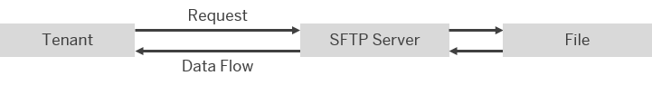

<!-- loio2de9ee58737247969eb7dc9e68b1b121 -->

# Configure the SFTP Sender Adapter

The SFTP sender adapter connects an SAP Integration Suite tenant to a remote system using the SSH File Transfer protocol to read files from the system. SSH File Transfer protocol is also referred to as Secure File Transfer protocol \(or SFTP\).

> ### Note:  
> In the following cases certain features might not be available for your current integration flow:
> 
> -   You are using a runtime profile other than the one expected. See: [Runtime Profiles](IntegrationSettings/runtime-profiles-8007daa.md).
> 
> -   A feature for a particular adapter or step was released after you created the corresponding shape in your integration flow.
> 
>     To use the latest version of a flow step or adapter – edit your integration flow, delete the flow step or adapter, add the step or adapter, and configure the same. Finally, redeploy the integration flow. See: [Updating your Existing Integration Flow](updating-your-existing-integration-flow-1f9e879.md).

> ### Note:  
> This adapter exchanges data with a remote component that might be outside the scope of SAP. Make sure that the data exchange complies with your company’s policies.

### How the Sender SFTP Adapter Works

If you have configured a **sender** SFTP adapter, message processing is performed as follows at runtime: The tenant sends a request to an SFTP server \(think of this as the sender system\), but the data flow is in the opposite direction, from the SFTP server to the tenant. In other words, the tenant reads files from the SFTP server \(a process that is also referred to as *polling*\).

  
  
**SFTP Sender Adapter: Tenant reads files from SFTP server**

### 

> ### Note:  
> This adapter does **not** support connections to FTP servers.
> 
> See: [FTP Adapter](ftp-adapter-4464f89.md).

As a prerequisite to use this adapter, you need to set up a connection to an SFTP server as described under: [Setting Up Inbound SFTP Connections \(Details\)](../40-RemoteSystems/setting-up-inbound-sftp-connections-details-e72eba4.md).

[Overview of Integration Flow Editor](overview-of-integration-flow-editor-db10beb.md).

Once you have created a sender channel and selected the SFTP sender adapter, you can configure the following attributes.

**General**

<table>
<tr>
<th valign="top">

Parameter

</th>
<th valign="top">

Description

</th>
</tr>
<tr>
<td valign="top">

*Name*

</td>
<td valign="top">

Enter the name of the SFTP channel.

</td>
</tr>
</table>

Select the *Source* tab and provide values in the fields as follows.

**Source**

<table>
<tr>
<th valign="top">

Parameters

</th>
<th valign="top">

Description

</th>
</tr>
<tr>
<td valign="top">

*Directory* 

</td>
<td valign="top">

Relative path to read the file from a directory. Example: `parentdirectory/childdirectory` 

</td>
</tr>
<tr>
<td valign="top">

*Regex Filtering*

\(Supported for adapter version 1.17 and above\)

</td>
<td valign="top">

Select to evaluate the entered filename as a real[regular expression](configure-the-sftp-sender-adapter-2de9ee5.md#loio2de9ee58737247969eb7dc9e68b1b121__sftp_regex).

Else, the file name will be evaluated as a [simple expression](configure-the-sftp-sender-adapter-2de9ee5.md#loio2de9ee58737247969eb7dc9e68b1b121__sftpsender_filename2).

</td>
</tr>
<tr>
<td valign="top">

*File Name* 

</td>
<td valign="top">

Name of the file to be read. If you do not enter a file name and the parameter remains blank, all the files in the specified directory are read. When you use an expression to include files from subdirectories, the relative path from the root directory of the user and the actual file name are evaluated. For more information, see [3529367](https://me.sap.com/notes/3529367)

> ### Note:  
> For simple expressions:
> 
> -   Expressions, such as `ab*`, `a.*`, `*a*`, `*a`, `?b`, and so on, are supported.
> 
> -   The expression \* replaces no character or an arbitrary number of characters.
> 
> -   The expression ? replaces exactly one arbitrary character.
> 
> 
> Examples:
> 
> -   If you want to include files from subdirectories \(see *Property Include Subdirectories* in the *Processing Tab*\), you need to consider the relative path in your pattern, for example, by using `*file.txt`.
> 
> -   If you specify `file*.txt` as the *File Name*, the following files are polled by the adapter: `file1.txt`, `file2.txt`, as well as `file.txt` and `file1234.txt`, and so on.
> 
> -   If you specify `file?.txt` as the *File Name*, the following files are polled by the adapter: `file1.txt`, `file2.txt`, and so on, but **not** the files `file.txt` or `file1234.txt`.

> ### Note:  
> For regular expressions:
> 
> -   Ensure that too complex regex patterns are not entered. A default value of 5 seconds is set for evaluation of regex expression.
> -   Regex pattern must be valid; invalid patterns may lead to unexpected results or errors.

> ### Caution:  
> Files with file names longer than 100 characters are processed as follows:
> 
> Note that the file name consists of the relative path from the root directory of the user and the actual file name.
> 
> -   If two files with names longer than 100 characters are available for processing, only one of these files is processed at a time. This means that both files are processed, but not in parallel. This is also the case if two runtime nodes/workers are available. If the node/worker fails multiple times while processing a file with a file name longer than 100 characters, none of the files sharing the first 100 characters with that file can be executed without manual intervention from the administrator.
> 
> -   The option *Keep File and Mark as Processed in Idempotent Repository* \(for sender channels under *Processing*\) will not work for these files.

</td>
</tr>
<tr>
<td valign="top">

*Address* 

</td>
<td valign="top">

Host name or IP address of the SFTP server and an optional port, for example, `wdfd00213123:22`.

</td>
</tr>
<tr>
<td valign="top">

*Proxy Type* 

</td>
<td valign="top">

Proxy type that you are using to connect to the target system.

-   Select *Internet* if you are connecting directly to the SFTP server.

-   Select *Manual* to manually specify *Proxy Host* and *Proxy Port* \(using the corresponding entry field\).

    This option is only available if *Edge* has been selected as runtime.

-   Select *On-Premise* if you are connecting to an on-premise SFTP server.

For more information, see [Using SAP Cloud Connector with Cloud Integration Adapters](../40-RemoteSystems/using-sap-cloud-connector-with-cloud-integration-adapters-65a60e7.md). For more information on how to use the *On-Premise* option to connect to an on-premise SFTP server, check out SAP Community blog [Cloud Integration – How to Connect to an On-Premise sftp server via Cloud Connector](https://blogs.sap.com/2018/11/16/cloud-integration-how-to-connect-to-an-on-premise-sftp-server-via-cloud-connector/).

</td>
</tr>
<tr>
<td valign="top">

*Proxy Protocol*

\(only available if *Manual* is selected for *Proxy Type*\)

</td>
<td valign="top">

Specify the type of proxy server which is used to communicate to the SFTP server. Choose between the following options:

-   *HTTP*

-   *SOCKS Version 4*

-   *SOCKS Version 5*

</td>
</tr>
<tr>
<td valign="top">

*Proxy Host*

\(only available if *Manual* is selected for *Proxy Type*\)

</td>
<td valign="top">

Enter the name of the proxy host to be used. For example: `proxy.mycompany.com`.

</td>
</tr>
<tr>
<td valign="top">

*Proxy Port*

\(only available if *Manual* is selected for *Proxy Type*\)

</td>
<td valign="top">

Enter the proxy port number to be used.

</td>
</tr>
<tr>
<td valign="top">

*Proxy Credential Name*

\(only available if *Manual* is selected for *Proxy Type* and if *HTTP* or *SOCKS Version 5* is selected for *Proxy Protocol*\)

</td>
<td valign="top">

Enter the referenced credential name used for proxy authentication.

</td>
</tr>
<tr>
<td valign="top">

*Location ID*

\(only if *On-Premise* is selected for *Proxy Type*\)

</td>
<td valign="top">

To connect to an SAP Cloud Connector instance associated with your account, enter the location ID that you defined for this instance in the destination configuration of SAP BTP cockpit.

</td>
</tr>
<tr>
<td valign="top">

*User Name* 

</td>
<td valign="top">

ID of the user performing the file transfer.

Make sure that the user name contains no other characters than `A-z`, `0-9`, `_` \(underscore\), `-` \(hyphen\), `/` \(slash\), `?` \(question mark\), `@` \(at\), `!` \(exclamation mark\), `$` \(dollar sign \), `'` \(apostrophe\), `(`, `)` \(brackets\), `*` \(asterisk\), `+` \(plus sign\), `,` \(comma\), `;` \(semicolon\), `=` \(equality sign\), `.` \(dot\), or `~` \(tilde\). Otherwise, an attempt for anonymous login is made which results in an error.

</td>
</tr>
<tr>
<td valign="top">

*Private Key Alias*

\(only if *Public Key* or *Dual* is selected for *Authentication*\)

</td>
<td valign="top">

Alias to identify the private key in the keystore used for the communication with the SFTP server.

</td>
</tr>
<tr>
<td valign="top">

*Timeout \(in ms\)* 

</td>
<td valign="top">

Maximum time \(in milliseconds\) to wait for the SFTP server to be contacted while establishing a connection or performing a read operation. Enter a minimum value bigger than `0`, and smaller than or equal to the maximum value of `299999`. The default ist set to `10000`.

</td>
</tr>
<tr>
<td valign="top">

*Maximum Reconnect Attempts* 

</td>
<td valign="top">

Maximum number of attempts allowed to reconnect to the SFTP server before message processing starts. The default is set to `3`. Enter `0` to disable this behavior.

> ### Note:  
> The setting is only relevant for establishing the initial connection to the server. If the server connection is interrupted during message processing, the connection will not be recovered. The message will be fetched with the next scheduled poll interval.

</td>
</tr>
<tr>
<td valign="top">

*Reconnect Delay \(in ms\)* 

</td>
<td valign="top">

Time \(in milliseconds\) the system waits before attempting to reconnect to the SFTP server; default Value: `1000`.

</td>
</tr>
<tr>
<td valign="top">

*Automatically Disconnect* 

</td>
<td valign="top">

Disconnect from the SFTP server after each message processing.

</td>
</tr>
<tr>
<td valign="top">

*Enable Support for Deprecated Algorithms* 

</td>
<td valign="top">

Select to allow several deprecated key exchange, public key, host key, and encryption algorithms like the ‘diffie-hellman-group1-sha1’ key exchange algorithm or the ‘ssh-rsa’ host key and public key algorithm.

For more information on compatibility and support, see SAP KBA [3079510](https://me.sap.com/notes/3079510).

</td>
</tr>
</table>

Select the *Processing* tab and provide values in the fields as follows.

**Processing**

<table>
<tr>
<th valign="top">

Parameters

</th>
<th valign="top">

Description

</th>
</tr>
<tr>
<td valign="top">

*Read Lock Strategy* 

</td>
<td valign="top">

Prevents files that are in the process of being written from being read from the SFTP server. The endpoint waits until it has an exclusive read lock on a file before reading it. Select one of the following options based on the capabilities of the SFTP server:

-   *None* \(default\): Does not use a read lock, which means that the endpoint can immediately read the file. *None* is the simplest option if the SFTP server guarantees that a file only becomes visible on the server once the process of writing it to the server has been finished.

-   *Content Change*: Monitors changes in the file length/modification timestamp to determine if the write operation on the file is complete and the file is ready to be read. If you have selected this option, the system waits for at least one second until there are no more file changes. Therefore, if you select this option, files cannot be read as quickly as with the other two options.

-   *Done File Expected*: Uses a specific file to signal that the file to be processed is ready for consumption.

    If you have selected this option, enter the name of the .done-file. The .done-file signals that the file to be processed is ready for consumption. This file must be in the same folder as the file to be processed.

    Default naming pattern: `${file:name}.done`

    > ### Caution:  
    > Avoid using static file names in combination with recursive flags and/or file name wildcard patterns, but please stick to the default naming pattern to avoid running into errors. It's recommended to always pair an incoming file with a .done-file.
    > 
    > Example:
    > 
    > `hello.txt` is the file to be consumed, `hello.txt.done` is the associated .done-file.

-   *Rename*: Renames the file on the SFTP server before reading it.

</td>
</tr>
<tr>
<td valign="top">

*Empty File Handling* 

</td>
<td valign="top">

Specify the protocol for managing empty files i.e., files with 0 bytes.

-   *Process Empty File*: Processes the empty files through the integration flow like any other files.

-   *Skip Empty File*: Bypasses the empty files, without generating [Message Processing Log](message-processing-log-b32f8cd.md) or executing any post-processing.
-   *MPL With Post Processing Only*: Excludes the files from primary processing while still generating a [Message Processing Log](message-processing-log-b32f8cd.md) and executing post-processing tasks, such as moving, archiving, or deleting the files, as selected from the [*Post-Processing*](configure-the-sftp-sender-adapter-2de9ee5.md#loio2de9ee58737247969eb7dc9e68b1b121__sftp_sender_postprocessing) options.

    > ### Note:  
    > Use *MPL With Post Processing Only* when you want to maintain traceability of empty files without triggering the main integration logic making it ideal for audit or archival purposes.

</td>
</tr>
<tr>
<td valign="top">

*Poll on One Worker Only* 

</td>
<td valign="top">

In case the integration flow is deployed on multiple worker nodes, each worker node is connected as separate consumer to the SFTP server.

When this option is selected, the polling process is performed on a single worker node at a time. This feature is important in scenarios when either the processing order of files is relevant or if you want to restrict the number of parallel connections to the SFTP server.

> ### Note:  
> This parameter determines how the parameters *Sorting* and *Max. Messages per Poll* influence message processing at runtime in the following way:
> 
> It is important to know that:
> 
> -   The SFTP server provides the files in an order that is not controlled by SAP Cloud Integration.
> 
> -   The order of messages is only maintained per worker.
> 
> -   The technical communication between workers prevents processing of the same file on multiple workers.
> 
> 
> Therefore, the setting of this parameter has the following impact on how the two other parameters behave at runtime, as explained under [Integration Flow Deployed on Multiple Worker Nodes](integration-flow-deployed-on-multiple-worker-nodes-95bb34a.md).

</td>
</tr>
<tr>
<td valign="top">

*Stop on Exception*

Only if *Poll on One Worker Only* is enabled

</td>
<td valign="top">

Select to stop the processing of the current file batch if any exception or error is encountered. The polling will be resumed in the next polling cycle.

If you use an [Exception Subprocess](define-exception-subprocess-690e078.md) with *Stop on Exception* enabled, ensure to end it with an *Error End* event. This is to ensure that the exceptions are not suppressed, in-turn disabling *Stop on Exception*.

</td>
</tr>
<tr>
<td valign="top">

*Sorting*

This field is enabled only if *Poll on One Worker Only* is checked.

> ### Note:  
> From adpater version 1.16 onwards, the *Sorting* field is accessible only when *Poll on One Worker Only* is enabled.

</td>
<td valign="top">

Select the type of sorting to use to poll files from the SFTP server:

-   *None* \(default\): The sorting is specified by the STFP server.

-   *File Name*: Files are polled sorted by file name.
-   *File Size*: Files are polled sorted by file size.
-   *Time Stamp*: Files are polled sorted by the modification time stamp of the file.

</td>
</tr>
<tr>
<td valign="top">

*Sorting Order* 

\(only if for *Sorting* another option than *None* is selected\)

</td>
<td valign="top">

Select whether to sort in ascending or descending order.

</td>
</tr>
<tr>
<td valign="top">

*Max. Messages per Poll* 

</td>
<td valign="top">

Maximum number of messages to gather in each poll. Enter any value between `1` and `500`. The default is set to `20`.

Consider how long it will take to process this number of messages, and make sure that you set a higher value for *Lock Timeout \(in min\)*. The messages are picked up sequentially.

In case the integration flow is deployed on multiple runtime nodes, each runtime node is connected as separate consumer to the SFTP server. Likewise, each runtime node polls files from the SFTP server independently. In such a case, the maximum number of polled files is the value specified for parameter *Max. Messages per Poll* multiplied with the number of runtime nodes. For example, if the integration flow is deployed on two runtime nodes and the parameter *Max. Messages per Poll* is set to 10, the overall maximum number of polled files per scheduled poll time is 20.

The system uses locks to ensure that each file from the SFTP server is only processed on one runtime node \(see: [Message Locks](message-locks-bce9ae0.md)\).

> ### Note:  
> The adapter processes the complete list of messages specified by this parameter before the subsequent poll \(according to the settings under *Scheduler*\) starts.

> ### Note:  
> If you are using the sender SFTP adapter in combination with an Aggregator step and you expect a high message load, consider the following recommendation:
> 
> Set the value for *Max. Messages per Poll* to a small number larger than `0` \(for example, `20`\). This ensures proper logging of the message processing status at runtime.

> ### Note:  
> If there’s an error during message processing, the system continues to process the next messages in the same polling batch \(see option *Max. Messages per Poll*\). After the batch is completed, the erroneous message may be processed again. Therefore, processing is not achieved in the original order anymore. If you rely on strict “in order” processing, you need to set *Max. Messages per Poll* to `1`. However, note that this comes with a negative performance impact, in particular, if there’s a large numbers of files on the SFTP server.

</td>
</tr>
<tr>
<td valign="top">

*Lock Timeout \(in min\)* 

</td>
<td valign="top">

Specify how long to wait before trying to process the file again in the event of SAP Cloud Integration outage. If it takes a very long time to process the scenario, you may need to increase the timeout to avoid parallel processing of the same file. This value should be higher than the processing time required for the number of messages specified by *Max. Messages per Poll*.

Default: `15`

</td>
</tr>
<tr>
<td valign="top">

*Change Directories Stepwise* 

</td>
<td valign="top">

Select this option to change directory levels one at a time.

To learn more, refer to [Stepwise changing directories](https://camel.apache.org/components/4.8.x/ftp-component.html#_stepwise_changing_directories).

</td>
</tr>
<tr>
<td valign="top">

*Include Subdirectories* 

</td>
<td valign="top">

Selecting this option allows you to look for files in all subdirectories of the directory.

</td>
</tr>
<tr>
<td valign="top">

*Flatten File Names*

\(only if *Include Sub-Directories* is selected\)

</td>
<td valign="top">

Flatten the file path by removing the directory levels so that only the file names are considered.

</td>
</tr>
<tr>
<td valign="top">

*Use Fast Exists Check*

</td>
<td valign="top">

If selected, file exists check is performed on the SFTP server. If your server doesn't support this operation, switch back to client side check. This option is enabled by default.

</td>
</tr>
<tr>
<td valign="top">

*Post-Processing* 

</td>
<td valign="top">

Allows you to specify how files are to be handled after processing.

Note that only successfully processed messages can be post-processed. If message processing fails, the *Post-Processing* settings are not effective.

You can select one of the following options:

-   *Delete File* \(default\): The file is deleted after it has been processed successfully.

    If you have also selected *Done File Expected* as *Read Lock Strategy*, the file to be processed as well as the done file is deleted.

-   *Keep File and Mark as Processed in Idempotent Repository*: Prevents a file from being consumed twice. For that purpose, an idempotent repository is activated.

    The idempotent repository contains information about files already been consumed from the SFTP server. Being stored in the idempotent repository, a file can be identified by the file name. When SAP Cloud Integration tries to process the file, the system can detect if the file has already been consumed \(based on its idempotent repository entry\) and that way can prevent it from being consumed a second time from the SFTP server.

    Select this option for SFTP servers that do not allow deletion or moving of files, but the files are to be read only once.

    Note that when you choose this option, the system only takes into account the file name to decide whether it is the same file or not. Attributes such like file size, timestamp, hash value, for example, are ignored.

    If you have also selected *Done File Expected* as *Read Lock Strategy*, an entry will be created in the idempotent repository; the done file will not be deleted.

-   *Keep File and Process Again*: The file is kept on the SFTP server and file processing is repeated. You can use this option for testing purposes, for example.

    If you choose this option, the file is processed with every message processing run, even in case it has not be changed.

-   *Move File*: The file is moved to another directory.

    If you select this option, you need to specify the target directory.

    If you have also selected *Done File Expected* as *Read Lock Strategy*, only the file to be processed is moved and the done file will be deleted.

</td>
</tr>
<tr>
<td valign="top">

*Idempotent Repository*

\(only if *Keep File and Mark as Processed in Idempotent Repository* is selected for *Post-Processing*\)

</td>
<td valign="top">

You can select one of the following idempotent repository options:

-   *Database*\(default\): Stores the file names in a database to synchronize between multiple worker nodes and to prevent the files from being read again when the runtime node is restarted. File name entries are deleted by default after 90 days.

    > ### Note:  
    > The idempotent repository uses the username, host name, and file name as key values to identify files uniquely across integration flows of a tenant.

-   *In Memory*: Keeps the file names in the memory. Files are read again from the SFTP server when the runtime node is restarted. It is not recommended to use the *In Memory* option if multiple runtime nodes are used. In this case the other nodes would pick the file and process it because the memory is specific to the runtime node.

</td>
</tr>
<tr>
<td valign="top">

*Archive Directory*

\(only if *Move File* is selected for *Post-Processing*\)

</td>
<td valign="top">

Specifies the target directory where to move the file.

Make sure that you specify a relative file path for the target directory. Note that the specified file path is defined relative to the directory specified with the *Directory* parameter. If you specify an absolute file path, it may occur that the file cannot be stored correctly at runtime. You can also specify the target directory dynamically, for example, using the timestamp of the message. The following example uses backup folders with timestamps and replaces the file extension with `bak: backup/${date:now:yyyyMMdd}/${file:name.noext}.bak`.

</td>
</tr>
</table>

Select the *Conditions* tab and provide values in the field as follows.

**Conditions**

<table>
<tr>
<th valign="top">

Parameter

</th>
<th valign="top">

Description

</th>
</tr>
<tr>
<td valign="top">

Maximum File Size

</td>
<td valign="top">

This parameter allows you to configure the maximum allowed file size in megabytes \(MB\).

> ### Note:  
> This feature is supported in SFTP Sender Adapter Version 1.15 and above.

The file size limit :

-   Default Value: 40 MB

-   Minimum Value: 0 MB
-   Maximum Value: 2,147,483,647 MB

**Polling Criteria:**

File size must be less than or equal to the configured Maximum File Size. Files exceeding the maximum size will be ignored.

If a file is ignored due to exceeding the Maximum File Size limit, use the Connectivity Test feature to verify the actual file size on the server. Refer to SAP Note [3519063](https://me.sap.com/notes/3519063) for more information.

</td>
</tr>
</table>

Select the *Scheduler* tab and provide values in the fields as follows.

> ### Caution:  
> How you specify the *Scheduler* settings depends on the constraints and requirements of your integration scenario. However, make sure to use the *Scheduler* parameters advisedly: Specify the scheduler settings in such a way that messages are not polled with too high frequency. Use intervals below 1 minute only if really required. Otherwise, there’s the risk to overload the SFTP server.

**Scheduler**

<table>
<tr>
<th valign="top">

Scheduler Option

</th>
<th valign="top">

Field

</th>
<th valign="top">

Description

</th>
</tr>
<tr>
<td valign="top" rowspan="4">

*Schedule on Day* 

</td>
<td valign="top">

On Date

</td>
<td valign="top">

Specify the date on which you want the operation to be executed.

</td>
</tr>
<tr>
<td valign="top">

At Time

</td>
<td valign="top">

Specify the time at which you want the operation to be executed.

</td>
</tr>
<tr>
<td valign="top">

Every

</td>
<td valign="top">

Specify a time period \(for example, every hour\) in a dedicated time window.

</td>
</tr>
<tr>
<td valign="top">

Time Zone

</td>
<td valign="top">

Select the time zone that you want the scheduler to use as a reference for the date and time settings.

</td>
</tr>
<tr>
<td valign="top" rowspan="3">

*Schedule to Recur* 

</td>
<td valign="top">

Daily

</td>
<td valign="top">

Select the time or interval and time zone for the schedule to recur.

</td>
</tr>
<tr>
<td valign="top">

Weekly

</td>
<td valign="top">

Select the checkboxes to indicate the days of the week on which the operation has to be executed. Also, specify the time or interval for the schedule to recur.

</td>
</tr>
<tr>
<td valign="top">

Monthly

</td>
<td valign="top">

Select the day of the month on which the operation has to be executed. Also indicate the time or the interval for the schedule to recur.

</td>
</tr>
</table>

**Related Information**  

[Setting Up Inbound SFTP Connections \(Details\)](../40-RemoteSystems/setting-up-inbound-sftp-connections-details-e72eba4.md "")

