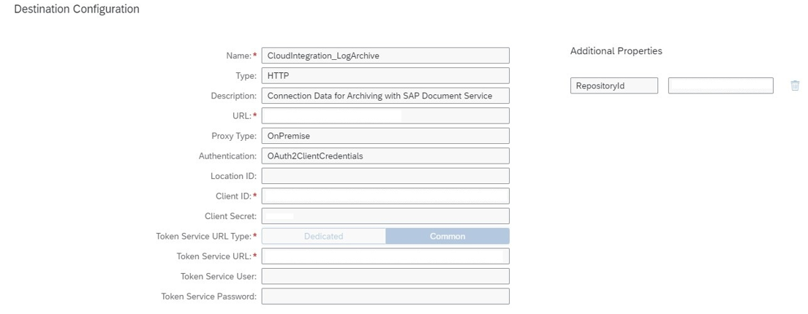
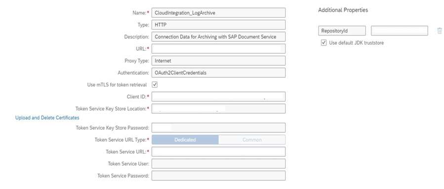

<!-- loioc1ac58014a8a4f208d18e716afae04f8 -->

# Configuring Destination

To configure a connection to your CMS system for data archiving, you've to define a destination in the subscriber account of your tenant and follow the steps described in "Enable Archiving in the Cloud Foundry Environment".

Create a new **Destination** pointing to the CMS System. Fill in the properties stated in the table:

****


<table>
<tr>
<th valign="top">

Property

</th>
<th valign="top">

Value or Description

</th>
</tr>
<tr>
<td valign="top">

*Name*

</td>
<td valign="top">

CloudIntegration\_LogArchive

> ### Note:  
> You can't change the destination name.


</td>
</tr>
<tr>
<td valign="top">

*Type*

</td>
<td valign="top">

Type of protocol must be HTTP.

</td>
</tr>
<tr>
<td valign="top">

*Description*

</td>
<td valign="top">

Description of the destination

</td>
</tr>
<tr>
<td valign="top">

*URL*

</td>
<td valign="top">

Add the URL :

For *Proxy Type* `Internet`

-   The CMS Repository


For *Proxy Type* `OnPremise`

-   The CMS Repository and replace host and port by the virtual host and port configured in the SAP Cloud Connector.

The required protocol in the URL is HTTP. This protocol isn't a security risk, as you can specify HTTPS in the SAP Cloud Connector configuration and thus ensure that the route from cloud connector on the on-premise system is encrypted. The connection between cloud connector and application VM in the cloud is always encrypted, as shown in: [Configuration of On-Premise Systems](https://help.sap.com/viewer/b865ed651e414196b39f8922db2122c7/Cloud/en-US/8db6945e70b44c5d8e0873c3e9fb3bf2.html#loio8db6945e70b44c5d8e0873c3e9fb3bf2__oP)

> ### Note:  
> The default binding is the browser-binding. Unless you specify `AtomPub` as `BindingType`, you've to specify the URL for the browser binding. WebServices binding isn't supported.


</td>
</tr>
<tr>
<td valign="top">

*Proxy Type*

</td>
<td valign="top">

-   Internet /OnPremise

-   Internet for the direct connection to CMS
-   OnPremise for Cloud Connector use

    > ### Note:  
    > Depending on the connection you expose to your repository, you have to use Cloud Connector because direct connection to the repository isn't always possible.


</td>
</tr>
<tr>
<td valign="top">

*Authentication*

</td>
<td valign="top">

BasicAuthentication or OAuth2ClientCredentials

> ### Note:  
> Until now, only client credentials grant is supported for Oauth authentication.


</td>
</tr>
<tr>
<td valign="top">

*User*

</td>
<td valign="top">

The user authorized for the CMS repository for BasicAuthentication. The user who connects with CMS repository requires several permissions. The permissions must include:

-   `cms:read`

-   `cms:write` 
-   The query capability `metadataonly`


</td>
</tr>
<tr>
<td valign="top">

*Password*

</td>
<td valign="top">

The user's password for BasicAuthentication.

</td>
</tr>
<tr>
<td valign="top">

*Client ID*

</td>
<td valign="top">

Client ID for the OAuth2ClientCredentials authentication

</td>
</tr>
<tr>
<td valign="top">

*Client Secret*

</td>
<td valign="top">

Client Secret for the OAuth2ClientCredentials authentication without mTLS \(mutual TLS\).

</td>
</tr>
<tr>
<td valign="top">

*Use mTLS for Token Retrieval*

</td>
<td valign="top">

Select the checkbox, if you want to use mTLS \(mutual TLS\) for Oauth2ClientCredentials authentication. This is only applicable for proxy type `Internet`

</td>
</tr>
<tr>
<td valign="top">

*Token Service Key Store Location*

</td>
<td valign="top">

Specify the value, if you want to use Oauth2ClientCredentials authentication with mTLS.

We require a keystore to be uploaded via the “Upload and Delete Certificates” link \(see screenshot\). This keystore is used for mTLS and contains the authentication data for the client.

The keystore has to meet the following requirements:

1.  The keystore must be in the JKS format.

2.  The keystore must contain exactly one keypair, containing the private key and the certificate chain required for the client.
3.  The keystore and key pair must be password protected with the **same** password.

After uploading the keystore, enter a name by selecting it from the dropdown list.

</td>
</tr>
<tr>
<td valign="top">

*Token Service Key Store Password*

</td>
<td valign="top">

Password for the keystore and the key pair contained in the keystore when using Oauth2ClientCredentials with mTLS.

</td>
</tr>
<tr>
<td valign="top">

*Token Service URL Type*

</td>
<td valign="top">

You can use both values `Dedicated` and `Common` for OAuth2ClientCredentials authentication.

</td>
</tr>
<tr>
<td valign="top">

*Token Service URL*

</td>
<td valign="top">

The authentication URL grants the Oauth token for OAuth2ClientCredentials authentication.

For the proxy-type `OnPremise`, you can only specify a URL with the http protocol. It seems to be a security risk, and is inconvenient if your URL uses the https protocol. But internally, we replace "http" with "https" in the URL used to call the token. We assume a URL with https for the proxy-type `OnPremise` and authentication type `OAuth2ClientCredentials` in a URL specified with http. For example: if you call the URL "**http**://xxx" in the destination, it's internally replaced by "**https:**://xxx".

</td>
</tr>
<tr>
<td valign="top">

*Token Service User*

</td>
<td valign="top">

This value can be left empty. \(We don't use it yet\)

</td>
</tr>
<tr>
<td valign="top">

*Token Service Password*

</td>
<td valign="top">

This value can be left empty. \(We don't use it yet\)

</td>
</tr>
</table>


<table>
<tr>
<th valign="top">

Additional Properties

</th>
<th valign="top">

Value or Description

</th>
</tr>
<tr>
<td valign="top">

`ArchiveCompletedMessagesOnly` \(optional\)

</td>
<td valign="top">

If you define this parameter and set its value to `TRUE`, or `true`, only archiving relevant MPLs with status COMPLETED are archived.

If this parameter isn't specified, or specified with any value other than `TRUE` or `true`, the MPL status isn't considered, except status DISCARDED.

All archiving relevant MPLs are archived, except MPLs with status DISCARDED.

> ### Caution:  
> If you've set the parameter with the value `TRUE`, or `true`, and you run an archiving job with this setting, the run **changes the archiving relevance of MPLs**. In this case, these particular MPLs with another status than COMPLETED aren’t archived anymore by further job runs. They'll be deleted by one of the next runs of the `Monitoring Data Cleanup Job`.


</td>
</tr>
<tr>
<td valign="top">

`BindingType` \(optional\)

</td>
<td valign="top">

Define this parameter only if you want to use the `AtomPub-Binding` instead of the Browser-Binding to connect to the repository.

In this case, specify `AtomPub` as parameter value and ensure that the URL property has the correct URL for the `AtomPub-Binding`. If you use SAP Cloud Connector, ensure that the URL for the `AtomPub-Binding` URL has the *URL* property value.

If you use `AtomPub-Binding`, the `AtomPub` URL must be displayed as an accessible resource in the SAP Cloud Connector configuration.

</td>
</tr>
<tr>
<td valign="top">

`ClientCompression` \(optional\)

</td>
<td valign="top">

If you set this parameter value to `true` or `TRUE`, the requests sent to the CMIS-Repository are compressed using `gzip`. This procedure improves the application performance if the repository can handle compressed requests.

Before activating this parameter, check if your repository can handle compressed requests.

We recommend using this parameter only if the performance observed, isn't acceptable for your usage scenario.

</td>
</tr>
<tr>
<td valign="top">

`ConnectTimeout` \(optional\)

</td>
<td valign="top">

With this parameter, you set the HTTP connect timeout for your CMIS client.

The value is a positive whole number and specifies the timeout in milliseconds.

> ### Note:  
> The timeout default value is 30000 milliseconds. The minimum value is 5000 milliseconds and the maximum value 100000 milliseconds. You can only specify values within this range.
> 
> For values lower than the minimum, the minimum is set, and for values higher than the maximum, the maximum is set.

Use this parameter if you observe frequent failures during testing because the timeout value being too low, or if the requests take too long to time out.

</td>
</tr>
<tr>
<td valign="top">

`CookiesForAuthentication` \(optional\)

</td>
<td valign="top">

If you set this parameter value to `true` or `TRUE`, cookies are used to transmit authentication information.

This action improves the application performance, but doesn't apply to all repositories.

We recommend using this parameter only if the performance observed, isn't acceptable for your usage scenario.

</td>
</tr>
<tr>
<td valign="top">

`CustomAttributeAndTypeNamesMapping` \(optional\)

</td>
<td valign="top">

Use this parameter if you want to have your own document type, name, and document attributes in your CMS repository, differing from the ones provided by SAP.

The parameter value has to be a JSON string, as shown in the example:

> ### Sample Code:  
> ```
> {
> 	"mpl:message":"sapcpi_mpl_message",
> 	"mpl:messageGuid":"c_mpl_message_guid",
> 	"mpl:correlationId":"c_mpl_correlation_id",
> 	"mpl:messageId":"c_mpl_message_id",
> 	"mpl:messageType":"c_mpl_message_type",
> 	"mpl:logStart":"c_mpl_log_start",
> 	"mpl:logEnd":"c_mpl_log_end",
> 	"mpl:sender":"c_mpl_sender",
> 	"mpl:receiver":"c_mpl_receiver",
> 	"mpl:iFlowComponentType":"c_mpl_iflow_component_type",
> 	"mpl:iFlowName":"c_mpl_iflow_name",
> 	"mpl:iFlowSymbolicName":"c_mpl_iflow_symbolic_name",
> 	"mpl:status":"c_mpl_status",
> 	"mpl:logLevel":"c_mpl_log_level",
> 	"mpl:statusCustom":"c_mpl_status_custom",
> 	"mpl:messageSize":"c_mpl_message_size",
> 	"mpl:transactionCount":"c_mpl_transaction_count"
> }
> 
> ```

The keys in the JSON are the names as provided by SAP, the values are the names you want to use instead, in the type you create.

The name of the type you create is the value of `mpl:message` in the JSON. In the sample code, the type name is `sapcpi_mpl_message`.

</td>
</tr>
<tr>
<td valign="top">

`DirectConnection` \(optional\)

</td>
<td valign="top">

Defines how the session to the CMS repository is created.

If you don't specify the parameter or if the parameter value is set to any other value than `false` or `FALSE`, the session is created by using the `RepositoryId` in the call for the session.

If the parameter value is set to `false` or `FALSE` , the system creates a list of all existing repositories and then uses the repository of the specified ID to create the session.

> ### Note:  
> Use this parameter only if you browse out during testing, that the default connection doesn't work.


</td>
</tr>
<tr>
<td valign="top">

`PathPrefix` \(optional\)

</td>
<td valign="top">

The default format for data archiving paths is **year/month/day**, using the log end date of the MPL to determine this date. The data archiving path is created under the root folder. The log end date is stated in UTC.

Use the `PathPrefix` parameter if you want to create the archiving path in a specific folder. Specify the path from the root folder down to the specific folder. Use `/` to start the path with and to separate its segments.

If you don't create the folder under the `PathPrefix` in advance, the archiving job creates this folder, provided the user-defined in the destination has the required permissions to create the path specified in the `PathPrefix` parameter.

</td>
</tr>
<tr>
<td valign="top">

`ReadTimeout` \(optional\)

</td>
<td valign="top">

With this parameter, you set the HTTP read timeout for your CMIS client.

The value is a positive whole number and specifies the timeout in milliseconds.

> ### Note:  
> The timeout default value is set to 600000 milliseconds. The minimum value is 5000 milliseconds and the maximum value 1000000 milliseconds. You can only specify values within this range.
> 
> For values lower than the minimum, the minimum is set, and for values higher than the maximum, the maximum is set.

Use this parameter if you observe frequent failures during testing because the timeout value being too low, or if the requests take too long to time out.

</td>
</tr>
<tr>
<td valign="top">

`RepositoryId`

</td>
<td valign="top">

ID of the CMS Repository.

Specify the repository Id and **not** the repository name.

</td>
</tr>
<tr>
<td valign="top">

`ResponseCompression` \(optional\)

</td>
<td valign="top">

If you set this parameter value to `true` or `TRUE`, your CMIS client requests that the repository compresses the responses sent. This procedure improves the application performance if the repository supports compression of responses.

Before activating this parameter, check if your repository supports response compression.

We recommend using this parameter only if the performance observed, isn't acceptable for your usage scenario.

</td>
</tr>
</table>

The screenshots are for illustrative purposes only. You can use all additional properties independently from the authentication type.

Example of an archiving destination with OAuth2ClientCredentials with required properties, without mTLS:



Example of an archiving destination with required properties with OAuth2ClientCredentials with required properties, with mTLS



Example of an archiving destination with BasicAuthentication and all additional properties:


**Related Information**  


[Enable Archiving](enable-archiving-0fbbe93.md "To enable data archiving on a tenant in the Cloud Foundry environment, use the OData API.")

