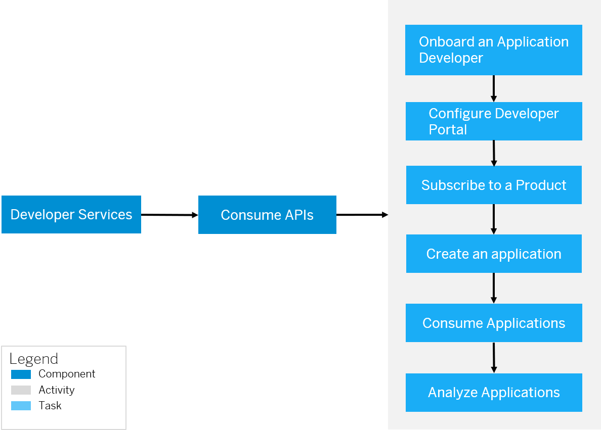

<!-- loioea561e424f6e44aa985fceedf7fabee7 -->

# Consume APIs

Consume APIs via the API business hub enterprise. In the API business hub enterprise, an application developer registers, explores the API exposed by customers, creates applications, and tests APIs.

 

API business hub enterprise is an application that provides a common platform for Application developers to consume APIs. Every API Management customer is provided with their own API business hub enterprise application on cloud. The API business hub enterprise offers capabilities to onboard application developers, explore and test APIs, create and subscribe to Applications.

The API business hub enterprise supports the following features:

-   **Onboard an Application developer**- To explore the APIs and subscribe to an Application, an Application developer must be registered to the API business hub enterprise. On registering, the Application developer is provided access to the API business hub enterprise.
-   **Browse Catalog**- Explore the Products \(assembled APIs\) available in the Catalog store, navigate to individual API proxies, read the API Documentation, and view the resources attached to the APIs.
-   **Create Applications** – An Application developer can create on or more applications to consume APIs. To consume the APIs, an Application developer must subscribe to an Application \(assembled Products\). It is by subscribing to an Application that you return to the developer the key required to access the APIs.
-   **Download JSON**- You can download the open API specification for the APIs that are part of the API business hub enterprise in JSON format. This enables the developer to use the metadata of the APIs for various aspects such as code/SDK generation for developing applications.

-   **Download SDK**- You can also download the client software development kit \(SDK\) for developers through a non-commercial license on open source sites. You can use this SDK for developing applications.

-   **Test APIs** - You can test the APIs and understand the runtime behavior of the APIs better. Use the Test Console to explore the resources associated with an API and execute the operations.

